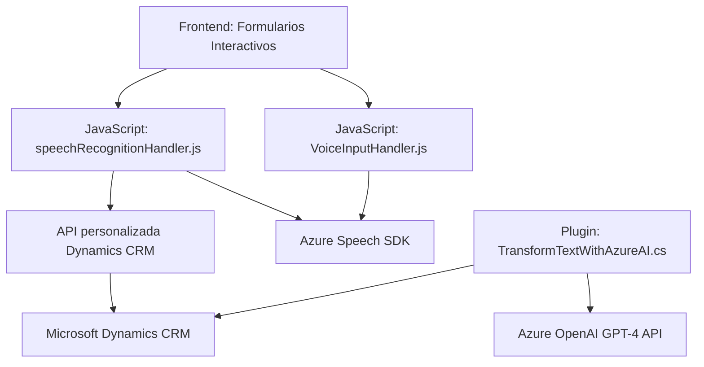

### Breve Resumen Técnico
El repositorio contiene un conjunto de archivos relacionados con la implementación de funcionalidades para formularios interactivos dentro de un sistema basado en Dynamics 365. Utiliza avances de reconocimiento de voz, síntesis de audio y procesamiento de lenguaje natural a través de servicios de Microsoft Azure Speech SDK y Azure OpenAI (GPT).

### Descripción de la Arquitectura
1. **Arquitectura General del Sistema:**
   - **N capas:** La arquitectura general tiene la distribución clásica de capas:
     - **Frontend:** Manejo de la interacción de usuarios con formularios, capturando datos y reconocimiento de voz.
     - **Lógica de negocio:** Plugins en Dynamics 365 que procesan datos con reglas específicas e integraciones con APIs.
     - **Servicios externos:** Integración con APIs de Azure Speech SDK y Azure OpenAI.

2. **Arquitectura del _Frontend_:**
   - Modular, con división de responsabilidades.
   - Gestión de eventos basada en peticiones (Event-Driven).

3. **Lógica mediante Plugins de Dynamics 365:**
   - Usa el **Plugin Pattern**, donde el contexto de ejecución maneja la entrada y salida de parámetros.
   - Procesos delegados en APIs externas para procesamiento avanzado.

### Tecnologías y Frameworks Usados
- **Front-end:**
  - Microsoft Azure Speech SDK (Reconocimiento y síntesis de voz).
  - JavaScript com modularización funcional.
  - Event-driven funcionality.

- **Back-end:**
  - **Microsoft Dynamics CRM SDK (Xrm):** Para manipular el contexto del formulario.
  - **Azure OpenAI GPT-4:** Procesamiento avanzado de texto.
  - **Newtonsoft.Json y System.Text.Json:** Manejo de datos JSON.

- **Servicios externos:**
  - Azure Speech SDK y OpenAI API son dependencias críticas.
  - Microsoft Dynamics Web API para integración directa con entidades CRM.

- **Patrones más usados:**
  - Modularización funcional.
  - Plugin Pattern.
  - Dependency Injection (en Dynamics CRM context y HttpClient).
  - Event-driven programming.

### Dependencias o Componentes Externos
1. **Para el _Frontend_:**
   - Azure Speech SDK cargado dinámicamente desde `https://aka.ms/csspeech/jsbrowserpackageraw`.
   - API personalizada de Dynamics 365 para procesamiento avanzado de información de formularios.

2. **Para el _Plugin_:**
   - Microsoft Dynamics CRM SDK (Xrm) - Contexto de plugins.
   - Azure OpenAI GPT-4 API: Para procesamiento de lenguaje natural.
   - Manejadores JSON (Newtonsoft.Json).

### Diagrama Mermaid

### Conclusión Final
Este sistema representa una solución de **n-capas** orientada a la integración de funciones avanzadas como reconocimiento de voz y procesamiento de lenguaje natural con mayor enfoque en la accesibilidad dentro de un entorno basado en Dynamics 365. El uso de Azure Speech SDK y OpenAI GPT-4 otorga un nivel significativo de innovación en las capacidades del sistema.

Los elementos del repositorio están organizados según principios de modularidad y extensibilidad, facilitando su mantenimiento y escalabilidad. La arquitectura propuesta (junto con el diagrama) sugiere una integración bien estructurada entre las capas de front-end, lógica y servicios externos para la optimización en el manejo de datos e interacción con usuarios.