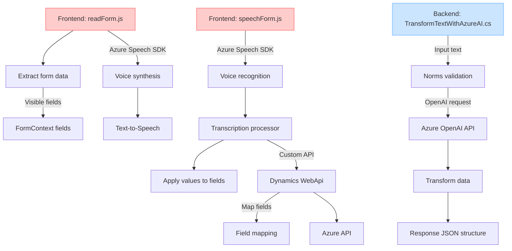

### Breve resumen técnico:
Este repositorio implementa funcionalidades avanzadas para interactuar con formularios y servicios externos, utilizando el Azure Speech SDK, APIs personalizadas en Dynamics 365 y Azure OpenAI. La solución incluye:
1. Frontend (JavaScript) para reconocimiento y síntesis de voz.
2. Backend plugin (C#) para transformación de texto utilizando servicios de IA (Azure OpenAI).

---

### Descripción de arquitectura:
La solución sigue una arquitectura modular en el frontend, con funciones bien delineadas orientadas a tareas específicas como lectura de datos de formularios, asignación de valores y procesamiento de texto con reconocimiento de voz. En el backend, la arquitectura está diseñada como un **microservicio**, donde el plugin ejecuta la lógica de transformación de texto delegando el procesamiento complejo a un servicio externo (Azure OpenAI) mediante una llamada HTTP.

En conjunto, esta solución combina los paradigmas de **n capas** y **microservicios**. Las capas incluyen:
1. **Capa de presentación (Frontend)**: JavaScript interactuando con formularios y realizando reconocimiento y síntesis de voz.
2. **Capa de lógica empresarial (Plugin)**: Validación y transformación de datos mediante Azure OpenAI.
3. **Capa de integración**: APIs externas (Dynamics WebApi, Azure Speech SDK, Azure OpenAI).

---

### Tecnologías usadas:
1. **Frontend**:
   - JavaScript
   - Azure Speech SDK
   - Window API
   - Dynamics 365 Context API (Xrm.WebApi)

2. **Backend**:
   - C# con Microsoft Dynamics CRM SDK (`Microsoft.Xrm.Sdk`)
   - Azure OpenAI (GPT-4 y JSON structuring capabilities)
   - Librerías: `Newtonsoft.Json`, `System.Net.Http`

3. **Servicios adicionales**:
   - Dynamics 365 (APIs internas)
   - Azure Speech SDK (para voz: audio->texto y texto->audio)
   - Azure OpenAI (IA avanzada para procesamiento y transformación de texto).

---

### Diagrama Mermaid:

---

### Conclusión final:
La solución integra capacidades avanzadas de interacción entre usuarios y formularios mediante voz y texto, utilizando servicios modernos en la nube (Azure Speech SDK y Azure OpenAI). La arquitectura combina principios de **n capas** y **microservicios**, ofreciendo una solución modular, extensible y escalable. Gracias al uso de APIs externas, la solución puede adaptarse fácilmente para expandir funcionalidades como procesamiento de lenguaje natural, automatización avanzada de IA y soporte más robusto para usuarios.