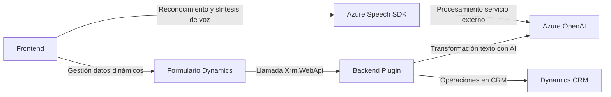

# Análisis Completo

## **Breve Resumen Técnico**
El repositorio describe una solución que integra reconocimiento y síntesis de voz, junto con un plugin desarrollado para Dynamics 365 que utiliza Azure OpenAI para realizar transformaciones avanzadas de texto. Está separada en componentes frontend (con JavaScript y el Azure Speech SDK) y una capa backend basada en C# para la gestión de datos mediante Dynamics CRM.

---

## **Descripción de Arquitectura**
La solución se estructura en tres capas principales:
1. **Frontend**: Interactúa con el usuario a través de un sistema basado en formularios y reconocimiento/síntesis de voz. Cada funcionalidad está modularizada para asegurar su separación y reutilización.
2. **Backend**: Implementado como plugins de Dynamics 365 que facilitan la interacción con el servicio Azure OpenAI a través de HTTP.
3. **Servicios externos**: Azure Speech SDK y Azure OpenAI se integran para realizar el procesamiento de voz y texto avanzado.

La arquitectura sigue un modelo híbrido:
- **Cliente-Servidor**: Existen varios puntos de interacción entre el cliente (frontend) y los servicios backend (Dynamics y Azure). La lógica principal del negocio está en la capa backend.
- **Patrón n-Capas**: La solución tiene tanto un frontend (presentación) como una capa backend (negocio y datos).
- **Modularidad y separación de responsabilidades**: Cada archivo contiene roles bien definidos para la extracción de datos, procesamiento y comunicación con servicios externos.

---

## **Tecnologías Usadas**
1. **Frontend**:
   - **JavaScript**: Desarrollo de funcionalidades de reconocimiento, transformación y síntesis de voz.
   - **Azure Speech SDK**: Para comandos de voz y lectura mediante servicios en línea.
   - **Dynamics 365 (Xrm.WebApi)**: Para llamadas dinámicas al backend CRM.

2. **Backend**:
   - **C# (.NET Framework)**: Desarrollo de plugins para Dynamics 365.
   - **Azure OpenAI**: Consumo de APIs para transformar texto a JSON utilizando modelos de inteligencia artificial.
   - **System.Text.Json y Newtonsoft.Json**: Manipulación avanzada de estructuras JSON.
   - **HttpClient**: Realiza peticiones HTTP hacia el servicio OpenAI.

---

## **Dependencias o Componentes Externos**
1. **Azure Speech SDK**:
   - Utilizado para la integración de voz.
   - Cargado dinámicamente en el navegador.
2. **Azure OpenAI**:
   - Servicio usado para transformar texto con IA.
3. **Dynamics 365**:
   - Backend CRM utilizado para contexto de ejecución de plugins y manipulación de datos del sistema.

---

## **Diagrama Mermaid**

---

## **Conclusión Final**
La solución presentada implementa una arquitectura **n capas híbrida**, con módulos separados para el frontend y backend que integran servicios externos (Azure Speech SDK y OpenAI) para ofrecer funcionalidad avanzada de reconocimiento/síntesis y transformación de texto. Este diseño asegura modularidad, separación de preocupaciones y reutilización del código. Es ideal para entornos empresariales como Microsoft Dynamics 365, donde la interacción con datos dinámicos y servicios externos es clave.