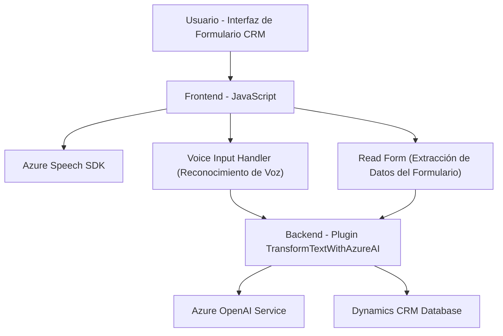

### Breve resumen técnico
El repositorio contiene tres archivos principales que implementan distintos aspectos de una solución tecnológica integrada con **Microsoft Dynamics CRM** y servicios externos como **Azure Speech SDK** y **Azure OpenAI**. Los archivos definen funcionalidades para generación de síntesis de voz desde texto, reconocimiento de voz y procesamiento de comandos hablados, y transformación de texto en objetos estructurados usando inteligencia artificial.

---

### Descripción de arquitectura
La solución utiliza una arquitectura **modular** con enfoque API-plugin. Combina un frontend JavaScript para la interacción de usuarios con un CRM (Dynamics CRM) y complementa la funcionalidad del backend con un plugin desarrollado en C#. Las piezas clave de la arquitectura son:

1. Un **frontend JavaScript** que facilita entrada de voz y síntesis utilizando **Azure Speech SDK**.
2. Un **backend plugin para Dynamics CRM** que integra Azure OpenAI para procesar comandos de texto y transformarlos en estructuras de datos orientadas a objetos JSON.
3. La solución se organiza siguiendo patrones como la **carga dinámica de dependencias** (JavaScript) y el **Plug-in Pattern** (C#).

Esta arquitectura puede clasificarse como **n-capas** con un enfoque hacia la modularidad y escalabilidad, además de usar servicios externos para IA y reconocimiento/síntesis de voz.

---

### Tecnologías usadas
1. **Microsoft Azure Speech SDK:** Usado tanto para síntesis como para reconocimiento de voz desde el frontend.
2. **Microsoft Dynamics CRM APIs:** Facilitan la interacción con datos en formularios dinámicos.
3. **Azure OpenAI Service:** Utilizado en el plugin/plugin de backend para transformar texto.
4. **Languages & Platforms:** JavaScript (frontend) y C# (backend plugin).
5. **Frameworks y Librerías:**
   - `Newtonsoft.Json.Linq` (gestión de JSON en C#).
   - `System.Net.Http` (gestión de solicitudes HTTP en C#).

---

### Diagrama Mermaid

---

### Conclusión final
La solución presentada integra tecnologías modernas para mejorar la experiencia del usuario en sistemas CRM, enfocándose en el manejo de comandos y datos mediante voz y procesamiento de texto avanzado. Utiliza una combinación de frontend interactivo con funcionalidades basadas en voz y un backend altamente especializado con un plugin que procesa datos mediante inteligencia artificial en Azure OpenAI. La arquitectura modular y las dependencias con servicios externos (Azure Speech SDK y OpenAI) hacen que la solución sea eficiente, escalable y adecuada para entornos dinámicos empresariales.