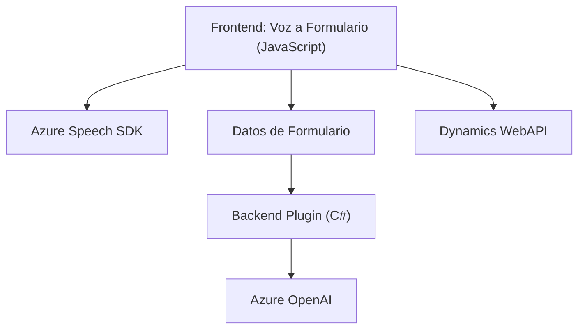

### Breve Resumen Técnico
El repositorio incluye un frontend (JavaScript) con funcionalidades de interacción por voz y procesamiento de transcripciones en formularios dinámicos. Además, un backend basado en Microsoft Dynamics CRM para transformar texto mediante la integración del servicio Azure OpenAI. Utiliza Azure Speech SDK en el frontend para reconocimiento y síntesis de voz.

---

### Descripción de la Arquitectura
1. **Frontend**: Implementa una solución modular y asíncrona que interactúa con formularios y utiliza Azure Speech SDK para captar y sintetizar voz. Sigue una arquitectura de cliente basada en módulos.
2. **Backend**: Se basa en la arquitectura de plugin de Microsoft Dynamics CRM (compartimentado y extensible) con patrón de integración externo utilizando Azure OpenAI para procesar datos.

La solución sigue una **arquitectura de n capas**, con una separación clara entre la capa de presentación (frontend), lógica de negocio (procesamiento de datos en el frontend y backend) y una capa de servicios (Azure Speech SDK y Azure OpenAI).

---

### Tecnologías Usadas
1. **Frontend**:
   - **JavaScript**: Lenguaje base de desarrollo del frontend.
   - **Azure Speech SDK**: Captura, reconocimiento y síntesis de voz.
   - **Dynamics 365 WebAPI**: Manipulación dinámica de formularios y atributos del CRM.
   - **Promesas y async/await**: Para manejar operaciones asíncronas en el frontend.
   - **DOM Manipulation**: Dinámica de carga del SDK.

2. **Backend**:
   - **C#**: Lenguaje utilizado para el desarrollo del plugin.
   - **Microsoft Dynamics SDK**: Framework para desarrollo de plugins en Dynamics CRM.
   - **Azure OpenAI**: Integración de servicios de inteligencia artificial.
   - **HttpClient**: Para realizar llamadas a servicios web en C#.
   - **JSON Manipulation**:
     - `System.Text.Json` en el entorno .NET.
     - `Newtonsoft.Json` para manipulaciones avanzadas.
   - **Encapsulación a través de IPlugin**: Implementación basada en un contrato definido por Dynamics CRM.

---

### Dependencias o Componentes Externos
1. **Azure Speech SDK**: Servicio para reconocimiento y síntesis de voz en el frontend.
2. **Azure OpenAI**: API utilizada en el backend para transformación de textos mediante inteligencia artificial.
3. **Dynamics WebAPI (Frontend)**: Servicios Dynamics usados en el frontend para vinculación de datos.
4. **CRM Plugin Infrastructure**: Base para ejecución de plugins personalizados en Dynamics CRM.
5. **Browser APIs**: Usados para entrada de micrófono y carga de recursos.

---

### Diagrama Mermaid válido para GitHub

---

### Conclusión Final
La solución integra el reconocimiento y síntesis de voz en el frontend, capturando datos dinámicos de formularios gestionados a través de Dynamics WebAPI y posteriormente vinculándolos al CRM. Por otro lado, un backend basado en un plugin de Dynamics CRM extiende esta funcionalidad integrando Azure OpenAI para procesamiento avanzado de datos.

La arquitectura modular de n capas logra una separación clara de responsabilidades. Las dependencias externas principales corresponden al ecosistema Azure y Dynamics, junto con patrones estándar como plugins, integración de API externas y manejo de datos JSON estructurados.