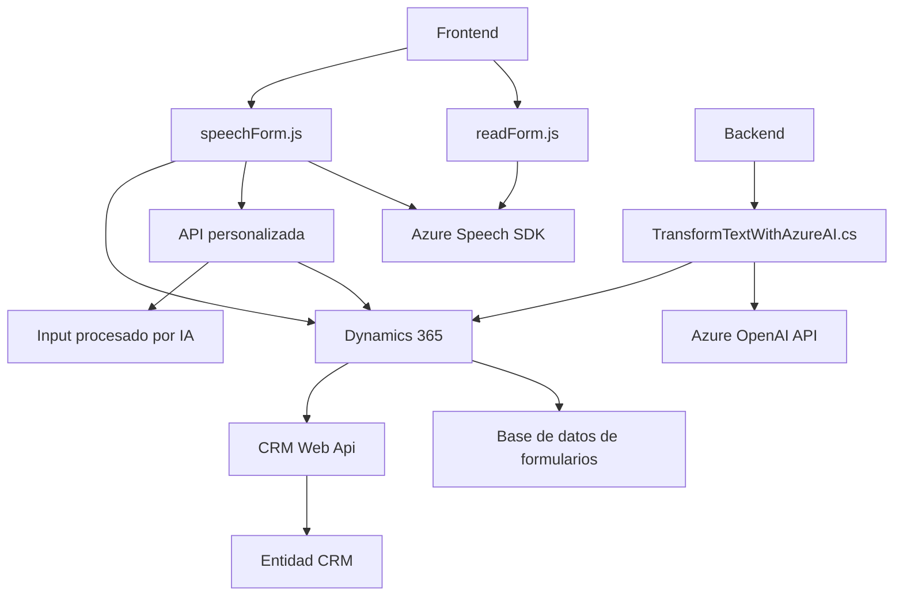

### Breve resumen técnico

El repositorio contiene archivos enfocados en la interacción con formularios de Dynamics 365 mediante reconocimiento de voz, síntesis vocal y procesamiento de texto avanzado con servicios de Azure. El diseño general sugiere una solución basada en servicios que conecta funcionalidades de frontend en JavaScript con plugins de backend en C# para realizar tareas automatizadas. Las tecnologías incluidas son Azure Speech SDK y Azure OpenAI API, con una arquitectura centrada en servicios y eventos.

---

### Descripción de arquitectura

La arquitectura combina los siguientes enfoques:

1. **N-Capas con integración de servicios externos:**
   - ***Capa frontal (Javascript):*** Contiene módulos como `readForm.js` y `speechForm.js`, que implementan la lógica de interacción usuario-formulario y se comunican con el SDK de Azure Speech.
   - ***Capa de lógica del negocio (plugins del backend):*** Implementación en C# mediante `IPlugin` para integrar reglas específicas que transforman datos con Azure OpenAI.
   - ***Capa de datos:*** Utilización de Dynamics 365 como base de datos y para la gestión dinámica de formularios y campos.

2. **Event-driven Architecture:**
   - Eventos dinámicos disparados por interacción con formularios o por el resultado de los servicios externos (Azure Speech SDK, OpenAI).

3. **Integración de Servicios Externos:**
   - La arquitectura integra servicios como Azure Speech SDK (reconocimiento/síntesis de voz) y Azure OpenAI API (procesamiento avanzado de texto).

4. **Modularidad y responsabilidad única:**
   - Cada archivo se enfoca en tareas específicas: lectura de formularios, procesamiento de texto o actualización de datos en Dynamics. Esto facilita la escalabilidad y el mantenimiento en sistemas complejos.

---

### Tecnologías usadas

1. **Frontend:**
   - **Javascript/ES6:** Funciones asincrónicas y manipulación dinámica del DOM para cargar Azure Speech SDK y manejar formularios.
   - **Azure Speech SDK:** Reconocimiento y síntesis de voz (https://aka.ms/csspeech/jsbrowserpackageraw).

2. **Backend:**
   - **C# en .NET Framework:** Plugins basados en Microsoft Dynamics CRM SDK (`IPlugin`).
   - **Newtonsoft.Json**: Manipulación de objetos JSON.
   - **Azure OpenAI API:** Integración para transformar texto con modelos GPT.

3. **Datos:**
   - **Dynamics 365:** Utilización de `Xrm.WebApi` para realizar operaciones CRUD sobre formularios y entidades.

4. **Patrones de diseño:**
   - Event-driven (uso de callbacks).
   - Service integration (Azure Speech SDK y OpenAI API).
   - Plugin Pattern (para Dynamics CRM).

---

### Diagrama Mermaid

---

### Conclusión Final

**Tipo de solución:**  
Se trata de una solución híbrida orientada a formularios interactivos con alto grado de automatización, combinando frontend dinámico basado en JavaScript y plugins backend para procesar texto y datos.

**Tecnologías clave:**  
El uso de Azure Speech SDK y Azure OpenAI API refuerza el enfoque basado en inteligencia artificial para tareas de automatización y procesamiento avanzado.

**Arquitectura:**  
La arquitectura tiene características de **N-Capas** con integración de servicios externos, y utiliza patrones como **eventos**, **plugin-handler**, y **servicios encapsulados**.

**Recomendaciones:**  
Para optimizar la solución, podría implementarse un manejo central de configuraciones mediante archivos externos o entornos seguros en lugar de definir valores en el código fuente. Además, considerar la inclusión de pruebas automatizadas para cada capa funcional garantizaría una mayor robustez y escalabilidad del sistema.