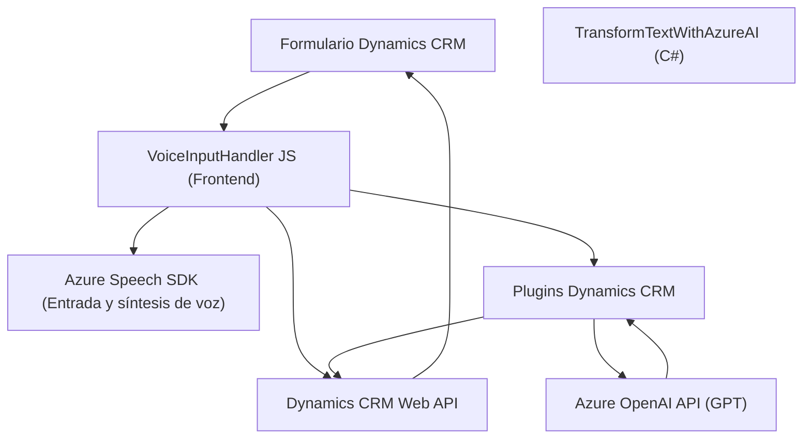

### Breve Resumen Técnico:
El repositorio aparentemente implementa una solución híbrida orientada a la manipulación de datos en formularios de Dynamics CRM, con interacción por voz y procesamiento textual mediante Azure OpenAI. Los archivos presentados indican una estructura compuesta de un frontal (JavaScript para manejo de voz y form data) y un backend (plugin en C#) encargado de realizar integraciones con APIs externas.

---

### Descripción de Arquitectura
La arquitectura empleada en este sistema tiene características tanto de **Monolito** como de **Arquitectura por Plugins**, siendo esta última la más probable dada la dependencia de Dynamics CRM, que opera bajo este esquema. La solución parece seguir un patrón de **Integración de API Externa**, donde se conecta con servicios de Microsoft Azure (Speech SDK y OpenAI API). Tiene una separación entre frontend (interacción del usuario) y backend (proceso de plugin en Dynamics CRM), por lo que también se acerca al patrón **N Capas**.

1. **Capa de Presentación (Frontend):**
   - Implementado con JavaScript, principalmente destinado a la interacción con formularios de Dynamics CRM, entrada/salida por voz y transmisión de datos a través de integraciones.
   - Integración directa con **Azure Speech SDK** para entrada y síntesis de voz.
   
2. **Capa de Lógica de Negocios (Backend):**
   - Implementada como un plugin de Dynamics CRM (`TransformTextWithAzureAI.cs`) que actúa como intermediario entre el CRM y el servicio de IA externo (Azure OpenAI API).
   - Sigue una arquitectura basada en plugins, típica de Dynamics CRM.

3. **Capa de Datos:**
   - Dinámicamente interactúa con la **Web API de Dynamics CRM**, utilizando objetos y atributos del contexto del formulario.
   - Usa el sistema de mapas de campos y datos definidos por el entorno CRM.

En conjunto, la arquitectura se alinea bajo una solución modular y extensible, con separación clara entre las funciones frontend y backend.

---

### Tecnologías Usadas
1. **Frontend:**
   - **JavaScript**:
     - Uso de promesas (`Promise`), funciones asíncronas (`async/await`) y callbacks.
   - **Azure Speech SDK**: Entrada de voz y síntesis de texto hablado, cargado dinámicamente desde un CDN.
   - **Dynamics CRM Web API**: Manipulación dinámica de datos de atributos y formularios del CRM.

2. **Backend:**
   - **C# (ASP.NET Framework)**: Desarrollo personalizado para plugins en Dynamics CRM.
   - **Azure OpenAI API**: Invocación de modelos GPT para transformación y generación de datos.
   - **Newtonsoft.Json.Linq**: Serialización/deserialización JSON para procesamiento de datos.

---

### Diagrama **Mermaid** para GitHub
Representación del flujo de interacción entre componentes.

---

### Conclusión Final
La solución representa una implementación robusta para integrar interacción por voz y procesamiento avanzado de texto dentro de un entorno Dynamics CRM. Funciona conjuntando dos capas principales: una capa frontend en JavaScript, que maneja interacción con el usuario y voz, y una lógica backend en C# que permite la integración con servicios externos de IA y datos del CRM.

#### Puntos destacables:
- **Arquitectura:** Combina el patrón de plugins y características de una arquitectura N capas.
- **Extensibilidad:** Uso de servicios externos como APIs de Azure y su SDK facilita agregar futuras capacidades avanzadas.
- **Patrones:** Integración asíncrona, diseño de fachada y los patrones comunes de Dynamics CRM están presentes.
  
#### Consideraciones:
- **Seguridad:** La gestión de claves de API en el código implica riesgos. Sería preferible almacenar credenciales de manera segura en un servicio de gestión de secretos.
- **Escalabilidad:** La arquitectura se beneficiaría de un desglose completo hacia una solución de microservicios si se proyecta mayor carga de usuarios o funcionalidad adicional.
