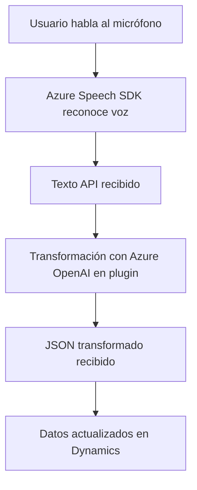

### Resumen Técnico del Proyecto

Este repositorio combina diferentes elementos destinados a la integración entre un sistema de reconocimiento de voz, generación de síntesis de voz, y procesamiento avanzado de texto con tecnologías de **Azure Speech SDK**, **Dynamics CRM**, y **OpenAI**. Está diseñado como un conjunto modular para proporcionar capacidades avanzadas de interacción con formularios y datos en un ecosistema empresarial basado en Dynamics CRM.

---

### Descripción de la Arquitectura

La solución representa una **arquitectura híbrida** con módulos en frontend para reconocimiento/síntesis de voz y un backend basado en plugins para necesidades más complejas, como transformación de texto con Azure OpenAI.

Componentes clave:

1. **Frontend:** Arquitectura de integración basada en funciones modulares orientadas a procesar formularios. Las funciones están segmentadas para usar el SDK de Azure Speech en tareas como leer formularios y reconocer comandos de voz.
2. **Backend:** Un **plugin en C#** extendiendo Dynamics CRM permite realizar transformaciones complejas con Azure OpenAI. Este componente sigue principios propios de microservicios, ya que delega su lógica principal a una API externa (Azure OpenAI) para procesamiento.

Se identifican varios patrones, como el **Patrón de Servicios**, **Facade Pattern**, y el modelo de **Plugin Event-Driven**.

---

### Tecnologías Usadas

1. **Frontend:**
   - **Azure Speech SDK**: Para reconocimiento de voz y síntesis de texto en formato de voz.
   - **JavaScript**: Para lógica específica de la UI y manejo dinámico de API.
   - **Dynamics CRM Web API**: Para actualizar datos de formularios en CRM, como campos lookup y opciones numéricas.

2. **Backend:**
   - **Azure OpenAI API** (ChatGPT/Completions): Procesa texto según criterios específicos (entregando JSON estructurado).
   - **C# / .NET Plugin Framework**: Desarrollo de integración nativa con Dynamics CRM.
   - **JSON (Newtonsoft y System.Text)**: Procesamiento de datos estructurados.

---

### Diagrama **Mermaid** Compatible con GitHub Markdown

El diagrama siguiente muestra los componentes y flujos funcionales principales de esta solución:

---

### Conclusión Final

Este repositorio forma parte de una solución empresarial altamente integrada, que aprovecha servicios avanzados de Azure como **Speech SDK** y **OpenAI** para automatización de flujos de trabajo en formularios dinámicos de Microsoft Dynamics CRM.

**Puntos destacados:**
- **Frontend:** Procesa información visual y recibe comandos directamente de voz, haciendo uso de Speech SDK.
- **Backend:** Amplía funcionalidades para procesamiento avanzado de texto dependiente de OpenAI en un modelo desacoplado.
- **Arquitectura:** Modular con integración vía APIs, una solución escalable para entornos de CRM modernos.

Es un diseño robusto y extensible, ideal para aplicaciones con interacción humana y automatización basada en IA.