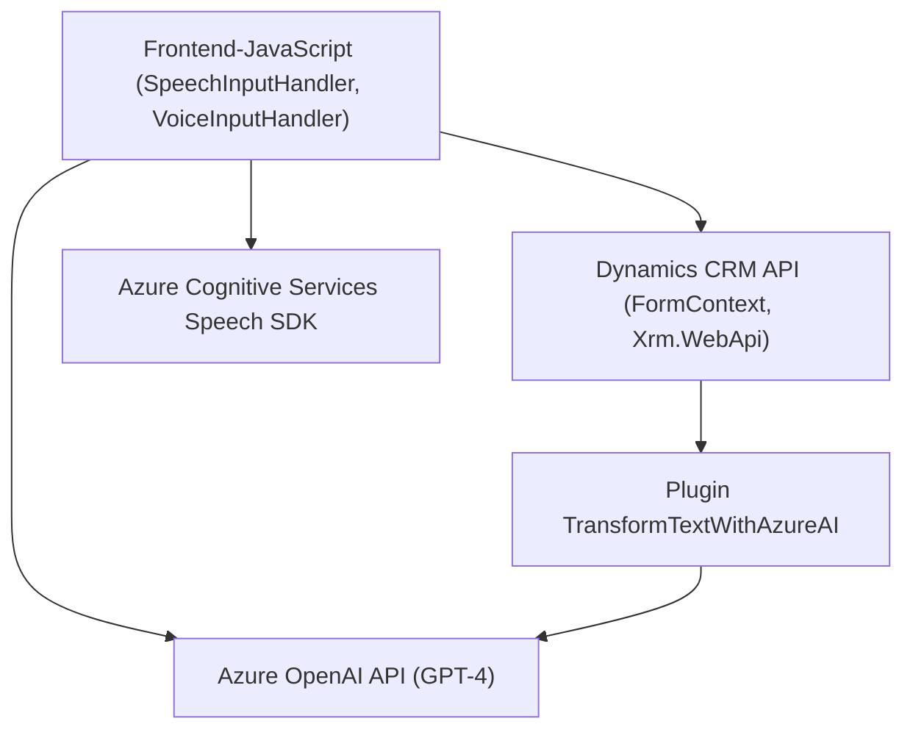

### **Análisis Técnico Detallado**

#### **1. Tipo de Solución**
La solución se centra en la construcción de una **herramienta de automatización basada en inteligencia artificial integrada a formularios de Microsoft Dynamics CRM**, que utiliza servicios de voz y procesamiento de texto. Podemos categorizarla principalmente como:
- **API**: Proceso y transformación de datos mediante servicios de Azure OpenAI.
- **Frontend funcional**: Scripts de JavaScript manejan interacciones usuario-formulario, lectura y aplicación de valores.
- **Plugins personalizables**: Extensiones de Dynamics CRM con lógica de negocio avanzada.

#### **2. Tecnologías, Frameworks y Patrones Utilizados**
- **Tecnologías y Servicios**
  - **Azure Cognitive Services Speech SDK**: Para síntesis de texto en voz y transcripciones.
  - **Azure OpenAI**: Modelo GPT-4 para procesamiento y generación de texto.
  - **Microsoft Dynamics CRM**: Plataforma central para gestión de formularios de usuario administrativo.
  - **JavaScript**: Para la lógica frontend en manejo del DOM, interacción con formularios y llamados asincrónicos a APIs.
  - **C# (.NET Framework)**: Lógica de backend implementada como plugin extendido en Dynamics CRM.

- **Patrones de Diseño y Arquitectura**
  - **Modularización Funcional**: División de responsabilidades en funciones específicas y clases (por ejemplo, clases de entrada, lectura y procesamiento de datos).
  - **Dependency Injection**: Usado en `IServiceProvider` para servicios dentro del plugin.
  - **Plugin Architecture**: Desarrollo en `TransformTextWithAzureAI.cs` como extensión estandarizada de Dynamics CRM.
  - **API Integration**: Uso del SDK y de Azure OpenAI refleja una arquitectura orientada a servicios (SOA).
  - **Asynchronous Workflow**: Utilización de promesas y callbacks en los scripts de JavaScript para mejorar las interacciones.
  - **MVC (Model-View-Controller)**: El archivo de JavaScript organiza y controla datos del formulario (modelo) que se reflejan en la UI (vista).

#### **3. Tipo de Arquitectura**
La arquitectura puede clasificarse como **n-capas** que combina módulos frontend con plugins de backend (Dynamics CRM), y utiliza servicios externos (microservicios como la API de Azure OpenAI y APIs de síntesis de voz). Sin embargo, la segmentación funcional no refleja un **esquema hexagonal** ni orientado completamente a microservicios.

#### **4. Dependencias o Componentes Externos**
- **Azure Cognitive Services Speech SDK**: Para generación y síntesis de voz.
- **Azure OpenAI API**: GPT-4 para transformación de texto.
- **Xrm.WebApi**: Para interacciones programáticas con Dynamics CRM.
- **Microsoft Dynamics CRM FormContext Module**: Gestión de campos en formularios administrativos.
- **API externa personalizada**: Comunicación complementaria entre frontend y modelos de IA en Azure.

#### **5. Diagrama Mermaid**
El siguiente diagrama representa la interacción entre los módulos, tecnologías y dependencias mencionadas:

### **Conclusión Final**
Se trata de una solución híbrida que combina capa de presentación interactiva con procesamiento informático avanzado mediante APIs de IA y síntesis de voz. Es idónea para aplicaciones de automatización en entornos empresariales, como Microsoft Dynamics CRM. 

Los patrones arquitectónicos están bien aplicados y dan lugar a un sistema modular donde cada componente cumple una función específica y puede escalarse independientemente de los demás con la integración de Azure AI y Cognitive Services.