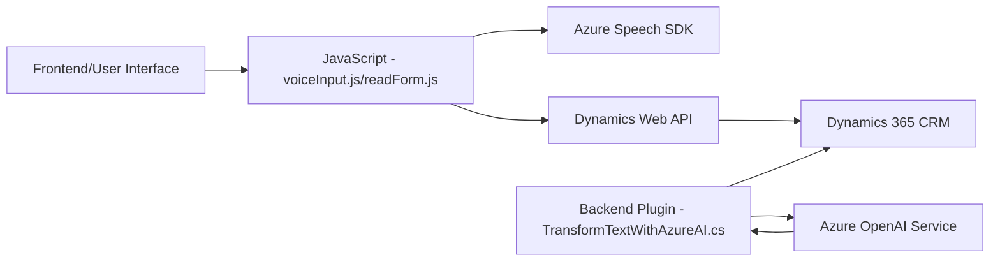

### Resumen Técnico 
Este repositorio integra múltiples archivos cuyo propósito principal es proporcionar funcionalidades relacionadas con reconocimiento de voz, síntesis de texto a voz, procesamiento de datos mediante inteligencia artificial, y actualización de campos dentro de un sistema CRM (evidentemente Dynamics 365). Utiliza APIs externas como Azure Speech SDK y Azure OpenAI para el reconocimiento y generación de datos procesados, y expone tanto lógica de frontend (JavaScript) como backend (Plugins en .NET). 

---

### Descripción de Arquitectura  
El proyecto utiliza una arquitectura **n-capas** donde cada capa cumple con responsabilidades específicas:  
1. **Capa de presentación** (Frontend - JavaScript): Maneja interacciones directas con el usuario y la integración con el SDK de Azure Speech para captura de voz, síntesis de texto y trascripción para mapeo a formularios.  
2. **Capa de lógica de negocio** (Plugins - .NET): Se encarga de implementar y extender las funcionalidades de Dynamics 365 mediante la interacción con Azure OpenAI y la gestión de datos procesados utilizando plugins de CRM.  
3. **Capa de integración**: La integración con servicios en la nube (Azure Speech Services, OpenAI).  

La solución en conjunto actúa como una extensión de un sistema existente, no como un sistema independiente. Es decir, el repositorio está construido para ofrecer complementos sobre Dynamics 365 que mejoren el manejo de datos con AI y facilitación por medio de interfaces de usuario.  

---

### Tecnologías Usadas  
1. **Lenguajes:**  
   - **JavaScript** (para el frontend).  
   - **C# (.NET Framework)** para los plugins y la lógica CRM.  
2. **Frameworks:**  
   - Dynamics 365 SDK y API (modelo de extensión).  
   - Azure Speech SDK para JavaScript (sintetización y reconocimiento de voz).  
   - Newtonsoft.Json para la manipulación de JSON en .NET.  
3. **Servicios externos:**  
   - **Azure Speech Services:** Para reconocimiento de voz y síntesis.  
   - **Azure OpenAI (GPT):** Procesamiento y transformación de texto.  

4. **Patrones de diseño:**  
   - **Capa de servicios**: La interacción con APIs externas como Azure Speech y OpenAI centraliza el procesamiento y aislamiento de lógica en métodos específicos.  
   - **Modularidad**: Los módulos de frontend son independientes y están orientados a funciones específicas.  
   - **Plugin extensible**: El patrón de plugins dinámicos para Dynamics 365 expande la lógica a nivel de backend.  
   - **Dynamic Script Loading**: El SDK de Speech se carga solo cuando es necesario.  

---

### Dependencias o Componentes Externos  
1. **Azure Speech SDK:** Para reconocimiento y síntesis de voz.  
2. **Azure OpenAI API:** GPT-4 usado para transformaciones de texto.  
3. **Dynamics 365 Web API:** Comunicaciones entre el frontend y los datos CRUD del CRM.  
4. **Microsoft.Xrm.Sdk:** Provee extensibilidad al backend de Dynamics.  
5. **JavaScript runtime:** Configuración del entorno web para ejecutar funciones de lectura y síntesis.  
6. **Newtonsoft.Json:** Manejo de estructuras JSON en los plugins.  
7. **HTTP client libraries:** Usadas en el código backend para manipular solicitudes REST.  

---

### Diagrama Mermaid  

---

### Conclusión Final  
La solución presentada tiene como funcionalidad principal mejorar la interacción y automatización dentro de un sistema CRM como Dynamics 365 utilizando tecnologías modernas como reconocimiento y síntesis de voz y procesamiento de datos mediante inteligencia artificial. Está diseñada en una arquitectura **n-capas**, donde cada componente cumple una función específica que incluye captura de datos en el frontend, procesamiento en el backend y comunicación con servicios modernos de Microsoft Azure. Aunque modular, la seguridad y encapsulación de datos sensibles es crítica, y algunos puntos como el manejo de claves API pueden requerir mejora para un entorno productivo robusto.