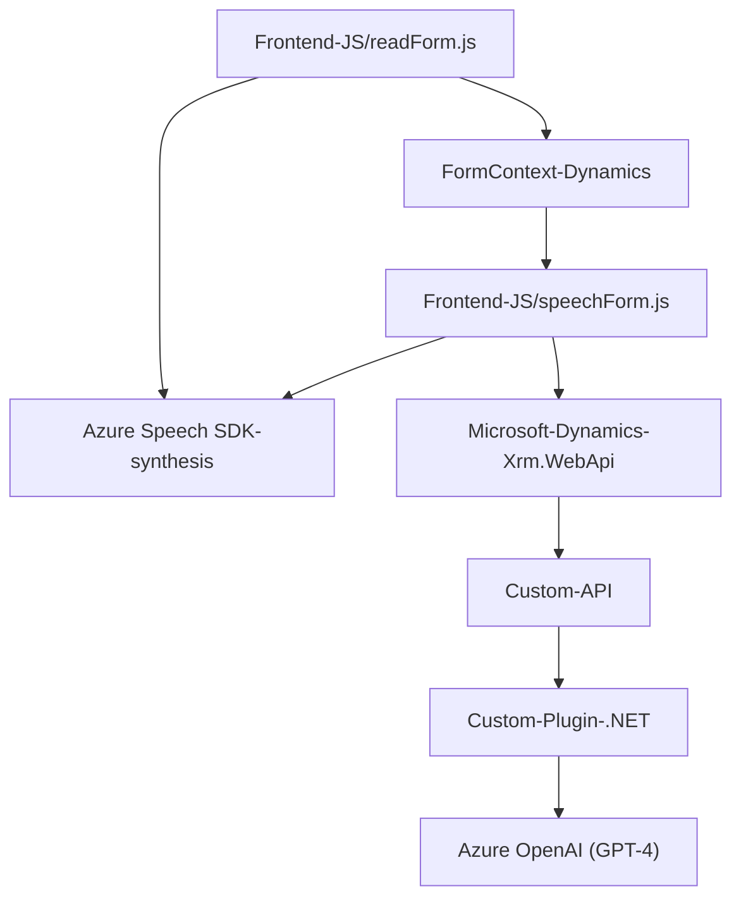

### Breve resumen técnico:
El proyecto consiste en una solución principalmente orientada a integrar funcionalidades de entrada y procesamiento de voz, así como generación y transformación de texto, con un enfoque en Microsoft Dynamics CRM. Usa el **Azure Speech SDK** para reconocimiento de voz y síntesis, junto con **Azure OpenAI (GPT-4)** para transformación avanzada de texto.

---

### Descripción de arquitectura:
Esta solución no es un monolito, sino una arquitectura **modular distribuida basada en capas**. Cada módulo tiene una responsabilidad específica:
- **Frontend**: Usa JavaScript para integración con formularios de Dynamics CRM y para interactuar con el usuario mediante voz (basado en Azure Speech SDK).
- **Backend**: Implementa lógica extendida mediante un **Microsoft Dynamics Plugin**, que conecta texto con una API externa de Azure OpenAI.

Presencia de:
- **Patron de repositorio**: Para manejar datos de CRM.
- **Lógica asincrónica por medio de Promises y eventos**.
- **Plugin Pattern**: Para extender funcionalidades de CRM.
- **Flujo de procesamiento**: Captura de voz → transformación → ejecución de procesos en formularios.
- **Distribución híbrida**: Combina el procesamiento del cliente (JavaScript en frontend) con servicios externos (Azure SDK + Plugin en backend).

---

### Tecnologías usadas:
1. **Frontend (JavaScript)**:
   - **Azure Speech SDK**: Para reconocimiento y síntesis de voz.
   - Integración directa con **Microsoft Dynamics 365** (formContext).

2. **Backend (C#)**:
   - Plugin basado en la **API SDK de Microsoft Dynamics CRM** (`Microsoft.Xrm.Sdk`).
   - Comunicación con **Azure OpenAI (GPT-4 API)** para transformación avanzada de texto.

3. **Patrones destacados**:
   - Modularización.
   - Lógica asincrónica (`async/await`).
   - Plugin dedicado en el backend según el framework de Dynamics.
   - Uso de SDK en frontend y backend, con carga dinámica.

---

### Diagrama Mermaid válido para GitHub:

---

### Conclusión final:
La solución combina integración de voz y texto en procesos CRM mediante una arquitectura híbrida modular, utilizando tecnologías de Microsoft y Azure. A nivel de diseño, este repositorio prioriza extensibilidad, modularización y uso de SDK y API, lo que permite la interacción directa entre el usuario y Microsoft Dynamics CRM usando voz. Además, la incorporación de Azure OpenAI le otorga una capacidad avanzada de transformación de texto en backend.