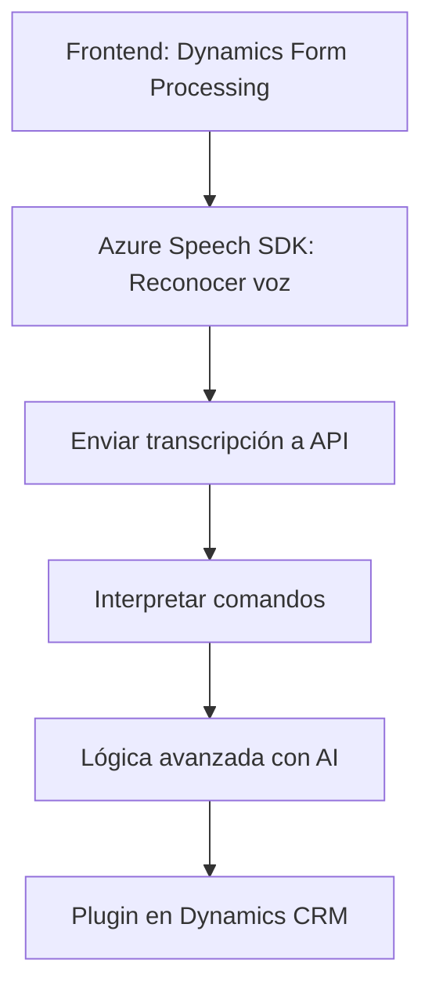

## Breve resumen técnico

El repositorio incluye implementaciones relacionadas con la interacción entre formularios en aplicaciones frontend (conectadas a Dynamics CRM) y servicios de Azure. Los archivos procesan datos transcritos por voz o texto mediante Azure Speech SDK y Azure OpenAI, además de manejar funciones específicas para sistemas Dynamics 365 como plugins y APIs personalizadas. 

Los patrones de diseño observados incluyen modularidad, llamada a servicios externos, separación de responsabilidades y orientación a eventos.

---

## Descripción de arquitectura

La arquitectura principal del sistema exhibe una **estructura en capas**, con separación entre frontend (manejo de formularios y voz), API dinámica (Azure AI), y un backend conectado como plugin de Dynamics CRM que consume servicios Azure OpenAI. Los principales elementos son:

- **Frontend:** JavaScript ejecutándose en cliente, incorporando Azure Speech SDK. Se encarga de entrada de voz, mapeo de campos y llamado a APIs.  
- **API personalizada:** Procesa comandos o texto mediante lógica específica y llama a Azure OpenAI. Sirve de puente entre frontend y CRM.  
- **Plugin backend:** Se ejecuta en Dynamics CRM y aplica lógica avanzada basada en Azure OpenAI para transformar texto.  

La solución muestra una dependencia significativa en tecnologías Microsoft (Azure Speech SDK, Azure OpenAI y Dynamics APIs).

---

## Tecnologías usadas

- **Frontend:**
  - **JavaScript/ES6**
  - **Azure Speech SDK**
  - API personalizada para Dynamics 365

- **Backend:**
  - **Microsoft Dynamics CRM SDK (Xrm.WebApi.online)**
  - **Azure OpenAI API**
  - Framework .NET para plugins
  - **Newtonsoft.Json** y **System.Net.Http**

---

## Diagrama Mermaid válido para GitHub

---

## Conclusión final

La solución implementa una **arquitectura en capas** con integración directa entre frontend, APIs personalizadas y plugins backend. Las funciones son altamente dependientes de los servicios Azure (Speech SDK y OpenAI). Esto asegura una interoperabilidad óptima entre inputs basados en voz y texto con manipulaciones en Dynamics CRM.

Puntos destacados:

1. **Diseño modular:** Cada capa tiene una responsabilidad específica: manejo de voz, lógica del frontend, integración de APIs externas y ejecución en el backend del CRM.  
2. **Uso de tecnologías avanzadas:** La solución aprovecha servicios de Microsoft como Dynamics, Azure OpenAI y Speech SDK para implementar tareas complejas como síntesis de voz y transformación de texto.  
3. **Dependencias externas:** Azure SDK y APIs son críticos para el funcionamiento del sistema; por lo tanto, es importante garantizar su configuración y seguridad.  

Esta arquitectura es adecuada para sistemas empresariales que integran la entrada multimodal (voz/texto) con procesos avanzados de inteligencia artificial.