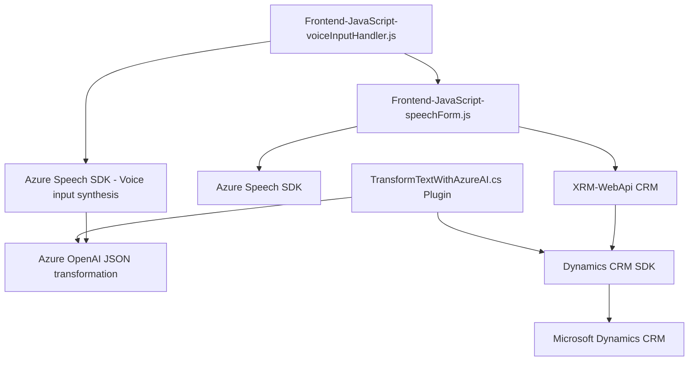

### Breve Resumen Técnico
El repositorio se compone de tres tipos de soluciones interconectadas que trabajan con **entrada de voz**, **procesamiento de texto con inteligencia artificial (Azure OpenAI)** y **formulario dinámico en Dynamics CRM**. La integración con **Azure Cognitive Services Speech SDK** y **Microsoft Dynamics CRM Plugins** sugiere un sistema basado en tecnologías cloud y servicios externos.

---

### Descripción de Arquitectura
La arquitectura observada en el código indica una mezcla entre:
1. **Sistema cliente-servidor orientado a N capas**:
   - **Frontend/JS:** Implementación en JavaScript para manejar eventos del cliente (voz y formularios).
   - **Backend/Plugins:** Plugin en C# para procesamiento y transformación de datos vía APIs.
   - **Azure Platform**: Servicios como el **Azure Speech SDK** y el **Azure OpenAI** para tareas de procesamiento y síntesis de voz.

2. **Event-driven architecture (Arquitectura basada en eventos)**:
   - Utiliza los eventos del **Microsoft Dynamics CRM** para desencadenar scripts y plugins en respuesta a interacciones específicas en la interfaz.
   - Microsoft XRM SDK interactúa directamente con los datos y entidades desde el sistema CRM.

3. **Arquitectura de integración externa con servicios vía APIs**:
   - Extensa dependencia de **Azure Speech SDK**, **Azure OpenAI Service**, y Dynamics CRM API para entrada de voz, síntesis y análisis de texto.

---

### Tecnologías Usadas
1. **Frontend / JavaScript**:
   - Tecnología: JavaScript.
   - Frameworks/APIs: Azure Speech SDK, DOM API.
   - CRM API Integration: `Xrm.WebApi.online.execute` (Dynamics).

2. **Backend / C# Plugin**:
   - Tecnología: C# (.NET Framework).
   - APIs/Libraries: Azure OpenAI REST API, Newtonsoft.Json (JSON), System.Net.Http for HTTP communication.
   - Dependency Injection: `IServiceProvider`.
   - Event-Driven: Handling Dynamics CRM events via `Microsoft.Xrm.Sdk` and plugin execution.

3. **Cloud Integration**:
   - Services: Azure Speech SDK (for text-to-speech and speech-to-text functionalities), Azure OpenAI Service (custom transformation tasks), integration with Dynamics CRM for real-time plug-ins.

---

### Diagrama Mermaid

---

### Conclusión Final
Este repositorio representa una solución basada en una arquitectura de **N capas** que combina frontend, backend y una integración robusta con servicios de Azure y Dynamics CRM. Los componentes trabajan en conjunto para funcionar como una solución orientada a la interacción dinámica del usuario con formularios mediante entrada de voz. La interacción de patrones como delegación, puente y observador en el código sugiere una estructura modular y extensible, lo que facilita su adaptación y escalabilidad. Sin embargo, ciertos puntos como la gestión de claves API pueden ser mejorados para garantizar mayor seguridad y conformidad con buenas prácticas.