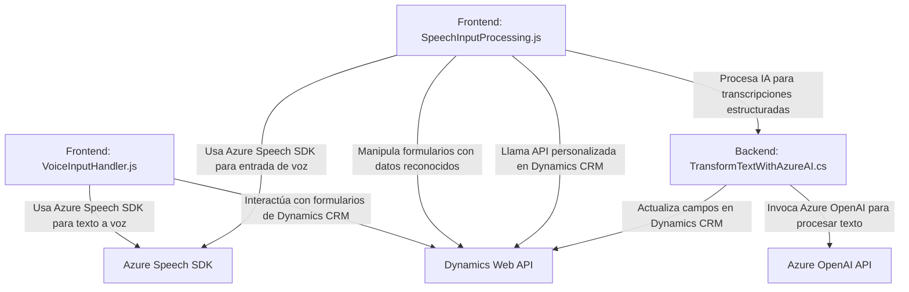

### Breve resumen técnico
El repositorio contiene una solución con funcionalidades centradas en el uso de reconocimiento de voz y síntesis de texto a voz mediante el SDK de Azure Speech, junto con integración de inteligencia artificial mediante Azure OpenAI y comunicación directa con Microsoft Dynamics CRM. Está orientado a facilitar la interacción con formularios en aplicaciones empresariales, principalmente en Dynamics 365. 

---

### Descripción de arquitectura
La arquitectura es **n-capas** con un enfoque modular:

1. **Capa de presentación (Frontend)**: 
   - Archivos JavaScript (`VoiceInputHandler.js`, `SpeechInputProcessing.js`) que interactúan con los formularios visibles en el navegador y manejan funciones relacionadas con la entrada y salida de voz. Estos componentes representan la capa de interfaz del usuario.
2. **Capa de lógica de negocio (Backend)**:
   - Plugin (`TransformTextWithAzureAI.cs`) para Microsoft Dynamics CRM, que gestiona solicitudes REST hacia Azure OpenAI para realizar transformaciones de texto y actualizaciones en la base de datos.
3. **Capa de datos**: 
   - Integración con la Web API de Dynamics basada en REST para el manejo de datos y actualización dinámica de campos.

---

### Tecnologías usadas
1. **Frontend**:
   - **Azure Speech SDK**: Reconocimiento de voz y síntesis de texto a voz en aplicaciones frontend.
   - **JavaScript**, ECMAScript: Lenguaje principal para interacción con el DOM/datos de Dynamics CRM.
   - **Dynamics Web API (Xrm.WebApi.online)**: Para gestionar datos de formularios en entornos CRM.

2. **Backend**:
   - **C# (.NET Framework)**: Implementación de un plugin que actúa como middleware entre Dynamics CRM y Azure OpenAI.
   - **Azure OpenAI Service API**: Utilizado para aplicar procesamiento de texto con modelos de inteligencia artificial.
   - **Newtonsoft.Json** y **System.Text.Json**: Para interactuar con JSON al usar APIs de Azure y Dynamics CRM.

3. **Arquitectura**:
   - Patrones modulares: Cada archivo está estructurado en funciones o clases con responsabilidades específicas y bien separadas.
   - API Gateway: El plugin interactúa directamente con el servicio Azure OpenAI mediante una comunicación HTTP.
   - Modelo de plugin estándar de Dynamics CRM.

---

### Diagrama Mermaid válido para GitHub

---

### Conclusión final
La solución emplea una arquitectura escalable y modular basada en un diseño **n-capas**, donde cada componente cumple roles específicos. Los elementos del frontend manejan la interacción con el usuario y el reconocimiento de voz, mientras que el backend se encarga de integrar la inteligencia artificial y actualizaciones en Dynamics CRM mediante el plugin.

Esta solución podría ser utilizada en diversos escenarios empresariales como asistentes de voz para formularios, sistemas de automatización basados en interacción de voz, y procesamiento de datos vía inteligencia artificial. La dependencia de servicios externos como Azure Speech y Azure OpenAI refuerza su capacidad de procesamiento avanzado y aprovechamiento de redes neuronales para mejorar la experiencia y productividad del entorno laboral.