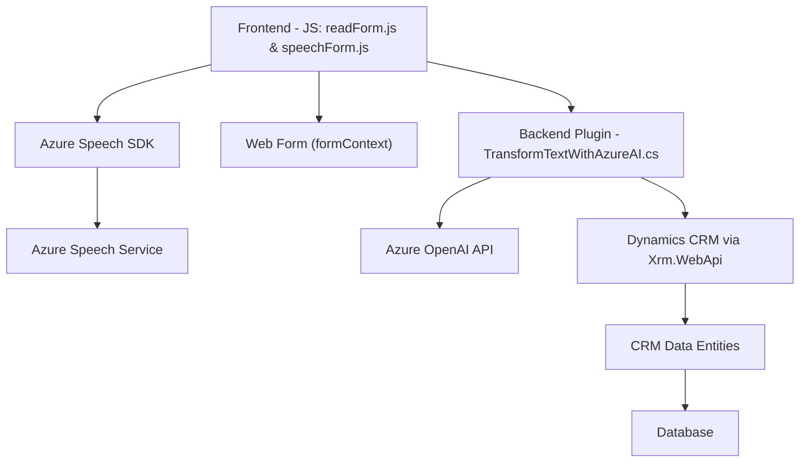

### Análisis Técnico del Repositorio

#### Breve Resumen Técnico:
El repositorio en cuestión contiene una solución centrada en la funcionalidad de detección de voz y síntesis de texto a voz usando el **Azure Speech SDK** y una integración con **Azure OpenAI API** para el procesamiento de datos mediante transformación de texto y generación de respuestas. Compuesta por múltiples archivos, esta solución utiliza una arquitectura orientada a servicios, adaptada a Dynamics CRM y sistemas web. Se observa un enfoque hacia la modularidad y división clara de responsabilidades.

---

### Descripción de Arquitectura:
1. **Tipo de Solución:**
   - La solución en conjunto puede clasificarse como una integración entre una **API externa (Azure OpenAI y Speech SDK)**, componentes **frontend** y una **plugin de Dynamics CRM**. Combina características de un sistema híbrido que interactúa entre un cliente (web frontend) y servicios cloud.

2. **Arquitectura General:**
   - La solución implementa un enfoque basado en **n capas**, típico para aplicaciones conectadas a servicios externos y dependientes de plataformas como Dynamics CRM. Podemos identificar capas de **UI**, **lógica de negocios** (procesamiento empresarial + plugin del CRM), y **servicio/external APIs**. Además, incorpora el modelo de **service-oriented architecture (SOA)** al integrar servicios de terceros como el Azure Speech SDK para interacciones de voz y Azure OpenAI API para procesamiento de lenguaje.

3. **Patrones Principales:**
   - **Modularidad:** Cada archivo está estructurado alrededor de funciones específicas, que cumplen una única responsabilidad, facilitando mantenimiento y pruebas.
   - **Callback/Event-driven:** Se utilizan callbacks para gestionar casos asíncronos, como la carga del SDK y las operaciones asincrónicas de voz y API externa.
   - **SDK Wrapper:** Capa de abstracción sobre el Azure Speech SDK mediante funciones como `ensureSpeechSDKLoaded` y `speakText`.
   - **Integración API:** El plugin para Dynamics CRM conecta el repositorio a servicios de IA mediante el patrón de integración API.

---

#### Tecnologías Usadas:
1. **Frontend:**
   - **JavaScript**: Lenguaje principal para la generación de lógica de aplicación y la integración con SDK de voz.
   - **Azure Speech SDK**: Para tareas de síntesis y reconocimiento de voz.

2. **Plugin Backend**:
   - **C#**: Lenguaje para la creación del plugin que extiende la funcionalidad de Dynamics CRM.
   - **Microsoft Dynamics CRM SDK (XRM)**: Para integrar y manipular datos del modelo CRM.
   - **Azure OpenAI API**: Servicio cloud para procesamiento y generación de texto basado en IA.
   - **Bibliotecas .NET**: Manejo de solicitudes HTTP y serialización de JSON (`System.Net.Http`, `Newtonsoft.Json.Linq`).

3. **Base tecnológica:**
   - **Navegador Web (JS Runtime + Azure Speech SDK)**: Requerido para las operaciones del frontend.
   - **Servicios RESTful**: Para comunicación entre el plugin y la API de Azure.
   - **Dependencias externas**: SDK y APIs como Azure Speech SDK y OpenAI.

---

### Diagrama Mermaid:
Se presenta un diagrama **Mermaid** compatible con **GitHub Markdown** que refleja de forma gráfica esta arquitectura entre los componentes y las dependencias externas:

---

### Conclusión Final:
1. La solución implementada en el repositorio integra componentes a nivel del cliente (frontend JavaScript) con los mecanismos de procesamiento de datos y voz proporcionados por **Azure Speech SDK** y **Azure OpenAI API**.
2. Sigue los principios de responsabilidad única y modularidad en la implementación de los archivos, asegurando que cada componente cumpla una tarea clara: reconocimiento de voz, procesamiento de datos del formulario o manipulación en la capa de integración del CRM.
3. La arquitectura presenta características de **n capas**, permitiendo separar la UI, la lógica del negocio y los servicios externos con facilidad.
4. La integración de servicios externos como Azure OpenAI revela un enfoque orientado a microservicios y al uso de APIs bien definidas.

Para mejorar la solución:
- Considerar una gestión más segura de las claves API, ya sea mediante variables de entorno o servicios de vault.
- Documentar e implementar tests para validar la correcta función del sistema y manejar fallos en las integraciones externas (fallos en Azure Speech SDK u OpenAI).
- Validar escenarios multinavegador para el uso del SDK en ambientes web.