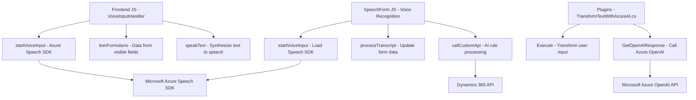

### Análisis Técnico

#### Breve Resumen Técnico
Este repositorio está diseñado para integrar tecnologías como **Azure Speech SDK**, **Azure OpenAI**, y **Microsoft Dynamics CRM** con frontends en JavaScript y un backend de C#. Cada archivo presenta utilidades específicas orientadas al procesamiento de voz y texto, en el contexto de formularios dinámicos en aplicaciones empresariales basadas en Dynamics 365.

#### Descripción de la Arquitectura
La solución tiene una arquitectura híbrida que combina:
- **Frontend de JavaScript**: Para manejo de datos del formulario y generación del procesamiento de voz (sistema accesible).
- **Backend con plugins en C#**: Lógica del negocio y transformación avanzada del texto utilizando Azure OpenAI.
- **Servicios Externos**: Uso extensivo de SDK y APIs en la nube.

La arquitectura se basa principalmente en **Patrones en Capas (n-capas)**: 
1. **Capa de Presentación**: Archivos JavaScript para interacción en frontend.
2. **Capa de Negocio**: Plugins de Dynamics CRM y procesamiento de datos.
3. **Capa de Servicios Externos**: Azure Speech SDK y Azure OpenAI en la nube.

#### Tecnologías Usadas
1. **Lenguajes**: JavaScript para frontend y C# para backend.
2. **Frameworks**: Dynamics CRM y sus APIs (`Xrm.WebApi.online`).
3. **SDK**: Azure Speech SDK para síntesis y reconocimiento de voz, Azure OpenAI para procesamiento de texto estructurado.
4. **APIs HTTP**: Llamadas a endpoints externos (Azure OpenAI, Dynamics API).
5. **Dynamic 365 Integration**: Aprovechando modelos y reglas internas de Dynamics CRM.
6. **Dependencias**:
   - **Frontend**: Dependencia de SDK cargados dinámicamente (`ensureSpeechSDKLoaded`), lo que permite compatibilidad sin paquetes adicionales.
   - **Backend (Plugins)**: Uso de `System.Net.Http`, `Newtonsoft.Json.Linq`, y `Microsoft.Xrm.Sdk` para manipulación de datos y lógica de integración.

#### Diagram Mermaid (GitHub Markdown)

#### Conclusión Final
La solución está bien estructurada y orientada a la integración de servicios externos y plataformas empresariales como **Dynamics 365**. La elección de tecnologías como Azure Speech and OpenAI SDK permite implementar una experiencia accesible y centrada en inteligencia artificial para reconocimiento y síntesis de texto. La arquitectura de **n capas** proporciona modularidad y separación de responsabilidades, lo que facilita el mantenimiento y escalabilidad del proyecto.

La integración con Dynamics 365 y servicios en la nube de Azure proporciona funciones avanzadas de lectura y procesamiento de voz y texto, lo que posiciona esta solución como una herramienta efectiva para automatización empresarial y accesibilidad. Sin embargo, el sistema podría beneficiarse de una configuración más dinámica para gestionar claves API y endpoints, lo que garantizaría flexibilidad en ambientes de producción.