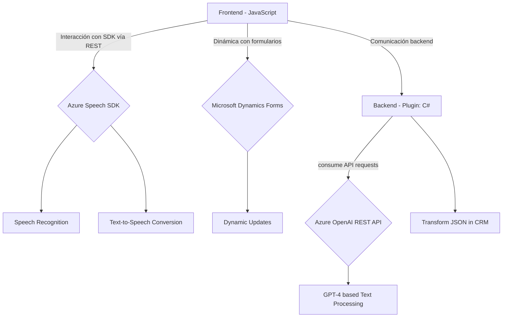

### Breve resumen técnico

La solución presentada corresponde a **un sistema cliente-servidor con procesamiento sobre formularios dinámicos**. En el lado del cliente (frontend), se integran capacidades avanzadas de reconocimiento y síntesis de voz mediante el **Azure Speech SDK**. Por otro lado, en el servidor, se implementa un plugin en C# para **Microsoft Dynamics CRM**, el cual interactúa con **Azure OpenAI** para transformar texto en contenido estructurado JSON.

---

### Descripción de arquitectura

#### Frontend:
1. **Modularidad para la interacción de voz:** Las funciones en los archivos JavaScript procesan formularios y datos mediante el Azure Speech SDK. Este componente del frontend actúa como un **microservicio cliente** que transforma voz en datos procesables o texto en síntesis de voz.
2. **Dynamic Form Handling:** Implementación orientada al rastreo dinámico y modificación de campos en tiempo real, vinculándose a formularios específicos mediante valores visibles y contextos.
3. **Eventos de tipo callback:** El diseño se basa en la ejecución de código solo después de condiciones específicas, como la carga del SDK.

#### Backend:
1. **Plugin microservicio para Dynamics CRM:** El archivo `TransformTextWithAzureAI.cs` sigue una arquitectura plugin al implementar la interfaz estándar `IPlugin` de Dynamics CRM. Este patrón genera extensibilidad para eventos y flujos en CRM.
2. **Integración SaaS:** Usa **AWS/OpenAI APIs** para realizar transformaciones bajo normas específicas, simulando una arquitectura basada en microservicios o serverless, donde el procesamiento avanzado ocurre en el backend.

---

### Tecnologías usadas

1. **Frontend:**
   - **JavaScript** como lenguaje base.
   - **Azure Speech SDK** para síntesis y reconocimiento de voz.
   - **Microsoft Dynamics CRM SDK (Xrm WebApi)** para formularios dinámicos y ejecución de interacciones.

2. **Backend (C# Plugin):**
   - **Microsoft Dynamics CRM SDK** (`IPlugin`) para procesamiento de lógica de negocio personalizado.
   - **Azure OpenAI (GPT Models)** para transformación de textos mediante inteligencia artificial.
   - Serialización/des-serialización en JSON mediante **Newtonsoft.Json**.
   - **System.Net.Http**: Para realizar llamadas HTTP RESTful a Azure OpenAI.
   - **Dependency Injection & Service Provider** como base de programación extensible.

---

### Diagrama Mermaid válido para GitHub

---

### Conclusión final

#### Tipo de solución:
El repositorio presenta una solución orientada a **capacidad extendida de interacción en formularios**, combinando procesos de voz (frontend) y procesamiento estructurado (backend) en un sistema de **cliente-servidor** con complementos (plugins) para **Microsoft Dynamics CRM**.

#### Arquitectura:
- **Cliente:** Modular con enfoque en tres capas: síntesis de datos (Azure SDK), captura dinámica de valores (DOM), y comunicación con backend.
- **Servidor:** **Monolito orientado a plugins** para CRM, sin arquitectura explícitamente distribuida en microservicios.

#### Dependencias externas:
- **Azure Speech SDK** y **Azure OpenAI API** para voz y IA.
- **Microsoft Dynamics CRM SDK** para interoperabilidad y gestión de formularios y eventos.
- **JSON libraries** y **HTTP libraries** para comunicación y manipulación de datos.

Este diseño es adecuado para extensibilidad y escenarios centrados en voz, IA y automatización del flujo de trabajo. Mientras que el frontend es modular y desacoplado del backend, ambos componentes dependen directamente de los servicios de Microsoft Azure, lo que implica gestión de credenciales, mantenimiento de APIs y control de acceso como tareas esenciales.