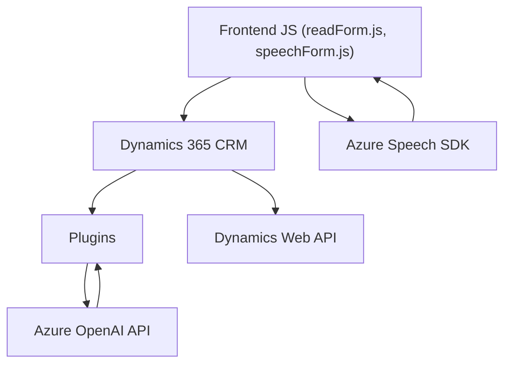

### Breve resumen técnico

El repositorio describe una solución integrada que conecta un frontend (basado en JavaScript) con Dynamics 365 CRM, utilizando Microsoft Azure Speech SDK y Azure OpenAI para gestionar y transformar datos relacionados con formularios mediante síntesis y reconocimiento de voz, además de transformación inteligente de texto utilizando inteligencia artificial.

---

### Descripción de arquitectura

La solución parece utilizar una arquitectura de **n capas**. Veríamos las siguientes capas de la aplicación:

1. **Capa de presentación (Frontend)** 
   - Contiene archivos como `readForm.js` y `speechForm.js`, donde se generan interacciones con formularios y se invocan servicios de procesamiento como el SDK de Azure Speech.

2. **Capa de lógica de negocios (Plugins en CRM)**
   - Plugins como `TransformTextWithAzureAI.cs` interactúan con Dynamics 365 CRM, aplicando reglas de negocio específicas y delegando la ejecución de tareas de transformación hacia Azure OpenAI. 

3. **Capa de servicios externos**
   - Se utiliza integración con servicios externos: el modelo de Azure OpenAI para interpretar y transformar texto, y Azure Speech SDK para reconocimiento y síntesis de voz.

El sistema tiene elementos de integración con APIs externas, permitiendo la comunicación entre distintos servicios, pero no se divide completamente en microservicios. La inclusión de plugins y SDK externals permite categorizarlos como una aplicación monolítica con fuerte orientación hacia la modularidad.

---

### Tecnologías, frameworks y patrones usados

1. **Tecnologías**:
   - **JavaScript/ES6**: En la capa de frontend, para procesar formularios y utilizar las APIs.
   - **C#**: En el plugin de Dynamics CRM para extensibilidad y lógica de negocios.
   - **Azure Platform**: Se usa Azure Speech SDK para reconocimiento y síntesis de voz, además de Azure OpenAI para transformación y procesamiento de texto.
   - **Dynamics 365 CRM Web API**: Para administrar datos del CRM y conectar con entidades y atributos del sistema.
   
2. **Frameworks**:
   - Microsoft Dynamics CRM SDK, que facilita la configuración de plugins en el CRM.
   - Azure Speech SDK para reconocimiento y transformación de voz a texto.
   - Azure OpenAI SDK para texto generado y transformado con GPT.

3. **Patrones de arquitectura**:
   - **N capas**: Separación de responsabilidades por capas (Frontend, Lógica de negocio y Servicios externos).
   - **Plugin Architecture**: Para la implementación específica en Microsoft Dynamics CRM.
   - **Integración con API**: Comunicación con servicios REST como Azure Speech y Azure OpenAI mediante HTTP/REST.
   - **Modularidad**: Código organizado en funciones con responsabilidades únicas y específicas (lectura de datos, síntesis, reconocimiento, transformación).

---

### Dependencias o componentes externos

1. **Azure Speech SDK**:
   - Utilizado para síntesis de voz y reconocimiento de voz. Cargado dinámicamente desde el CDN de Azure.

2. **Azure OpenAI API**:
   - Interfaz en C# que permite la interacción del plugin con GPT-4 para la transformación inteligente de texto y generación de respuestas en formato JSON.

3. **Dynamics 365 Web API**:
   - Los archivos de frontend, en conjunto con el plugin de C#, interactúan con Dynamics 365 para obtener, manipular y almacenar datos asociados con formularios dinámicos.

4. **Front-end**: 
   - Podría estar ejecutándose dentro de Dynamics 365 como parte de sus formularios y dependiente de las API de su plataforma.

---

### Diagrama Mermaid válido para GitHub

---

### Conclusión final

Este proyecto se construye sobre una solución híbrida basada en Dynamics 365 CRM con interacción directa entre el **frontend** en JavaScript, plugins en C#, y dos servicios de Microsoft Azure (Speech SDK y OpenAI). Tiene una arquitectura **n capas**, con una fuerte modularización de responsabilidades a través de funciones y métodos, y utiliza el **patrón de plugin** en su capa de lógica de negocios dentro del CRM. 

La integración con servicios externos es crítica para cumplir con sus funcionalidades principales (reconocimiento de voz, síntesis de voz, transformación de texto). En cuanto a mejoras futuras, el manejo de credenciales debería ser más seguro y abstraído de los archivos base, utilizando servicios de almacenamiento seguro (como **Azure Key Vault**).