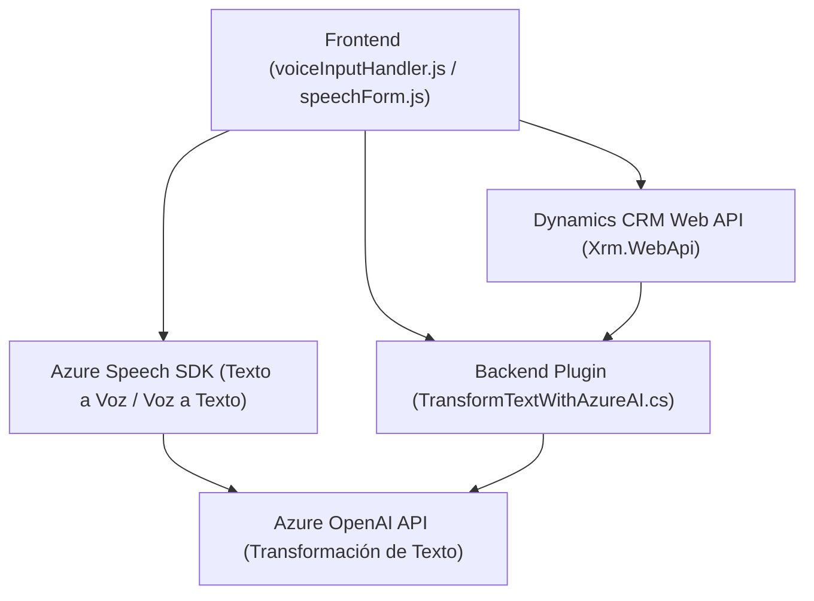

## Breve resumen técnico

El repositorio contiene archivos relacionados con la integración de servicios de entrada de voz y procesamiento de texto mediante el Azure Speech SDK y Azure OpenAI. Estos archivos están aparentemente diseñados para su uso en un entorno Dynamics CRM, como aplicaciones personalizadas o extensiones que interactúan con formularios y APIs.

---

## Descripción de arquitectura

### Tipo de solución
La solución está orientada al desarrollo de funcionalidades específicas, en particular el manejo de datos de formularios, la entrada de voz y la transformación avanzada de texto utilizando inteligencia artificial. Técnicamente, puede ser clasificada como una **solución híbrida Web/CRM** que comunica backend y frontend con servicios externos.

### Arquitectura utilizada:
1. **Plugins para Dynamics CRM:** El archivo `TransformTextWithAzureAI.cs` usa el patrón de plugins del CRM (orientado a eventos desencadenados por operaciones del sistema) y funciona como un servicio backend.
2. **Modularización:** En los archivos del frontend (`voiceInputHandler.js` y `speechForm.js`), las funciones están separadas por responsabilidades específicas siguiendo una estructura clara.
3. **Procesamiento orientado a servicios externos:** Los sistemas interactúan directamente con el SDK y las APIs de Azure Speech y OpenAI para funcionalidades avanzadas, como síntesis de voz y comprensión del lenguaje.
4. **Componentes de frontend estándar:** Los scripts de JavaScript (ubicados en `FRONTEND/JS`) implican que el frontend está orientado a interactuar con formularios en una aplicación web. La ausencia de un marco frontend como React o Angular sugiere una implementación ligera basada en scripts con integración HTML.

En general, la arquitectura se orienta hacia **n capas**, con una división clara entre las capas de presentación (frontend), lógica de negocio (plugins en C#), y acceso a servicios externos.

---

## Tecnologías usadas

1. **Frontend:**
    - **JavaScript:** Para la lógica de integración con el SDK y operaciones con los formularios.
    - **Azure Speech SDK:** Para síntesis y reconocimiento de voz mediante servicios de Azure.
    - **Dynamics CRM APIs:** Para manipular datos de formularios y llamar a Custom APIs en el CRM.

2. **Backend:**
    - **C#:** Implementación del plugin de Dynamics CRM.
    - **Microsoft Dynamics SDK:** Contiene interfaces y servicios para interactuar con la plataforma CRM.
    - **Azure OpenAI API:** Utilizada para procesamiento avanzado de texto mediante inteligencia artificial.
    - **System.Net.Http:** Para enviar solicitudes a APIs externas.
    - **Newtonsoft.Json y System.Text.Json:** Para manipulación y serialización de datos JSON.

3. **Patrones:**
    - **Lazy Loading:** Implementado en el frontend mediante la carga bajo demanda del Azure Speech SDK.
    - **Encapsulación:** Cada función y método trabaja de manera independiente para cumplir con tareas específicas.
    - **Plugin Pattern:** Usado en el backend para extender funcionalidad de Dynamics CRM.

---

## Diagrama Mermaid válido para GitHub

Este diagrama muestra cómo interactúan los elementos principales de la solución:

---

## Conclusión final

1. **Tipo de solución:** La solución se puede categorizar como una **plataforma CRM extendida con APIs y SDKs externos** para procesamiento de lenguaje natural y generación/reconocimiento de voz.
2. **Tecnologías:** Utiliza tecnologías modernas e integraciones robustas con Azure Speech SDK y Azure OpenAI, junto con herramientas especializadas del ecosistema Dynamics CRM.
3. **Arquitectura:** Adopta un modelo de **n capas**, dividiendo responsabilidades entre frontend (interacción en formularios), servicios externos (Azure SDK y APIs) y backend (plugin para eventos de negocio en Dynamics).
4. **Dependencias clave:** Según los archivos analizados, incluye Azure Speech SDK, Azure OpenAI API y Microsoft Dynamics CRM SDK como principales dependencias externas.
5. **Recomendaciones:** Para mejorar la estructura del código, podría emplearse un enfoque más orientado a objetos y patrones comunes (Factory, Repository) para mejorar la mantenibilidad, y una posible separación en microservicios según las funcionalidades más críticas de entrada de voz y transformación textual.