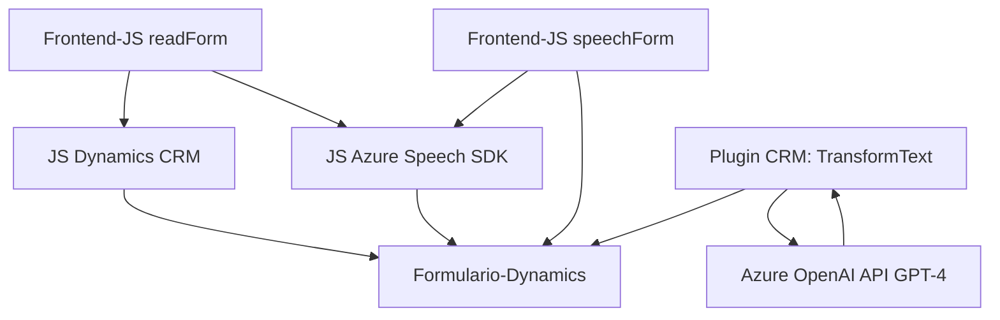

### Breve resumen técnico:
El repositorio contiene funcionalidades que integran:
1. **Frontend (JavaScript):** Procesos de síntesis y reconocimiento de voz utilizando **Azure Speech SDK**, complementados con interacciones en tiempo real para la lectura y modificación de formularios en **Microsoft Dynamics CRM**.
2. **Backend (C#):** Plugins en Dynamics CRM que utilizan **Azure OpenAI** para transformar texto en estructuras JSON ajustándose a normas específicas.

### Descripción de arquitectura:
Este sistema muestra una arquitectura basada en **n capas**, dado que divide claramente:
1. **Frontend:** Interacciones directamente con usuarios mediante JavaScript.
2. **Integración con internals CRM:** Plugins que procesan datos en **Dynamics CRM**.
3. **Servicios externos:** Uso de **Azure Speech SDK** y **Azure OpenAI API** como componentes externos para agregar capacidad avanzada en sintetización y análisis de texto.

**Patrones usados:**
- **Facade Pattern:** Usado extensivamente para simplificar llamadas a APIs externas (e.g. Azure Speech SDK, Azure OpenAI).
- **Modular Pattern:** Archivos organizados según tareas específicas (sintetización, reconocimiento, y transformación de datos).
- **Plugin Architecture:** La integración en Dynamics CRM se realiza como un plugin implementando `IPlugin`.

### Tecnologías usadas:
1. **Frontend:**  
   - **JavaScript.**  
   - **Azure Speech SDK:** Usado para sintetizar texto y ejecutar reconocimiento de voz.  
   - **Microsoft Dynamics CRM (Xrm.WebApi):** Para interactuar con el formulario del CRM.  
2. **Backend:**  
   - **C# .NET Framework/SDK.**  
   - **Azure OpenAI API (GPT-4):** Usado para transformar texto en formato estructurado.  

### Dependencias y componentes externos:
1. **Servicios externos:**  
   - **Azure Speech SDK:** Para sintetización y reconocimiento de voz.  
   - **Azure OpenAI/GPT-4:** Procesamiento avanzado de texto vía API REST.  
2. **SDKs internos:**  
   - **Dynamics CRM SDK:** Administración de formularios y búsqueda de campos.  
   - **System.Net.Http:** Para enviar datos a APIs externas.  
   - **Newtonsoft.Json** o **System.Text.Json:** Manejo de objetos JSON derivados de procesos IA.

---

### Diagrama **Mermaid** válido para GitHub:

### Conclusión final:
El repositorio combina tecnologías modernas como **Azure Speech SDK** y **Azure OpenAI** junto con operaciones en **Microsoft Dynamics CRM** utilizando C# y JavaScript. La arquitectura general del sistema es **n capas** con integración modular, donde cada módulo cumple una función claramente definida. El uso extensivo de servicios externos como **Azure Speech SDK** y APIs de **OpenAI** agrega capacidades avanzadas de IA y voz al sistema.