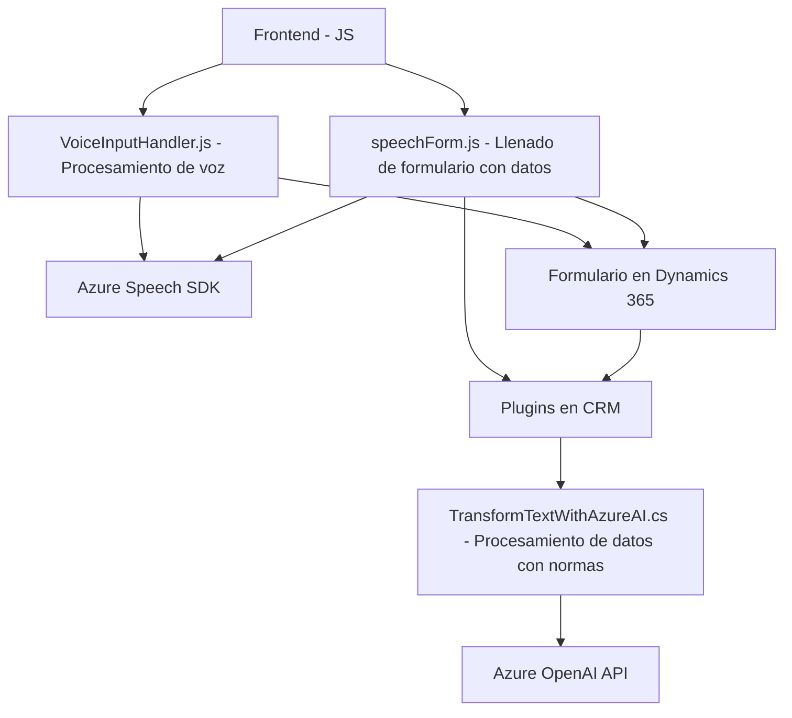

### Breve resumen técnico
El repositorio parece ser un solución de software compuesta por varias capas, que integra frontends en JavaScript, plugins para Microsoft Dynamics CRM y APIs externas como Azure Speech y Azure OpenAI. Los componentes están diseñados para interactuar entre sí: el frontend realiza operaciones de entrada y procesamiento de datos, mientras que el backend ejecuta lógica personalizada para transformar texto mediante inteligencia artificial. En todas las piezas, el uso de Azure y Dynamics CRM es un eje central.

---

### Descripción de arquitectura
La solución sigue una arquitectura **n-capas** con integración explícita de servicios externos como el SDK de Speech de Azure y la API de OpenAI. El diseño incluye capas modularizadas:

1. **Frontend (en JavaScript):**
   - Gestiona la interacción del usuario, permitiendo la entrada de voz, la extracción de datos del formulario y el envío/recepción de información procesada con la API de Azure y el plugin de Dynamics CRM.
   
2. **Plugin de Microsoft Dynamics CRM:** 
   - Ejecuta lógica específica en el backend, transformando datos textuales desde el frontend invocado a través de APIs según reglas específicas mediante Azure OpenAI.

3. **Servicios externos (Azure Speech SDK, Azure OpenAI):**
   - Proveen procesamiento de voz, conversión de texto a voz, reconocimiento de comando y generación de texto estructurado.

En conjunto, la solución actúa como un sistema **interoperable con una arquitectura distribuida**, donde cada componente está diseñado para realizar tareas especializadas mediante desacoplamiento lógico.

---

### Tecnologías usadas
1. **Frontend (JavaScript):**
   - Frameworks relacionados con Dynamics 365 y Xrm API para manipulación de formularios.
   - SDK de **Azure Speech** para reconocimiento de voz y síntesis de texto a voz.
   - Programación de eventos y uso extensivo del paradigma asíncrono.

2. **Backend (C# - Plugins en Dynamics CRM):**
   - Usa el SDK de Dynamics CRM para extender y personalizar la funcionalidad del sistema.
   - API REST con `HttpClient` para comunicación con OpenAI.
   - Librerías auxiliares como `Newtonsoft.Json` y `System.Text.Json` para manejo de JSON.

3. **Servicios externos:**
   - **Azure Speech SDK**: Provee capacidades de voz (texto a voz y reconocimiento de voz).
   - **Azure OpenAI**: Manipulación de texto estructurado y transformación basada en IA.

---

### Diagrama Mermaid válido para GitHub
El siguiente diagrama representa la relación entre los componentes clave del sistema.

---

### Conclusión final
Esta solución es una plataforma de procesamiento inteligente centrada en aprovechar características de interacción mediante voz, con un frontend Javascript que opera sobre formularios en un entorno CRM (Dynamics 365). Se integra con Azure Speech SDK y Azure OpenAI para proporcionar capacidades avanzadas de ingreso de datos y síntesis/conversión de información contextual. La arquitectura puede clasificarse como una **solución n-capas con integración de componentes distribuidos** que interactúan mediante APIs.  
  
Es una implementación técnica eficiente para escenarios que requieren interacción fluida entre un sistema CRM y servicios cognitivos avanzados.