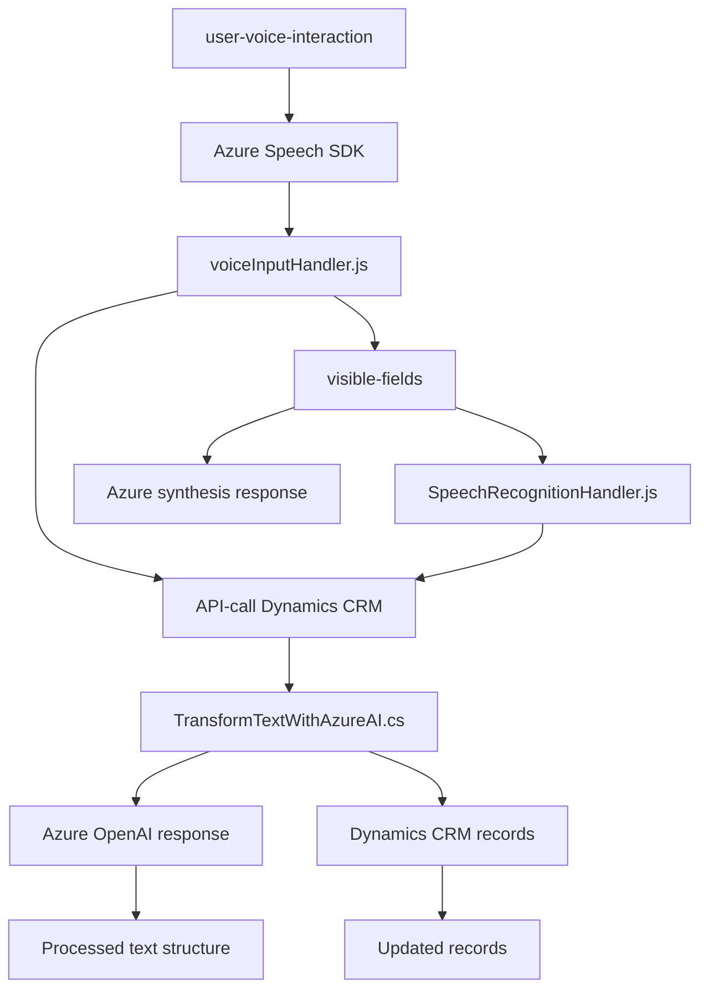

### Breve resumen técnico
El repositorio describe una solución diseñada para interactuar con formularios de Dynamics CRM, utilizando capacidades de entrada y síntesis de voz mediante Azure Speech SDK y transformación de texto con Azure OpenAI. Los módulos principales abarcan manipulación de voz, reconocimiento de texto, interacción de flujos IA, y un plugin específico que se integra con Dynamics CRM para enriquecer procesos empresariales.

---

### Descripción de la arquitectura
La solución cuenta con una arquitectura **modular de n capas**, estructurada de la siguiente manera:
1. **Presentación (Frontend)**:
   - Archivos JS como `voiceInputHandler.js` y `speechRecognitionHandler.js` gestionan la entrada/salida de datos en el navegador a través de la interacción con formularios y la síntesis de voce.
2. **Lógica y Procesamiento**:
   - Los archivos anteriores también incluyen lógica para normalización de datos y procesamiento de la voz.
   - La capa con el plugin (`TransformTextWithAzureAI.cs`) maneja la lógica avanzada, transformando texto mediante Azure OpenAI.
3. **Integración con Servicios Externos**:
   - La solución interactúa directamente con Azure Speech SDK (Frontend) y Azure OpenAI (Backend - Plugin).
   - Utiliza Dynamics 365 APIs para manejar datos en tiempo real (CRUD sobre formulación dinámica).

Este diseño es modular y puede evolucionar hacia **microservicios**, ya que las dependencias externas y accesos de datos están bien separados.

---

### Tecnologías usadas
1. **Frontend**:
   - **JavaScript**: Para la gestión de voz y visualización en navegador.
   - **Azure Speech SDK**: Reconocimiento de voz y síntesis de texto.
   - **Dynamics CRM Web API (Xrm.WebApi)**: Acceso a datos.
2. **Backend**:
   - **C#**: Implementación del plugin bajo la arquitectura de Dynamics CRM.
   - **Azure OpenAI API (GPT-4)**: Procesamiento avanzado de texto.
   - **Microsoft.Xrm.Sdk**: Framework para interacción con Dynamics CRM.
   - **HTTP Frameworks**: `HttpClient` para llamadas a servicios externos.
3. **Patrones**:
   - Modularidad.
   - Integración con SDKs externos.
   - Control de flujo en frontend y backend.
   - En una capa, uso del patrón `Plug-in` de Dynamics CRM.

---

### Diagrama Mermaid válido para GitHub
Este diagrama muestra las interacciones principales entre componentes y dependencias de la solución.

---

### Conclusión final
La solución presenta una estructura modular integrada con tecnologías de Microsoft y Azure, diseñada para mejorar la experiencia del usuario en interacción con formularios, utilizando capacidades de voz e IA. Su arquitectura es clara y permite adaptaciones futuras, como:
- Evolución hacia microservicios.
- Inclusión de nuevos SDKs o tecnologías relacionadas con procesamiento de voz y texto.

Este diseño resulta escalable, eficiente, y fácil de mantener gracias a la separación entre lógicas funcionales, dependencias externas y capas de procesamiento.