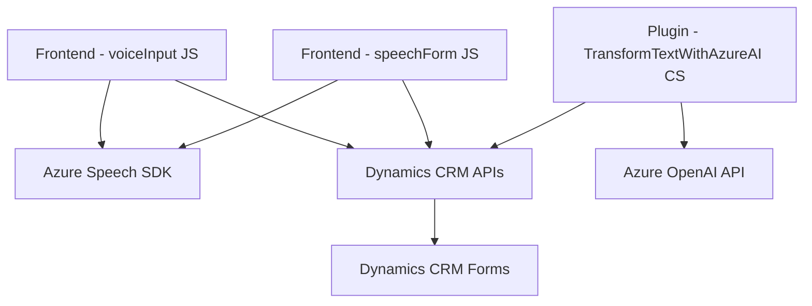

### Breve resumen técnico
El repositorio contiene tres componentes funcionales principales:
1. **Frontend (JavaScript)**: Dos archivos, `voiceInput.js` y `speechForm.js`, que implementan funcionalidades de entrada y procesamiento de voz utilizando el SDK Azure Speech, junto con integración con formularios Dynamics CRM.
2. **Plugin (C#)**: `TransformTextWithAzureAI.cs`, que actúa como un plugin de Dynamics CRM para transformar texto a JSON mediante la API Azure OpenAI (GPT-4).

### Descripción de arquitectura
La solución tiene una arquitectura de **n-capas** orientada a servicios:
- **Capa de Presentación**: Implementada en los archivos JavaScript del frontend, que interactúan con usuarios y procesan datos de formularios CRM.
- **Capa de Negocio**:
  - Funcionalidades JavaScript realizan operaciones como transformar y sintetizar texto, y asignar valores en formularios CRM.
  - El plugin de C# actúa como el núcleo para transformar texto mediante reglas específicas aprovechando Azure OpenAI.
- **Capa de Integración/Servicios**: Conexión con SDK de Azure Speech y la API Azure OpenAI para operaciones de voz y transformación de texto avanzada.

---

### Tecnologías usadas
1. **JavaScript**:
   - Azure Speech SDK: Para síntesis y reconocimiento de voz.
   - APIs de Dynamics CRM: Para acceder y manipular formularios CRM.
2. **C#**:
   - Dynamics CRM SDK (`Microsoft.Xrm.Sdk`): Para interactuar con el entorno CRM como un plugin.
   - Azure OpenAI API: Para transformación avanzada de texto usando GPT-4.
   - JSON Libraries (`System.Text.Json`, `Newtonsoft.Json.Linq`): Para manejo de datos estructurados.
3. **Patterns and Architecture**:
   - **Modular Design**: Cada component está organizado de forma funcional.
   - **Plugin Pattern**: Integración en Dynamics CRM para el procesamiento de texto (que se ejecuta según eventos definidos en CRM).
   - **Service-Oriented Architecture (SOA)**: Dependencias externas como SDKs de Azure y API GPT se encapsulan como servicios.
   - **Adapter Pattern**: Adaptación de datos de formularios visibles para su procesamiento.
   - **Dependency Injection**: Empleada en el plugin para acceder dinámicamente a servicios CRM.

---

### Diagrama Mermaid válido para GitHub

---

### Conclusión final
La solución es un sistema integrado para manejar entrada y salida de voz, transformación avanzada de texto con IA y mapeo dinámico en formularios de Dynamics CRM. Presenta una arquitectura **n-capas orientada a servicios**, destacando su modularidad y capacidad de integrar servicios externos (Azure Speech y OpenAI). Es ideal para entornos donde la interacción con voz y la inteligencia artificial amplían las funcionalidades de procesamiento de datos CRM, promoviendo tanto la automatización como la mejor experiencia de usuario.