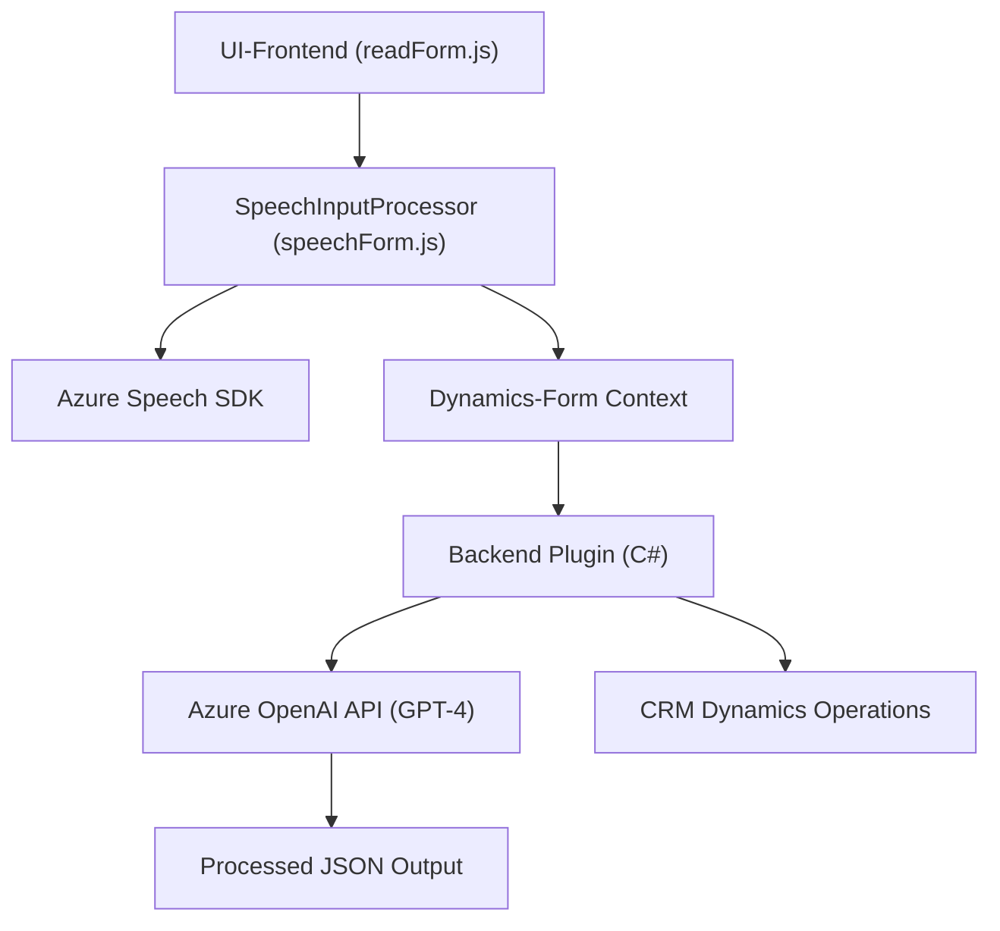

### Breve resumen técnico:
El repositorio parece ser parte de una solución destinada a una plataforma interactiva que mejora la experiencia del usuario en **Dynamics 365**, añadiendo capacidades basadas en reconocimiento de voz, síntesis de voz y mapeo inteligente de datos al formulario. Además, incluye un plugin inteligente que interactúa con Azure OpenAI para transformar textos según reglas específicas.

---

### Descripción de la arquitectura:
1. **Tipo de solución**:
   - **Sistema híbrido cliente-servidor**, donde el frontend facilita la interacción entre el usuario y el formulario mediante entrada y salida de voz. El backend utiliza plugins de **Dynamics 365** y servicios externos como Azure OpenAI para mejorar la funcionalidad del sistema.

2. **Patrón arquitectónico**:
   - **N-capas**:
     - **Capa de presentación**: Archivos JavaScript en el frontend (`readForm.js`, `speechForm.js`) sirven como capa de interacción con el usuario.
     - **Capa lógica de negocio**: Plugin `TransformTextWithAzureAI.cs` procesa las solicitudes y comunica con APIs externas.
     - **Capa de integración/servicios**: Se integra con Azure Speech SDK y Azure OpenAI a través de APIs.
   - Incorporación modular y patrones de integración de SDK aseguran una arquitectura bien estructurada.

3. **Principales patrones observados**:
   - **Event-Driven**: Callbacks en JavaScript activados por eventos.  
   - **SDK Integration**: Uso de SDKs externos como Azure Speech y Dynamics 365.
   - **Plugin Pattern** para Dynamics CRM.

---

### Tecnologías usadas:
1. **Frontend**:
   - **JavaScript** para interacción en tiempo real y manejo de formularios en Dynamics 365.
   - **Azure Speech SDK** para entrada y salida de voz.

2. **Backend (plugins)**:
   - **C#** y **Dynamics 365 SDK** para extender funcionalidad.
   - **Azure OpenAI API (GPT-4)** para transformación inteligente de texto.

3. **Dependencias**:
   - Azure Speech SDK (https://aka.ms/csspeech/jsbrowserpackageraw).
   - Azure OpenAI (GPT-4).  
   - Newtonsoft.Json y System.Text.Json para manejo de JSON.  
   - Dynamics 365 SDK.

---

### Diagrama Mermaid:

---

### Conclusión final:
El repositorio refleja una solución tecnológica especializada para **Dynamics 365**, orientada a una experiencia de usuario más rica e inclusiva mediante entrada y salida de voz. Se integra perfectamente con servicios externos como **Azure Speech SDK** y **Azure OpenAI API**, además de aprovechar patrones bien definidos como **n-capas** y **SDK Integration**. La separación de responsabilidades entre frontend y backend asegura modularidad y escalabilidad.