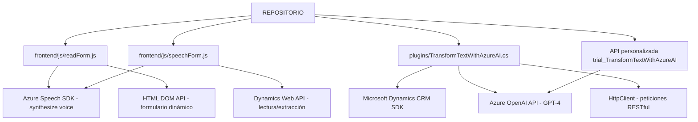

### Breve Resumen Técnico

Tras analizar la estructura del repositorio y los archivos proporcionados, se puede concluir que el proyecto se trata de una solución **integral y modular** que conecta una interfaz de usuario (Frontend) con servicios externos en la nube (Azure Speech SDK y Azure OpenAI API) y funciones internas de Dynamics CRM. El enfoque del sistema está orientado hacia la accesibilidad, mejora de la experiencia del usuario e implementación de inteligencia artificial mediante la conversión de texto en voz y reconocimiento energético de voz para la interacción con interfaces de formularios.

---

### Descripción de Arquitectura

La arquitectura parece estar distribuida con un diseño en **capas interactivas** y utiliza elementos de **arquitectura orientada a servicios (SOA)**:

1. **Frontend:** Desarrollado en JavaScript, interactúa con el usuario mediante formularios y permite la conversión entre texto y voz (y viceversa). Utiliza SDKs de terceros como Azure Speech SDK y una API personalizada específica para integrar con Azure OpenAI.
2. **Backend:** Dynamics CRM utiliza plugins personalizados escritos en C# para procesar texto mediante Azure OpenAI. Proporciona capacidades extensivas de datos de formularios estructurados y manipulación de contenido basado en IA. 
3. Integración a través de **SDKs y APIs** externas: los componentes se comunican principalmente con servicios provistos en la nube (Azure Speech y OpenAI) usando solicitudes HTTP y SDKs específicos.

---

### Tecnologías Usadas

1. **Frontend:** 
   - **JavaScript:** Lenguaje central para la ejecución de lógica en el navegador.
   - **Azure Speech SDK:** Para la síntesis y reconocimiento de voz.
   - **HTML DOM API:** Manipulación directa de elementos HTML.
   - **Dynamics Web API (Xrm.WebApi):** Utilizado para interactuar con datos del backend CRM.

2. **Backend:**
   - **C#:** Lenguaje principal usado para los plugins (Dynamics CRM).
   - **Microsoft Dynamics CRM SDK:** Para la interacción y personalización del entorno CRM.
   - **Azure OpenAI API (GPT):** Para ejecutar transformaciones de texto mediante modelos de lenguaje.
   - **HttpClient:** Para implementar patrones como proxy para integrarse con servicios RESTful.
   - **JSON:** Para manipular y enviar datos en formato estructurado.

---

### Diagrama Mermaid Válido para GitHub

---

### Conclusión Final

Esta solución representa parte de una arquitectura modular distribuida, donde su componente principal (Frontend) interactúa directamente con usuarios para recogida de datos de formularios y les provee accesibilidad mediante síntesis y reconocimiento de voz. Los datos capturados se comunican con un backend que incluye plugins personalizados en Dynamics CRM, enriquecidos mediante AI de Azure OpenAI.

Es un diseño **SOA (Service-Oriented Architecture)** con integración de SDKs externos y servicios RESTful, destacando la capacidad de utilizar componentes externos para inteligencia artificial y accesibilidad.

#### Aspecto Destacado
La solución aprovecha enormemente el ecosistema de **Azure** mediante sus servicios (Azure Speech y Azure OpenAI), lo que reduce la complejidad de infraestructura interna mientras garantiza escalabilidad y adaptabilidad.