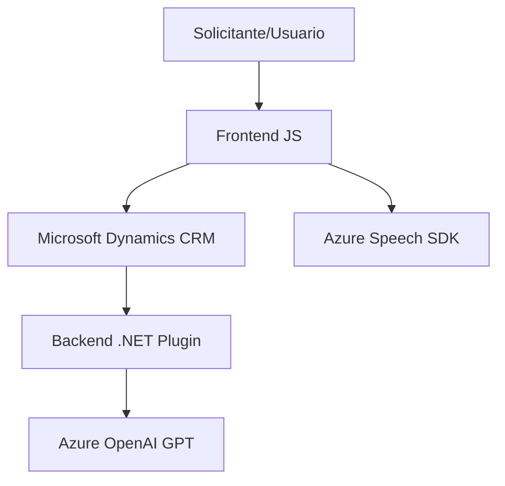

### Breve resumen técnico
Este repositorio contiene componentes que forman parte de una solución híbrida para manipulación de formularios en un entorno CRM (probablemente Microsoft Dynamics/365). La solución integra funcionalidades frontend mediante JavaScript y un backend .NET que utiliza el servicio de Azure OpenAI. En el frontend, los módulos interactúan con los SDKs de Azure Speech para reconocimiento y síntesis de voz. En el backend, se extiende la funcionalidad de transformación de texto mediante un plugin que utiliza modelos de GPT alojados en Azure.

---

### Descripción de arquitectura
La solución se clasifica como **híbrida de integración de servicios**, con lógica distribuida entre frontend y backend, apoyada en servicios externos de Microsoft Azure (Azure Speech SDK y Azure OpenAI). Se utiliza un esquema de arquitectura en capas:
1. **Frontend** (JS): Administración de formularios y operaciones de síntesis/reconocimiento de voz que interactúan directamente con los usuarios.
2. **Backend** (.NET): Flujo de transformación y procesamiento con OpenAI, desplegado como plugin dentro de Dynamics CRM.
3. **Servicios externos**: Azure Speech y Azure OpenAI actúan como mecanismos adicionales para procesar voz y texto.

### Tecnologías usadas
1. **Frontend**:
   - **JavaScript**: La lógica principal de manipulación del formulario.
   - Azure Speech SDK para reconocimiento y síntesis de voz.
   
2. **Backend**:
   - **Plugin .NET** con C# (Microsoft Dynamics CRM).
   - Frameworks: `System.Net.Http`, `Newtonsoft.Json.Linq`, `System.Text.Json`.

3. **Servicios externos**:
   - **Azure Speech SDK**: Configuración, Audio y síntesis de voz.
   - **Azure OpenAI (GPT)**: Transformación avanzada de texto operando como un microservicio REST.

### Diagrama Mermaid válido para GitHub

---

### Conclusión final
El repositorio implementa una solución avanzada para la integración de voz y texto en un entorno CRM. Aprovecha servicios de Microsoft Azure y sigue una arquitectura modular para garantizar la separación de preocupaciones entre frontend, backend y servicios externos. La elección de Azure para la carga dinámica del SDK y la API OpenAI asegura flexibilidad y escalabilidad. Este esquema es robusto y puede extenderse fácilmente para nuevos requerimientos, como agregar soporte para otros idiomas o reglas de negocio más complejas.