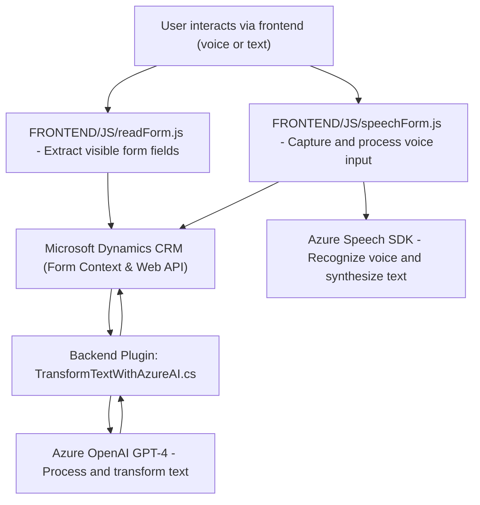

### Breve resumen técnico
El proyecto parece ser una solución híbrida destinada a integrar y automatizar el procesamiento de formularios mediante el uso de tecnologías como el reconocimiento de voz (Azure Speech SDK) y la inteligencia artificial (Azure OpenAI GPT). Se encuentra construida sobre Microsoft Dynamics CRM y consta de un frontend basado en JavaScript (archivos en la carpeta `FRONTEND/JS`) que interactúa directamente con el CRM, así como un backend basado en un plugin .NET.

---

### Descripción de arquitectura
#### Arquitectura general:
- **Tipo de solución:** La estructura sugiere una integración entre frontend, backend y servicios externos para el control y procesamiento de formularios en un CRM. En esencia, es una solución híbrida que combina una aplicación frontend (procesamiento de voz/formularios) con un backend extensible (plugin para CRM).
- **Tipo de arquitectura:** 
  - El sistema global sigue un **modelo de arquitectura n-capas**, común en desarrollos basados en plataformas como Microsoft Dynamics CRM. Las capas observadas son:
    - **Presentación:** Frontend desarrollado en JavaScript para procesamiento de salida e integración con la plataforma CRM.
    - **Negocio:** Plugin de .NET (`TransformTextWithAzureAI`) que encapsula lógica de negocio y realiza operaciones de procesamiento de texto con Azure GPT-4.
    - **Datos:** Integración directa con Dynamics CRM para persistencia y lectura/escritura de datos.

#### Aspectos adicionales:
- **Integración con servicios externos:** Se realiza mediante API para consumir Azure Speech SDK y Azure OpenAI, utilizando HTTP.
- **Modularidad:** Las funciones en el frontend y en el plugin están estructuradas para tareas específicas, lo que promueve facilidad de mantenimiento y escalabilidad.

---

### Tecnologías usadas
1. **Frontend:**
   - JavaScript (vanilla) para la lógica de procesamiento de voz y datos del formulario.
   - Azure Speech SDK para síntesis y reconocimiento de voz.
   - Microsoft Dynamics CRM Web API (`Xrm.WebApi`) para interactuar con los datos del CRM.

2. **Backend:**
   - .NET Framework/C#.
   - Microsoft Dynamics SDK (`Microsoft.Xrm.Sdk`) para extensibilidad del CRM.
   - API de Azure OpenAI para transformar texto utilizando modelos de inteligencia artificial (GPT-4).
   - HTTP (`System.Net.Http`) y JSON (`System.Text.Json` y `Newtonsoft.Json`) para comunicación externa con APIs.

3. **Patrones:**
   - **Arquitectura basada en servicios externos:** Conexión directa con Azure Speech SDK y OpenAI.
   - **Carga condicional:** Validación dinámica en el frontend para la carga del SDK.
   - Plugin extensible para integrar CRM mediante el patrón de `IPlugin`.

4. **Dependencias principales:**
   - Speech SDK de Azure (cargado dinámicamente en el navegador).
   - Azure OpenAI.
   - Microsoft Dynamics Web API para CRM.

---

### Diagrama Mermaid válido para GitHub

---

### Conclusión final
La solución presentada es una eficiente integración entre Windows Dynamics CRM, servicios de Azure y un frontend en JavaScript. Es capaz de automatizar la captura de datos en formularios mediante dos enfoques (voz y texto) y de procesarlos y transformarlos mediante inteligencia artificial. La arquitectura n-capas utilizada (presentación, negocio, datos) permite modularidad y escalabilidad, mientras que el uso de servicios externos fomenta la productividad sin depender de infraestructura adicional. Sin embargo, un aspecto mejorable sería la flexibilización del método de configuración de normas en el backend para admitir configuraciones más dinámicas sin dependencias rígidas.