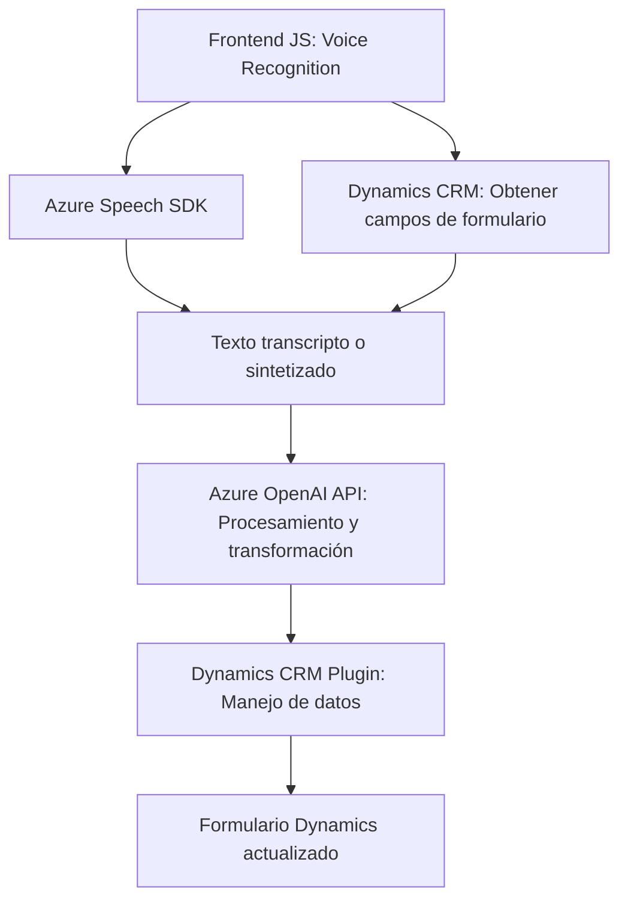

### Resumen Técnico

El repositorio analizado incluye soluciones enfocadas en procesamiento de datos a través de voz y texto, integrando servicios externos como **Azure Speech SDK** y **Azure OpenAI** con **Microsoft Dynamics 365 CRM**. Posee una orientación a facilitar interacción avanzada entre usuarios y sistemas mediante reconocimiento de voz, síntesis de texto, y transformación de datos utilizando inteligencia artificial.

---

### Descripción de Arquitectura

La arquitectura utiliza un enfoque híbrido que combina los siguientes conceptos:
1. **Modularidad**:
   - Código en el frontend organizado en funciones para recolección, procesamiento, síntesis, y transcripción de voz integrados con formularios dinámicos.
   - Plugins en el backend delegan transformación de datos al servicio Azure OpenAI.
2. **Arquitectura de N Capas con integración de servicios externos**:
   - Presentación (Frontend): Scripts en JavaScript para transcripción de entrada de voz.
   - Lógica de negocio en backend: Plugins que interactúan con Dynamics CRM y **Azure OpenAI**.
   - Persistencia: Los datos procesados se manejan con Microsoft Dynamics CRM.
3. **Asincronía**:
   - Uso de promesas y callbacks para integrar SDKs externos con APIs de procesamiento.

---

### Tecnologías Usadas

1. **Frontend**:
   - **JavaScript**: Lenguaje base para orquestar transcripción, síntesis de voz y recolección de datos.
   - **Azure Speech SDK**: Reconocimiento de voz y síntesis text-to-speech.
   - **Dynamic CRM APIs**: Manipulación de formularios.

2. **Backend**:
   - **C# / .NET**: Desarrollo del plugin que procesa texto con Azure OpenAI.
   - **Azure OpenAI API**: Realiza interpretaciones avanzadas de texto con GPT-4.

3. **Patrones de diseño**:
   - **Plugin Pattern** en Dynamics.
   - **Observer (callback)** y **Async/Await** para asincronía en el frontend.
   - **Encapsulación modular**: Cada componente del repositorio tiene responsabilidades claramente definidas.

---

### Dependencias Externas

1. **Servicios en Azure**:
   - **Azure Speech SDK**: Reconocimiento/transformación del texto a voz y viceversa.
   - **Azure OpenAI API**: Procesamiento IA para textos.
2. **Microsoft Dynamics**:
   - CRM APIs para manipulación de formularios, atributos y comportamiento de la interface.
3. **Frameworks/librerías**:
   - **Newtonsoft.Json**: Manejo de JSON en el plugin.

---

### Diagrama **Mermaid**

A continuación, se presenta un diagrama aprobado por GitHub que describe la interacción entre los componentes:

---

### Conclusión Final

La solución reúne un enfoque avanzado en el manejo de datos mediante tecnologías de inteligencia artificial y voz. Está estructurada como una arquitectura de **n capas** con integración fuerte de servicios externos como **Azure Speech SDK** y **Azure OpenAI**. Esto le otorga la capacidad de interactuar dinámicamente con el sistema de Dynamics CRM y procesar texto de forma optimizada.

Es ideal para sistemas empresariales que buscan aumentar la accesibilidad mediante IA, con particiones funcionales claramente separadas en frontend y backend.