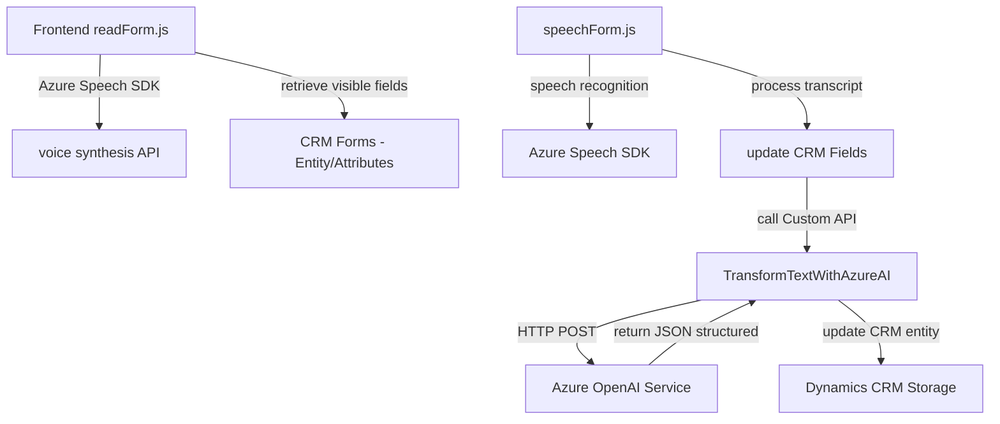

### Breve resumen técnico

El repositorio contiene tres componentes principales:
1. **Frontend JavaScript (readForm.js, speechForm.js):** Implementa generación de voz y reconocimiento de voz integrados en formularios dinámicos del CRM (Dynamics 365), usando el **Azure Speech SDK**.
2. **Dynamics 365 Plugin (TransformTextWithAzureAI.cs):** Procesa texto mediante la **API de Azure OpenAI** generando una respuesta JSON estructurada para integrarlo en Dynamics CRM.

---

### Descripción de arquitectura

#### **Tipo de solución:**
Es una combinación de:
- **Frontend SDK interactivo**: Gestión de voz para formularios.
- **Plugin de backend**: Procesamiento de datos mediante una API externa en Dynamics CRM.

#### **Patrones principales:**
1. **Event-driven architecture (E.D.A):** En el frontend, funciones están diseñadas para reaccionar a eventos (ejemplo: `startVoiceInput` o `speech recognition`).
2. **Cliente-API:** En el backend, consumo de APIs externas (Azure OpenAI con HTTP POST).
3. **Modularidad:** Código dividido en funciones y clases según responsabilidades específicas.
4. **Multi-capa:** Frontend interactivo y backend con consumo de servicios en Dynamics 365.

#### **Arquitectura:**
La arquitectura general es **modular con elementos de n capas**:
- **Frontend modular**: Lógica JavaScript para la interfaz del usuario y síntesis/reconocimiento de voz.
- **Backend basado en plugin para Dynamics CRM**: Gestiona la invocación a OpenAI.

---

### Tecnologías usadas

1. **Frontend:**
   - **Azure Speech SDK**: Reconocimiento y síntesis de voz basada en la nube.
   - **JavaScript**: Para lógica del manejo de voz y formularios visibles.
   - **Dynamics 365 WebAPI/Xrm.WebAPI**: Interacción directa con el entorno de CRM.

2. **Backend (Plugin):**
   - **Azure OpenAI Service**: Procesamiento avanzado de texto.
   - **Dynamics 365 Plugin Framework**: Controlador basado en `IPlugin`.
   - **Libraries**:
     - `Newtonsoft.Json` y `System.Text.Json`: Manipulación de datos JSON.
     - `System.Net.Http`: Comunicación con el servicio externo de OpenAI.

---

### Dependencias y componentes externos

1. **Externas:**
   - **Azure Speech SDK**: Gestión de eventos de voz.
   - **Azure OpenAI Service**: Generación de estructuras avanzadas a partir de texto.
   - Microsoft Dynamics 365 WebAPI.
   - Servicios de nombres en Dynamics 365 (Lookup).

2. **Internas:**
   - Dynamics CRM entities (`executionContext.data.entity.attributes`).
   - Custom API (`trial_TransformTextWithAzureAI`).

---

### Diagrama **Mermaid**

---

### Conclusión final

Este repositorio implementa una solución modular de **sincronización entre voz y datos** en un entorno CRM mediante tecnologías en la nube. Se destacan:
1. **Frontend interactivo**: Usando reconocimiento de voz con **Azure Speech SDK** para integrarse dinámicamente con entidades de CRM.
2. **Backend funcional**: Consumiendo APIs externas (Azure OpenAI) mediante un plugin de Dynamics CRM, garantizando una estructura JSON estándar.
3. **Arquitectura separada**: Modularidad con una aproximación **n capas**, permitiendo despliegues flexibles y ajustes en las integraciones según necesidades.

La solución es ideal para automatización de datos en áreas como ingreso de información, manejo de formularios dinámicos y procesamiento en tiempo real. Añadir mayor manejo de errores y autenticación fría podría mejorar la robustez del proyecto.