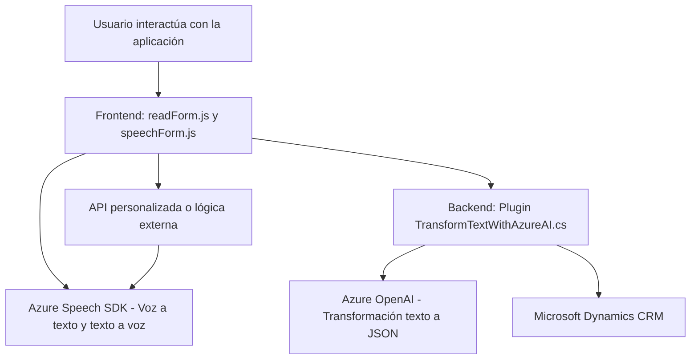

### Breve resumen técnico
Los tres archivos enunciados muestran una solución que utiliza funcionalidades avanzadas de accesibilidad y procesamiento de voz integradas con datos provenientes de formularios en un entorno Dynamics CRM. El sistema emplea el SDK de Azure Speech (para síntesis y reconocimiento de voz) y el servicio OpenAI de Azure (para procesamiento y transformación de texto). Los objetivos incluyen transformar datos de entrada de usuario en objetos estructurados (JSON) y mejorar la interacción mediante accesibilidad y entrada de voz.

### Descripción de arquitectura
El sistema combina un enfoque **n capas** y **arquitectura orientada a servicios**. Se observan múltiples capas de procesamiento:
1. **Capa UI/Frontend**: Archivos relacionados con la interacción del usuario en el navegador, por ejemplo `readForm.js` y `speechForm.js`.
2. **Capa lógica de negocio**: Funcionalidades como mapeo de valores, aplicación de resultados a formularios y gestión de SDK operan en esta capa.
3. **Capa de integración externa**:
   - Se realiza una comunicación bidireccional hacia Azure Speech y OpenAI desde los dos archivos mencionados y desde el plugin.
   - El plugin en `TransformTextWithAzureAI.cs` gestiona eventos del sistema de CRM y se comunica con Azure OpenAI para enriquecer los datos del usuario con lógica avanzada.
   
Este diseño fomenta la escalabilidad y reutilización, con el uso de servicios en la nube.

### Tecnologías usadas
1. **Frontend**:
   - JavaScript (almacenado en `FRONTEND/JS`).
   - SDK de Azure Speech (para síntesis y reconocimiento de voz vía `window.SpeechSDK`).
   - Integración con Dynamics CRM (`executionContext` y `formContext`).

2. **Backend/Plugins**:
   - Lenguaje: C# (.NET Framework).
   - Framework CRM: Microsoft Dynamics SDK.
   - API externas y servicios: Azure OpenAI (GPT), Azure Speech.

3. **Patrones**:
   - **Facade**: El procesamiento de datos y acceso al SDK se centraliza en funciones específicas para simplificar la interacción.
   - **Cargar dependencias bajo demanda**: Dynamic loading del SDK de Azure Speech.
   - **Event-Driven Architecture**: Los métodos en el plugin se desencadenan por eventos del CRM.
   - **External Service Integration**: Conexiones a servicios de Azure Speech y OpenAI.

### Dependencias externas y componentes presentes
1. **Azure Speech SDK**: Para voz a texto y texto a voz.
2. **Azure OpenAI Service**: Utilizado en el plugin C# para transformar texto en JSON estructurado mediante IA avanzada.
3. **Microsoft Dynamics CRM SDK**: Usado en el plugin para la integración en entornos CRM.
4. **Framework para solicitudes HTTP**: Comunicación HTTP con Azure OpenAI desde el plugin.
5. **Librerías para manipulación JSON**:
   - `System.Text.Json`
   - `Newtonsoft.Json.Linq`

### Diagrama Mermaid válido para GitHub:
A continuación, el diagrama simplificado que representa las interacciones entre componentes:

### Conclusión final
La solución se orienta hacia una arquitectura **n capas** que incluye integración con servicios externos (Azure) y enriquecimiento de datos. Esto provee una experiencia enriquecedora para el usuario y permite manejar flujos complejos en un entorno CRM. Se manifiesta el uso de tecnologías modernas basadas en SDKs y APIs de Azure, complementadas con patrones de diseño que mejoran la modularidad y accesibilidad.