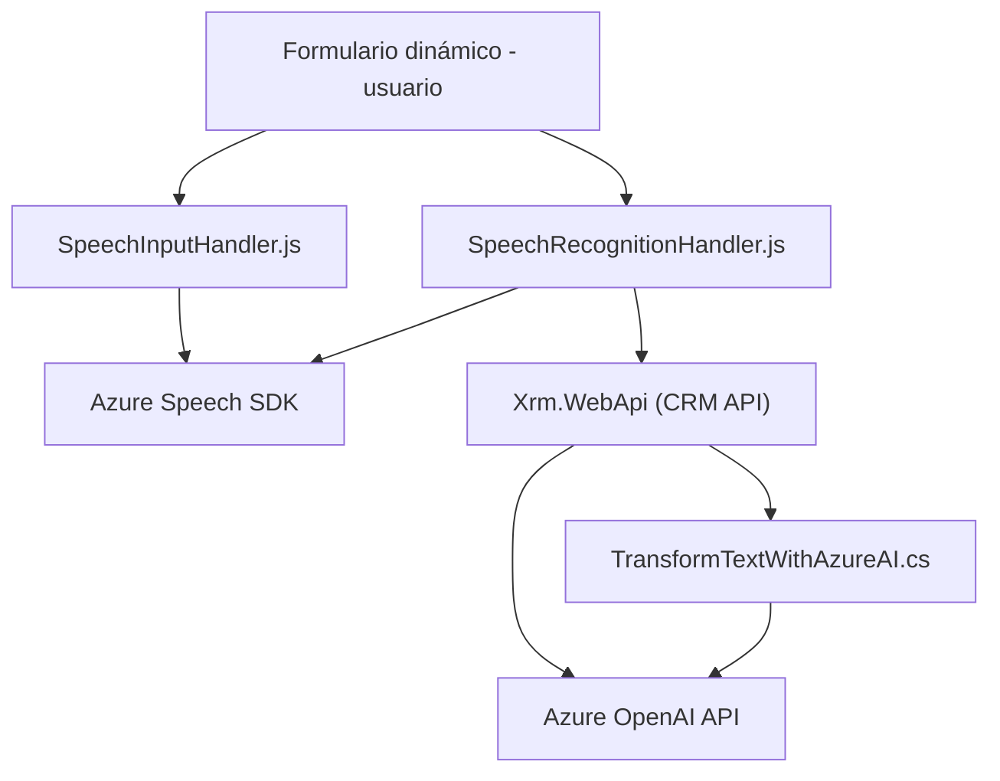

### Breve resumen técnico

El repositorio implementa múltiples componentes para gestión de datos de formularios dinámicos utilizando entrada de voz, síntesis de texto a audio, y conexiones con servicios externos como Azure Speech SDK y Azure OpenAI. Está dividido en tres categorías:
1. **Frontend**: Módulos JavaScript para generación de audio desde texto y reconocimiento de voz.
2. **CRM Dynamics Plugin**: Extensión orientada a procesar texto usando Azure OpenAI API, integrado en la capa server-side.
3. **Dependencias externas**: Azure Speech SDK para voz a texto y viceversa, y un plugin que conecta a Azure OpenAI para procesamiento avanzado de texto.

---

### Descripción de arquitectura

La arquitectura sigue un modelo híbrido entre **arquitectura por capas** (en el CRM Dynamics) y **arquitectura modular** en el frontend. Por ejemplo:

- **Frontend**: Modular con funciones reutilizables encapsuladas para manejar entrada, salida y conexión a SDKs.
- **Backend**: Un enfoque con plugins que extienden la funcionalidad de Dynamics CRM usando patrones como Remote Service Invocation.

Componentes clave:
- Capa de presentación (interacción de usuario vía formularios).
- Capa lógica (manejo del SDK y procesamiento de datos).
- Capa de integración (conexión a servicios externos como Azure Speech y OpenAI).

---

### Tecnologías usadas

1. **Frontend**:
   - **JavaScript**.
   - Azure Speech SDK (`https://aka.ms/csspeech/jsbrowserpackageraw`).
   - Integración con formularios dinámicos CRM (modelo Xrm).

2. **Backend**:
   - Microsoft Dynamics CRM SDK.
   - .NET Framework/C# para implementación de plugins.
   - Azure OpenAI API para procesamiento de texto.

3. **Patrones arquitectónicos**:
   - Modularidad.
   - Plugin Architecture (en el CRM).
   - Remote Service Invocation (interacción con Azure APIs).
   - Delegación (ejemplo: `leerFormulario`, `speakText`).

---

### Diagrama Mermaid

---

### Conclusión final

Este repositorio implementa una solución modular que reúne interacción de usuario, reconocimiento de voz, síntesis de audio, y procesamiento avanzado mediante IA externa. Su arquitectura híbrida combina el frontend con un sistema CRM extendido mediante plugins, mostrando una integración efectiva con Azure Services para mejorar la experiencia del usuario en sistemas dinámicos. Aunque no es estrictamente microservicios, su separación por módulos funcionales es adecuada para integraciones a nivel empresarial.