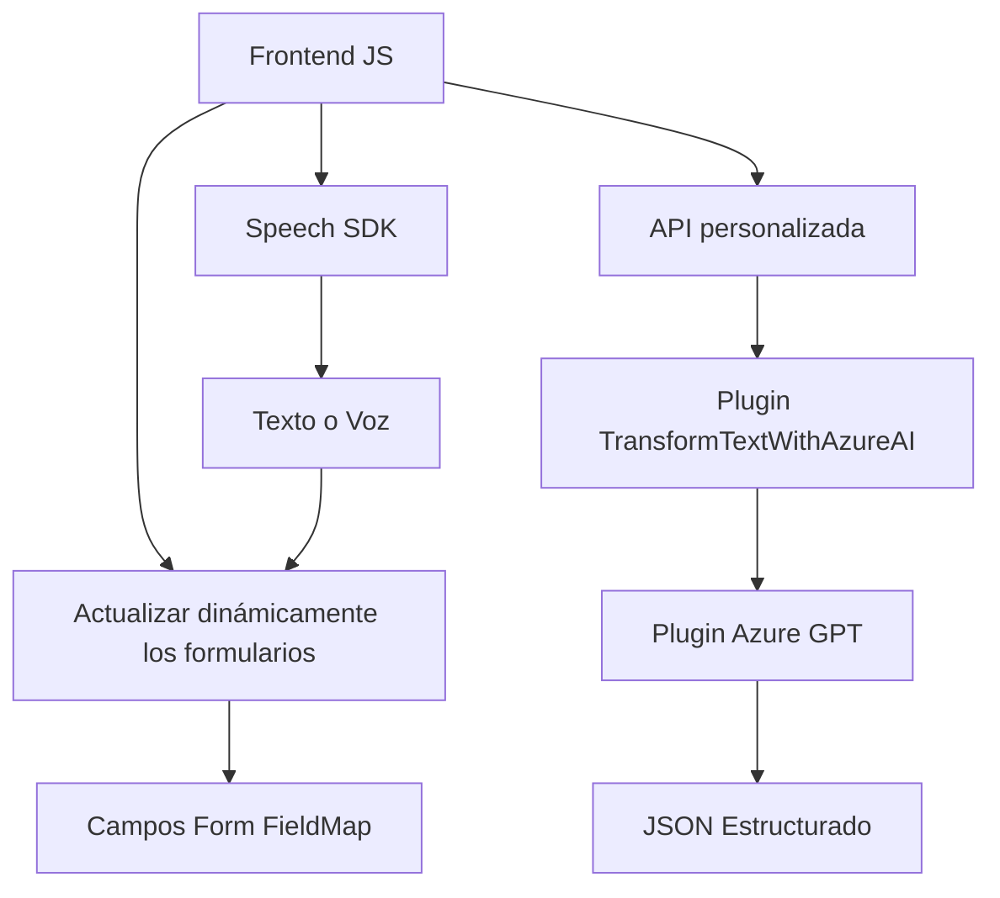

### Breve resumen técnico
El código analiza y responde a las interacciones por voz y texto desde formularios de Dynamics 365, utilizando Azure Speech SDK para reconocimiento de voz y síntesis de texto, mientras que un plugin en C# conecta con Azure OpenAI para generar respuestas avanzadas y estructuradas. El enfoque modular y la integración de servicios externos destacan en las implementaciones.

---

### Descripción de la arquitectura
1. **Arquitectura general**: La solución combina una arquitectura modular y un patrón basado en servicios externos para habilitar funciones de interacción con Dynamics 365 y Azure.
   - **Frontend**: Implementado en JavaScript para administrar formularios locales y el reconocimiento de voz/síntesis de texto.
   - **Backend**: Plugin en C# desarrollado con el patrón de diseño **Plugin** de Dynamics 365 y conexión a servicios mediante integración directa. 
   - **Servicios externos**: Azure Speech SDK y Azure OpenAI conectados como APIs externas.
2. **Estilo arquitectónico**: Aunque no se especifica una separación estricta, la implementación sugiere una aproximación **n-capas** con una capa de presentación (formularios), lógica de control en JavaScript/C# y servicios (Azure).

### Tecnologías usadas
- **Microsoft Dynamics 365**: Para manipulación de formularios y campos.
- **Azure Speech SDK**: Para reconocimiento de voz y síntesis de texto.
- **Azure OpenAI (GPT)**: Transformación de texto mediante un modelo GPT en el plugin.
- **JavaScript**: Para modularidad en el frontend.
- **C#**: Plugin optimizado para servicios de Dynamics 365.
- **Newtonsoft.Json** y **System.Text.Json**: Manejo de JSON.
- **System.Net.Http**: Consumo de APIs REST.

### Dependencias o componentes externos
1. **Azure Speech SDK**: Suministrado mediante un paquete dinámico de Azure.
2. **Azure OpenAI Service**: Utilizado en el plugin backend para generar respuestas inteligentes en formato predefinido.
3. **Dynamics CRM SDK**: Para manejo avanzado de atributos y entidades en formularios.

---

### Diagrama Mermaid válido para GitHub

---

### Conclusión final
La solución combina la potencia de la tecnología de reconocimiento de voz y procesamiento de texto avanzado de Azure con la capacidad de personalización de Dynamics 365. Su arquitectura se basa en un modelo híbrido de interacción entre frontend (JavaScript) y backend (C#). Un enfoque modular en el diseño de código, con claras divisiones de responsabilidad, lo hace extensible y eficiente en contextos de CRM.

Este sistema sería ideal para empresas que requieren automatización sobre la base de datos dinámica y entrada de datos mediante voz o texto en escenarios interactivos.