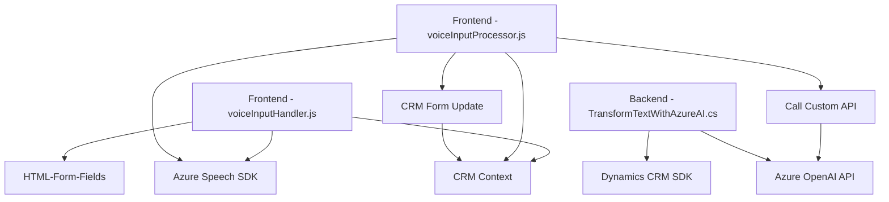

### Breve resumen técnico
El proyecto tiene una estructura que integra la funcionalidad de reconocimiento y síntesis de voz, la manipulación de formularios en un sistema CRM y el procesamiento de datos mediante inteligencia artificial. Utiliza tecnologías como **Azure Speech SDK** y **Azure OpenAI API** para trabajar con formularios y audio, mientras que las integraciones dependen de SDKs de Dynamics CRM.

---

### Descripción de Arquitectura
El sistema está diseñado con características propias de una arquitectura **n-capas**:
- **Capa de presentación (Frontend)**: Incluye procesamiento de voz y actualización de datos visibles en formularios mediante JavaScript y el SDK de Azure. Se prefieren SDKs y APIs que abstraen la complejidad del trabajo con datos de formularios y reconocimiento de voz.
- **Capa de lógica (Backend)**: Implementa un plugin para Dynamics CRM donde se lleva a cabo el procesamiento avanzado de texto con Azure OpenAI API.
- **Capa de acceso a datos**: Utiliza los servicios de APIs del Dynamics CRM SDK para manipular datos relacionados con el sistema CRM, además de realizar llamadas HTTP hacia APIs externas (Azure OpenAI) para enriquecimiento de datos.

El proyecto está compuesto por:
1. **Frontend interactivo**: La integración de entrada de voz y reconocimiento a texto, que interactúa con formularios HTML o relacionados con algún sistema CRM.
2. **Plugins**: Para abordar la integración y la manipulación de datos en el backend del CRM, con procesamiento avanzado a través de la API de OpenAI.

La modularidad es destacable, con funciones unitarias bien definidas en JavaScript y clases encapsuladas en C#. Aprovecha técnicas de **callback** para la integración con el SDK de Azure y uso de patrones de diseño orientados a plugins en Dynamics CRM.

---

### Tecnologías usadas
1. **Frontend (JavaScript)**:
   - Azure Speech SDK: Para reconocer voz y sintetizar audio.
   - Microsoft Dynamics CRM SDK: Para la manipulación de formularios y datos en interacción directa con el sistema CRM.
   - ECMAScript (ES6): Para manejo de funciones, callbacks y promesas.

2. **Backend (.NET/C#)**:
   - Azure OpenAI API: Procesamiento avanzado de texto usando IA.
   - Microsoft.Xrm.Sdk: Extensión para el manejo directo de los datos en Dynamics CRM.
   - Framework de .NET: Base para la implementación de plugins en Dynamics CRM.

3. **Patrones de arquitectura**:
   - Modularidad: Separación de responsabilidades en funciones y clases específicas.
   - Integración con servicios externos: Uso de SDKs y APIs para extender las funcionalidades del sistema principal.
   - Abstracción: Utilización de objetos y servicios del CRM como interfaces para comunicarse con datos de la organización.

---

### Diagrama Mermaid válido para GitHub Markdown

---

### Conclusión final
El proyecto tiene una arquitectura **n-capas**, pero se apoya en soluciones externas (APIs y SDKs) para añadir inteligencia artificial y procesamiento avanzado de voz en mecanismos CRM. La modularidad del código es un punto destacable; cada componente es reutilizable y cumple con una tarea limitada y enfocada. Además, se utiliza el SDK oficial de Dynamics CRM, asegurando una integración confiable con los sistemas existentes. Este enfoque modular y basado en APIs permite extender funcionalidad y reducir la necesidad de implementar lógica personalizada desde cero.