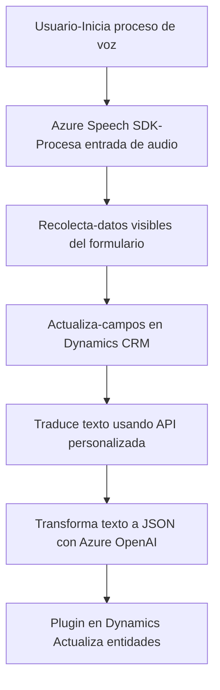

### Breve resumen técnico
El sistema presentado en el repositorio GitHub integra soluciones avanzadas basadas en SDKs (Azure Speech y Dynamics 365) y arquitecturas modulares para crear una solución que interactúa sobre formularios dinámicos y servicios de nube. Utiliza reconocimiento de voz y procesamiento de texto para llenar formularios automáticamente, transformar datos mediante APIs personalizadas y extender Dynamics CRM con plugins.

---

### Descripción de arquitectura
1. **Tipo de solución**:
   - La solución es una **API híbrida** que combina lógica de frontend y backend con extensiones específicas para Dynamics CRM.
   - Puede considerarse como un sistema integrado entre un cliente (frontend) y componentes backend específicos basados en Dynamics CRM y Azure.

2. **Patrones arquitectónicos observados**:
   - **Patrón N capas**: La lógica central está dividida en varias capas donde el software interactúa con:  
     - SDKs (Azure Speech y Dynamics Web API) para lógica empresarial/acción externa.  
     - Formularios y plugins internos que operan como una capa de presentación y procesamiento.  
   - **Integración con microservicio en nube**: El sistema utiliza servicios externos de Azure Speech y OpenAI.
   - **Modularidad**: Cada archivo tiene propósitos específicos y usa funciones desacopladas (por ejemplo, manejo de voz, procesamiento de texto mediante APIs).
   - **Plugin Design Pattern**: En el backend, el plugin transforma texto usando Azure OpenAI API como punto de conexión hacia servicios de terceras partes.

---

### Tecnologías, frameworks y dependencias
1. **Frontend**:
   - **JavaScript**: Para manejar datos de formularios y utilizar Azure Speech SDK.
   - **Azure Speech SDK**: Reconocimiento de voz, síntesis de texto a audio y transcripción.
2. **Backend**:
   - **Microsoft Dynamics CRM SDK**: Extensión del entorno CRM mediante plugins.
   - **Azure OpenAI API**: Procesamiento de texto transformado en un objeto JSON para manipulación estructurada.
   - **.NET Framework (posiblemente .NET Core)**: Desarrollo de plugins.
   - **Newtonsoft.Json** y **System.Text.Json**: Manejo y manipulación de JSON estructurado.
3. **Servicios de nube**:
   - Azure Speech Services y el modelo GPT-4 vía Azure OpenAI.
4. **Patrones adicionales**:
   - Modularidad y separación de responsabilidades.
   - Uso de integración con APIs externas tanto en frontend como backend.

---

### Diagrama Mermaid válido para GitHub

---

### Conclusión final
La solución presentada define un ecosistema integrado para automatización de formularios y manipulación de voz mediante servicios de nube como Azure Speech y OpenAI. Se observa una arquitectura **N capas** complementada por una modularidad eficiente que encapsula cada funcionalidad en archivos separados. Tiene como objetivo ofrecer un flujo dinámico para transformación y asignación de datos en formularios de **Dynamics 365** mediante tecnologías modernas de **Reconocimiento de voz** e **Inteligencia Artificial**.