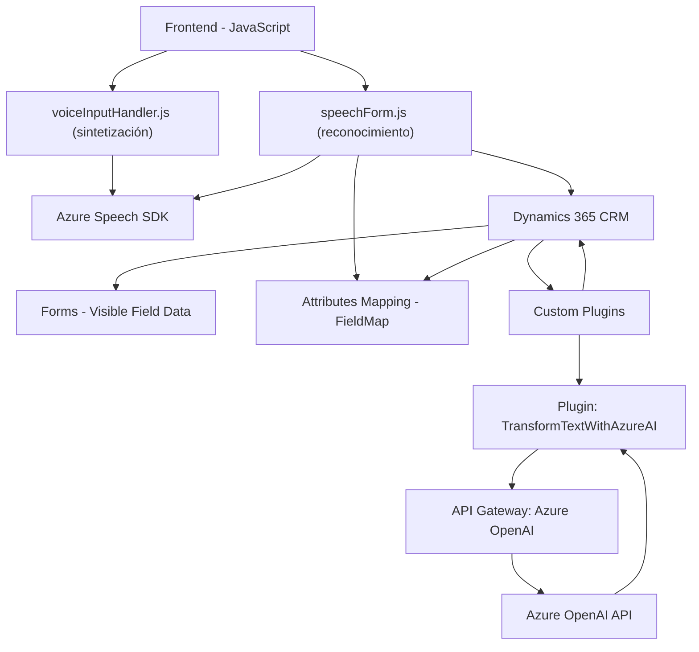

### Breve Resumen Técnico:
La solución es para un sistema que combina una **API**, un **frontend** relacionado, y **plugins**. Principalmente, la arquitectura utiliza el `Azure Speech SDK` y la `Azure OpenAI API` para adicionar funcionalidades de síntesis y reconocimiento de voz, así como transformación de texto mediante inteligencia artificial. Está integrado con Dynamics CRM (Microsoft Dynamics 365), lo que permite la interacción directa con formularios y datos del sistema CRM.

---

### Descripción de Arquitectura:
La arquitectura combina múltiples componentes:
1. **Frontend en JavaScript** tiene dos archivos principales (`readForm.js` y `speechForm.js`) que brindan funcionalidades para reconocimiento y síntesis de voz de formularios. El patrón utilizado es modular con funciones independientes, reutilizables y orientadas a servicios externos como el Azure Speech SDK.
2. **Backend en forma de Plugin para Dynamics 365** (`TransformTextWithAzureAI.cs`) sigue una arquitectura de **plugin**, diseñada específicamente para Dynamics CRM. Integra a través de una API externa de Azure (OpenAI) y sigue patrones para interacción remota vía HTTP.
3. La solución sigue una arquitectura **orientada a servicios** (SOA) al conectar los elementos (frontend, plugin, APIs externas) mediante protocolos y SDK.

El diseño global tiene similitudes con una arquitectura de **microservicios**, ya que diferentes componentes cumplen con responsabilidades específicas e interactúan mediante APIs externas como el Azure Speech SDK y la Azure OpenAI API. Sin embargo, en la presente estructura, la relación entre el frontend y el plugin de Dynamics 365 sugiere un modelo **híbrido** más centrado en un ecosistema **orientado a servicios** que no cumple con una estricta definición de microservicios. 

---

### Tecnologías Usadas:
1. **Frontend:**
   - **Lenguaje**: JavaScript.
   - **SDK externo**: Azure Speech SDK para funcionalidad de voz (versión dependiente).
   - **CRM Web API**: Dynamics 365 Web API (`Xrm.WebApi.online`).

2. **Backend Plugin:**
   - **Lenguaje**: C#.
   - **Framework**: .NET Framework (para Dynamics 365 plugin framework).
   - **Librerías externas**:
     - `Newtonsoft.Json` para manejo de JSON.
     - `System.Net.Http` para integración con Azure OpenAI API.
   - **API Externa**:
     - Azure OpenAI API para transformación de texto.

3. **Servicios cloud**:
   - Un servicio de `Azure Speech` para síntesis y reconocimiento de voz.
   - Un servicio de `Azure OpenAI` (probablemente basado en GPT series).

---

### Dependencias y Componentes Externos:
1. **Azure Speech SDK**: Integración desde fórmula web con su paquete JavaScript para reconocimiento y síntesis de voz.
2. **Azure OpenAI API**: Para transformación avanzada de texto. Precisa claves API y configuración regional.
3. **Dynamics 365 WebAPI**: Integración desde el cliente con los formularios de CRM.
4. **Plugins y servicios personalizados** en Dynamics CRM que interactúan con los formularios del sistema y recursos como entidades y API personalizadas.
5. **XRM SDK**: Para extender CRM con plugins nativos de Dynamics.

---

### Diagrama **Mermaid** compatible con **GitHub Markdown**:

---

### Conclusión Final:
Este repositorio representa un híbrido bien segmentado que usa patrones orientados a servicios para integrarse con servicios externos (Azure Speech SDK y Azure OpenAI API) y un CRM (Dynamics 365). La arquitectura general organizada por capas y responsabilidades promueve buenas prácticas de modularidad, código reutilizable y claridad en la delegación de responsabilidades. Si bien la presencia de plugins para Dynamics implica una relación estrecha entre frontend y backend (desafiando un concepto purista de microservicios), el sistema presenta elementos propios de una arquitectura **orientada a servicios**, ideal para soluciones integradas como esta.