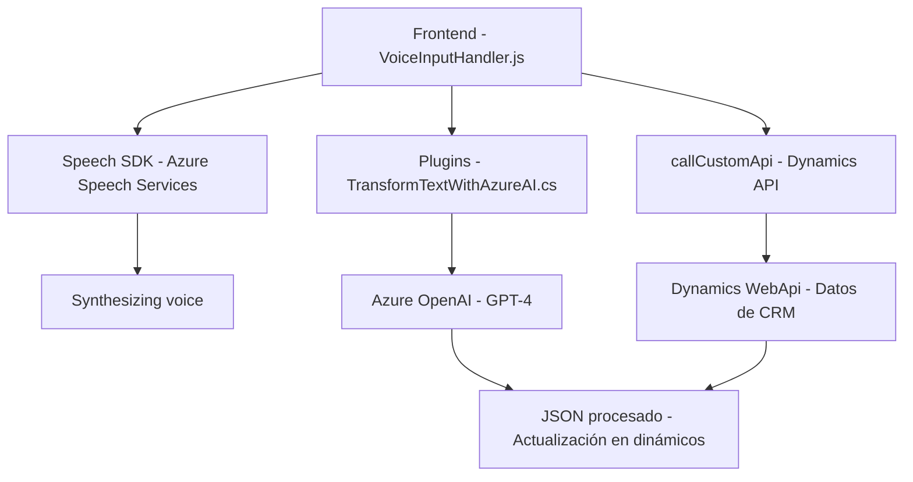

# Análisis Técnico de la Solución

## Breve Resumen Técnico
La solución consiste en una plataforma integrada con **Dynamics CRM** que utiliza **Azure Speech SDK** y **Azure OpenAI GPT-4** para añadir funcionalidades avanzadas de entrada y procesamiento de texto y voz. Incluye componentes frontend implementados en JavaScript y una extensión como plugin en C# para procesamiento basado en Inteligencia Artificial.

---

## Descripción de Arquitectura
La arquitectura general está orientada a **n capas** con integración en el ecosistema Dynamics CRM. Este tipo de arquitectura permite la separación de responsabilidades entre:
1. **Frontend** (aplicación cliente): Se encarga de gestionar la entrada, visualización y manipulación de datos a nivel de usuario. 
2. **Controladores, servicios y lógica del backend**: Implementados como plugins de Dynamics CRM para operaciones específicas como transformación de texto utilizando Azure OpenAI.
3. **Integración de servicios externos:** Se realiza una comunicación directa con APIs ofrecidas por Azure (Speech Services y OpenAI) para funcionalidades de síntesis, reconocimiento de voz y procesamiento de texto.

La comunicación entre frontend (JavaScript) y backend (plugin en C#) parece estar organizada principalmente mediante el API de Dynamics CRM.

---

## Tecnologías Usadas
1. **Microsoft Dynamics CRM/XRM**:
   - Uso de `Dynamics CRM SDK` para integrar y actualizar datos en formularios.
   - Plugins para extender la lógica empresarial.
   - Métodos tradicionales como `Xrm.WebApi`.
   
2. **Azure Speech SDK**:
   - API de síntesis y reconocimiento de voz.
   - Integración con dinámicas de intercambio de datos usando callbacks.

3. **Azure OpenAI Service (GPT-4)**:
   - Usado para procesamiento avanzado de texto.
   - Comunicación mediante una API REST para obtener respuestas procesadas.

4. **Lenguajes y frameworks**:
   - **JavaScript**: Para el frontend y la lógica del cliente.
   - **C#**: Para el plugin del lado del servidor.
   - **HTML/CRM XRM Framework Context** para operaciones en formularios dinámicos.

5. **Patrones de diseño identificados**:
   - **Event-Driven**: Uso de callbacks para gestionar la carga dinámica del SDK y el reconocimiento de voz en tiempo real.
   - **Encapsulación**: Las funciones tienen responsabilidades acotadas, con separación clara entre entrada en voz, síntesis, y procesamiento.
   - **Integración REST**: Uso de servicios externos mediante APIs REST.
   - **Mapper dinámico**: Construcción de un mapa entre texto reconocido y campos asociados en el formulario.

---

## Dependencias y Componentes Externos
1. **Azure Speech SDK**: Para manejo de entrada y salida de voz.
2. **Dynamics CRM SDK**: Elementos clave para acceder y modificar datos en la aplicación de CRM.
3. **Azure OpenAI Service**: Procesamiento de texto mediante GPT (Generative Pre-trained Transformer).
4. **Microsoft Cloud Services**: Para obtener claves de API y configuraciones regionales.
5. **CDN JavaScript Libraries**: La librería del Speech SDK se carga dinámicamente desde `https://aka.ms/csspeech/jsbrowserpackageraw`.

---

## Diagrama Mermaid Compatible

---

## Conclusión Final
La solución parece ser una extensión avanzada para un sistema de **Dynamics CRM**, utilizando herramientas modernas de reconocimiento de voz, procesamiento de texto con IA (Azure OpenAI), y síntesis de voz. Adopta patrones de diseño que favorecen la modularidad y escalabilidad, además de combinar servicios cloud con funcionalidades específicas de CRM para ofrecer capacidades avanzadas de interacción de datos.