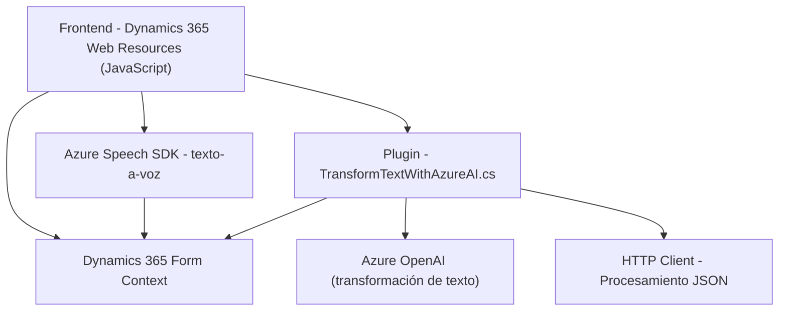

### Breve Resumen Técnico
El repositorio contiene componentes de software que trabajan en conjunto con Dynamics 365 para implementar funcionalidades de texto-a-voz, reconocimiento de voz y transformación de texto con Azure OpenAI. Incluye archivos JavaScript que se integran con formularios web de Dynamics y un plugin en C# que extiende la lógica de Dynamics CRM mediante la interacción con Azure OpenAI. Adicionalmente, utiliza tecnologías y servicios en la nube para procesamiento de voz y transformación de datos.

---

### Descripción de Arquitectura
La solución está estructurada con una **arquitectura de n capas**, donde:
1. **Capa de presentación (Frontend)**: Incluye los archivos JavaScript (`readForm.js`, `speechForm.js`) que interactúan con los formularios web de Dynamics 365.
2. **Capa lógica/comunicación API externa**: 
   - Los archivos frontend utilizan `Azure Speech SDK` para integrar reconocimiento y síntesis de voz.
   - El plugin C# (`TransformTextWithAzureAI.cs`) implementa una capa lógica que usa Azure OpenAI para transformar texto.
3. **Capa de servicios externos**: Se integra con Azure Speech y Azure OpenAI para funcionalidades basadas en la nube.
4. **Capa del modelo de datos**: Los formularios de Dynamics 365 conforman los datos estructurados sobre los que opera la solución.

La arquitectura también aprovecha patrones de diseño como **event-driven** (activaciones por interacciones de usuario) y utiliza estrategias de **modularidad** y **encapsulación funcional** para asegurar que cada componente tenga una responsabilidad definida.

---

### Tecnologías y Patrones Usados
#### Tecnologías:
1. **Frontend:**
   - Lenguaje: JavaScript.
   - SDK: Azure Speech SDK.
   - Framework relacionado con `formContext` del Dynamics SDK (Dynamics 365 Web Resources).
   - API de DOM para manipulación de formularios y campos.
2. **Plugin Backend:**
   - Lenguaje: C# (.NET Framework o .NET Core).
   - SDK: Microsoft Dynamics CRM SDK.
   - HTTP Client para comunicación con Azure OpenAI.
   - JSON Utilidades: `System.Text.Json`, `Newtonsoft.Json.Linq` para procesamiento de datos JSON.
3. **Servicios Externos:**
   - **Azure Speech SDK**: Procesamiento de voz (texto-a-voz y reconocimiento).
   - **Azure OpenAI**: Transformación de texto avanzado.

#### Patrones:
- **Carga Dinámica**: Los SDK necesarios se cargan on-demand en el frontend para mejorar el rendimiento.
- **Event-Driven**: Reconocimiento de voz y operaciones se activan en respuesta a eventos de usuario.
- **Modularidad y Encapsulación**: Cada función en los archivos `readForm.js` y `speechForm.js` está diseñada para cumplir un propósito específico.
- **Integración con Servicios de Terceros**: El plugin interactúa con Azure OpenAI mediante endpoints REST.
- **DTO (Data Transfer Object)**: Utilización de JSON para transferir información entre servicios y componentes.

---

### Dependencias o Componentes Externos Posibles
1. **Azure Speech SDK**
   - Endpoint para cargar el SDK dinámicamente: `https://aka.ms/csspeech/jsbrowserpackageraw`.
   - Autenticación y configuración mediante claves (`azureKey`, `azureRegion`).
2. **Azure OpenAI**
   - Endpoint personalizado para transformaciones de texto.
   - Se requiere configuración de credenciales y definición de normas.
3. **Dynamics 365 API y SDK**
   - Contexto del formulario (`formContext`) y manipulación de los atributos mediante SDK (`Xrm`).
   - Integración directa mediante Plugins personalizados.
4. **JavaScript (DOM API)**
   - Manipulación directa de la interfaz de usuario.
5. **APIs de comunicación HTTP y JSON**:
   - `HttpClient` y procesadores JSON (`System.Text.Json` y `Newtonsoft.Json.Linq`) para las operaciones del plugin backend.

---

### Diagrama Mermaid Válido para GitHub Markdown

---

### Conclusión Final
El repositorio implementa una solución de integración avanzada con Dynamics 365, que añade capacidades de voz y procesamiento semántico mediante Azure Speech y OpenAI. La arquitectura se basa en un diseño de **n capas**, asegurando una separación de responsabilidades adecuada entre frontend, lógica de negocio y servicios externos. Además, el uso extensivo de patrones como modularidad y DTO garantiza escalabilidad y mantenibilidad. Esta solución es óptima para escenarios donde se requiere interacción mediante voz y transformación dinámica de datos con IA.