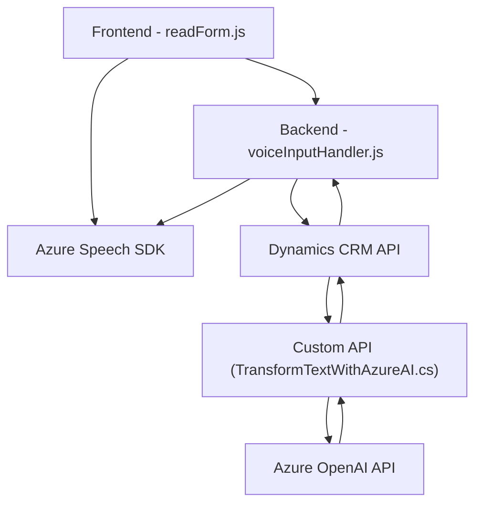

## Breve resumen técnico

El repositorio contiene tres módulos clave:
1. **Frontend**: Integración de funciones con Azure Speech SDK para síntesis de voz y reconocimiento de voz, además de manipular dinámicamente atributos en formularios de Dynamics 365.
2. **Backend**: Plugin en Dynamics CRM, que utiliza Azure OpenAI API para procesar texto y transformarlo en JSON estructurado.
3. **Dependencias externas**: Azure Speech SDK, Dynamics CRM API y Azure OpenAI.

El sistema combina reconocimiento de voz, asignación dinámica de datos en formularios y procesamiento avanzado mediante IA. Utiliza interacción entre frontend, APIs personalizadas de Dynamics CRM y servicios de Azure.

---

## Descripción de arquitectura

### Tipo de solución
La solución tiene elementos de **frontend** y **backend**. Es una integración entre un módulo de **sintetización de voz** en el navegador web, un motor de **reconocimiento de voz** que interactúa con APIs personalizadas y un **plugin** en Dynamics CRM para procesamiento de datos con servicios externos de IA.

### Arquitectura
La arquitectura es una combinación de **n-capas** y **integraciones híbridas Cloud** que unen:
- **Front-end** (cliente): Interactúa con formularios de Dynamics 365 y servicios de Azure Speech SDK.
- **Back-end** (Dynamics Plugin): Ejecuta lógica backend y comunica con Azure OpenAI para transformar texto.
- **Service Integration**: Servicios externos (Azure Speech SDK y OpenAI) manejan tareas especializadas.

### Patrones utilizados
- **Orientado a eventos**: La carga del SDK en el frontend se dispara mediante callbacks.
- **Plugin Pattern**: Dynamics CRM utiliza plugins mediante interfaces como `IPlugin` para lógica personalizada.
- **Integración de servicios API**: Comunicación externa con Azure Speech SDK y OpenAI para complementos avanzados.
- **Separation of Concerns**: Frontend y backend tienen responsabilidades bien delimitadas.

---

## Tecnologías usadas
1. **Frontend**:
   - JavaScript.
   - Azure Speech SDK.
   - Manipulación estándar del DOM y formularios en Dynamics 365.
2. **Backend**:
   - API de Dynamics 365 (`Microsoft.Xrm.Sdk`).
   - Azure OpenAI API (GPT-4) para procesamiento de texto.
   - Framework .NET para plugins en Dynamics.
3. **Servicios externos**:
   - Azure Speech SDK: Reconocimiento y síntesis de voz en tiempo real.
   - Azure OpenAI: Transformaciones avanzadas con GPT-4/IA.

---

## Diagrama Mermaid válido para GitHub

---

## Conclusión final

La solución presentada combina un enfoque práctico para implementar funcionalidades avanzadas de voz e inteligencia artificial dentro de un ecosistema Dynamics 365. La arquitectura, con separación de capas y la integración de SDKs externos, es adecuada para manejar este caso de uso específico. Sin embargo, se deben considerar prácticas avanzadas de seguridad para configuraciones críticas, como claves API, que pueden estar expuestas en el código. Adicionalmente, para aumentar la robustez del sistema, sería pertinente integrar patrones como una **arquitectura hexagonal** que facilite la extensión futura y la desacopla aún más los elementos internos de las dependencias externas.