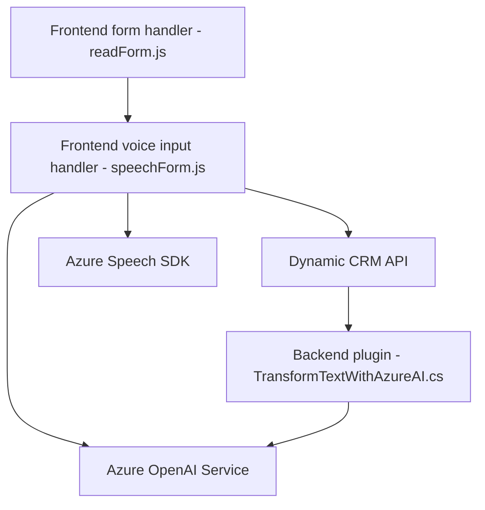

### Breve resumen técnico
Este es un proyecto que integra funcionalidades avanzadas de procesamiento de voz y texto con una plataforma CRM (Microsoft Dynamics CRM). Utiliza Azure Speech SDK para capturar, sintetizar, y transmitir datos de voz, además de emplear servicios de Azure OpenAI para transformar texto mediante modelos de inteligencia artificial de última generación (GPT-4). Los diferentes archivos del repositorio forman parte de una solución híbrida entre frontend y backend, con interacción directa con servicios externos de Microsoft Azure.

---

### Descripción de arquitectura
La arquitectura de este proyecto está diseñada en varios niveles:
- **N-capas:** La aplicación parece estar formada por diversos módulos que separan las responsabilidades:
  - **Presentación:** Representada por los scripts en JavaScript que capturan y procesan inputs del formulario en Dynamics CRM.
  - **Lógica de negocio:** Delineada por el uso del plugin `TransformTextWithAzureAI.cs`, que procesa datos del CRM y realiza solicitudes a Azure OpenAI y otros servicios necesarios.
  - **Integración con servicios:** Uso del Speech SDK para interactuar con comandos de voz, además de llamadas a una API personalizada y las capacidades del modelo GPT en el servicio Azure OpenAI.
- **Microservicios:** Algunas de las funciones mencionadas parecen delegarse a servicios externos mediante APIs (e.g., procesamiento AI, ejecución por speech-to-text).

---

### Tecnologías utilizadas
1. **Azure Speech SDK:** Servicios de reconocimiento y síntesis de voz integrados con Microsoft Azure.
2. **Microsoft Dynamics CRM SDK:** Extensiones y APIs para trabajar con datos de una plataforma CRM.
3. **Azure OpenAI Service (GPT-4):** Servicios de procesamiento inteligente de texto, con capacidades como generación de JSON basado en reglas.
4. **JavaScript (Frontend):** Scripts para dinámica de formularios y manipulación del DOM.
5. **C# (Backend Plugin):** Implementación del plugin mediante el framework de Dynamics CRM y lógica necesaria para comunicación con Azure y JSON handling.
6. **Libraries:** 
   - `Newtonsoft.Json.Linq` y `System.Text.Json` para manipular datos JSON.
   - `System.Net.Http` para enviar solicitudes HTTP a servicios externos.

---

### Diagrama Mermaid válido para GitHub

---

### Conclusión final
Este repositorio encapsula una robusta solución que combina interacción frontend y backend con dos tipos de third-party services (Azure Speech SDK y Azure OpenAI). La architecture propuesta se inclina hacia un modelo de **N-capas** debido a la separación entre presentación, lógica de negocio y comunicación externa. Sin embargo, la integración con microservicios también juega un rol importante.

La solución está diseñada utilizando tecnologías modernas y patrones estandarizados, particularmente con un enfoque en **Event-Driven Architecture**, **lazy loading**, y **modular encapsulation** para maximizar la reusabilidad y mantenimiento del código. Una posible mejora sería asegurar que las dependencias de Azure sean gestionadas adecuadamente para evitar problemas relacionados con la conectividad y los tiempos de respuesta.