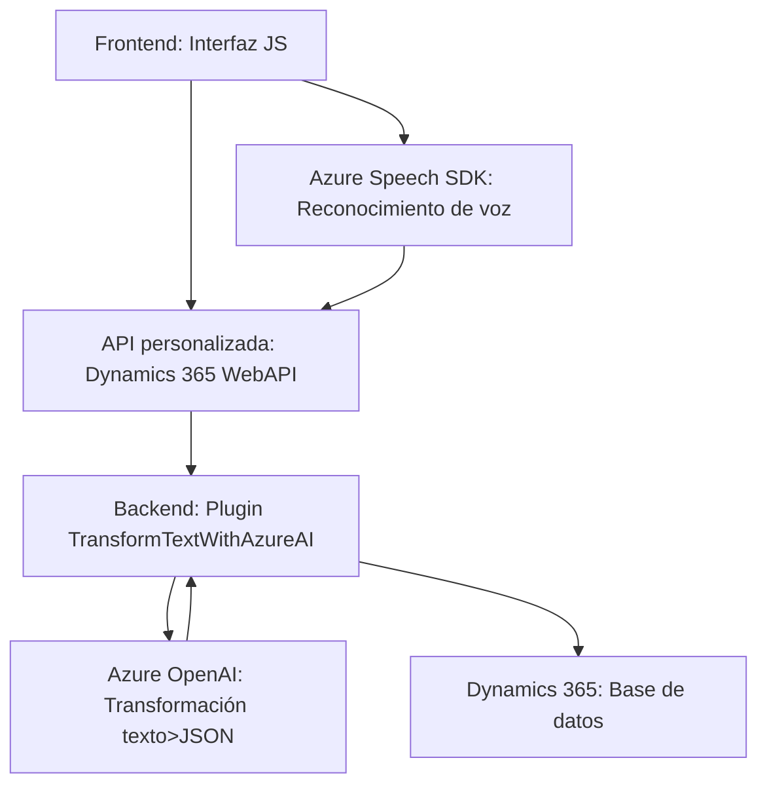

### Breve resumen técnico

La solución presentada está orientada a integrar servicios de procesamiento de voz y transformación de texto (mediante los SDK de Azure Speech y Azure OpenAI) dentro de un entorno de Microsoft Dynamics 365 y una interfaz frontend en JavaScript. Incluye tres componentes principales:
1. **Frontend**: Realiza operaciones de entrada/salida de voz y manipulación de formularios mediante el Azure Speech SDK.
2. **Backend (Plugins)**: Define plugins para Dynamics CRM que interactúan con el Azure OpenAI API y los datos internos del sistema.
3. **API Externa (Azure)**: Uso de servicios en la nube de Azure para reconocimiento de voz (Speech SDK) y procesamiento de texto (OpenAI).

---

### Descripción de la arquitectura

El sistema combina diferentes patrones arquitectónicos y niveles de interacción, destacando los siguientes aspectos:
- **Arquitectura de capas**:
  - **Frontend**: Manejo de la interfaz de usuario y procesamiento inicial de datos (lectura y actualización de formularios).
  - **Backend (Plugins)**: Procesamiento y transformación específica de datos enviados desde el frontend mediante Microsoft Dynamics CRM.
  - **Servicios externos**: Uso del Azure Speech SDK para reconocimiento de voz y del Azure OpenAI API para procesamiento avanzado de texto.
- **Patrón de plugins**: Se utiliza en los archivos de backend para integrar extensiones dentro de Dynamics CRM.
- **Integración de APIs/SDKs externas**: El uso intensivo del Azure Speech SDK y del Azure OpenAI API conecta de manera directa las necesidades del negocio con servicios en la nube para ofrecer reconocimiento de voz y enriquecimiento de texto.
- **Factores dinámicos**: El frontend está diseñado para cargar dependencias externas de Azure Speech SDK de forma dinámica, minimizando el impacto inicial en la carga de recursos.
- Esta solución puede clasificarse como una arquitectura **híbrida** compuesta por diversas capas, integrándose hacia un monolito gestionado por Dynamics 365 y utilizando servicios externos de Azure.

---

### Tecnologías usadas

#### Frontend:
- **Lenguaje:** JavaScript / ES6.
- **Frameworks y servicios:**
  - **Azure Speech SDK**: Para reconocimiento de voz y síntesis de texto-audio.
  - **Microsoft Dynamics 365**: API (`Xrm.WebApi`).
- **Patrones:** 
  - Modularidad en funciones.
  - Fassade (simplificación de entradas).

#### Backend (Plugins):
- **Lenguaje:** C# (.NET Framework) para los plugins en Dynamics CRM.
- **Servicios:** 
  - Dynamics 365 SDK (gestión de la base de datos y datos de usuario).
  - Azure OpenAI (transformación avanzada de texto).
- **Frameworks / Librerías:**
  - Newtonsoft.Json (gestión de JSON).
  - HttpClient (llamadas HTTP).
- **Patrones:**
  - Plugin extensible (Dynamics CRM).
  - Factory pattern para los servicios de organización.
  - Consumo de REST APIs (Azure OpenAI).

---

### Diagrama **Mermaid**

---

### Conclusión final

Esta solución utiliza una arquitectura **de capas con integraciones externas** para ofrecer funcionalidades avanzadas de voz y procesamiento de texto. Combina un frontend dinámico basado en JavaScript con un backend extensible en Dynamics CRM que gestiona la lógica de negocio y el almacenamiento de datos. Las integraciones con el **Azure Speech SDK** y **OpenAI API** destacan por su capacidad de delegar tareas complejas (procesamiento de texto y voz) a servicios en la nube, mejorando la modularidad y escalabilidad. Sin embargo, el uso intensivo de servicios externos implica un fuerte acoplamiento con Azure, lo que debe considerarse para temas de costos, disponibilidad y tiempo de respuesta.