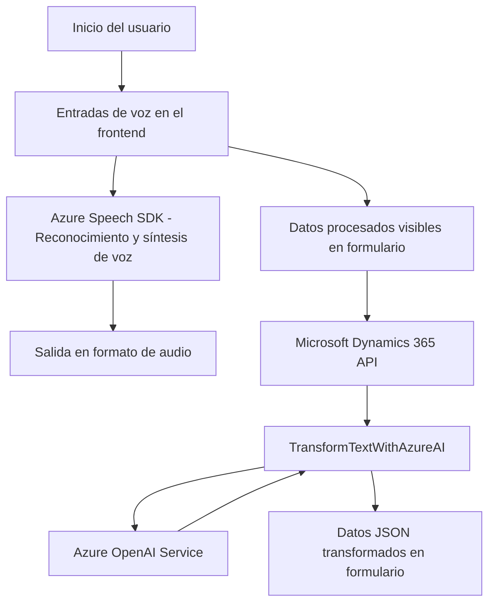

### Breve Resumen Técnico

El repositorio contiene un conjunto de archivos organizados para una solución de procesamiento de voz, interactividad con formularios, y plugins extensibles en el contexto de Dynamics CRM. Los componentes clave incluyen:
1. Frontend implementado con JavaScript para manejo de entrada de voz y síntesis de texto en audio.
2. Un plugin en C# que interactúa con el servicio Azure OpenAI para realizar transformaciones basadas en IA.

### Descripción de Arquitectura

La arquitectura sigue principios de n capas. Contiene:
- **Capa de Frontend** para manejar la entrada de voz, generación de audio, y asignación de valores al formulario.
- **Capa de lógica** integrada como un plugin en Dynamics CRM, que realiza transformaciones sobre datos mediante Azure OpenAI.
- **Capa de servicios** utilizando Azure como proveedor externo para la API Speech SDK (envolviento mediante el SDK) y la API OpenAI.
  
Se detecta el uso de patrones como "Plugin Pattern" para el código de C#, "Service Integration" para la interacción con APIs externas, y modularización en el frontend para separar responsabilidades en funciones específicas.

### Tecnologías Usadas

1. **Frontend**:
   - Lenguaje: JavaScript.
   - Framework: DOM API para manipulación de elementos.
   - Servicio externo: **Azure Speech SDK** para reconocimiento de voz y síntesis.
2. **Backend (Plugin)**:
   - Lenguaje: C#.
   - Framework: Dynamics CRM SDK (`Microsoft.Xrm.Sdk`).
   - Servicio API: **Azure OpenAI** para transformación de texto con IA.
3. **Dependencias**:
   - `Newtonsoft.Json` para el manejo de datos JSON.
   - Request HTTP hacia Azure OpenAI y Speech SDK.
   - Dynamics CRM API (`Xrm.WebApi`) y APIs personalizadas (`TransformTextWithAzureAI`).

### Diagrama Mermaid 100% compatible con GitHub Markdown

### Conclusión Final

La solución implementa una arquitectura de n capas que integra frontend modular basado en JavaScript con servicios externos y un backend extensible de Microsoft Dynamics CRM mediante plugins. Se destaca la integración con Azure Speech SDK para funciones de reconocimiento y síntesis de voz, y con Azure OpenAI para transformación avanzada de texto. El diseño presenta un nivel elevado de cohesión y un enfoque modular con patrones claros como el patrón "plugin", "service integration" y modularización.

Este diseño es ideal para aplicaciones empresariales que buscan aprovechar servicios de inteligencia artificial y voz en decisiones inteligentes mediante una integración fluida con sistemas CRM.