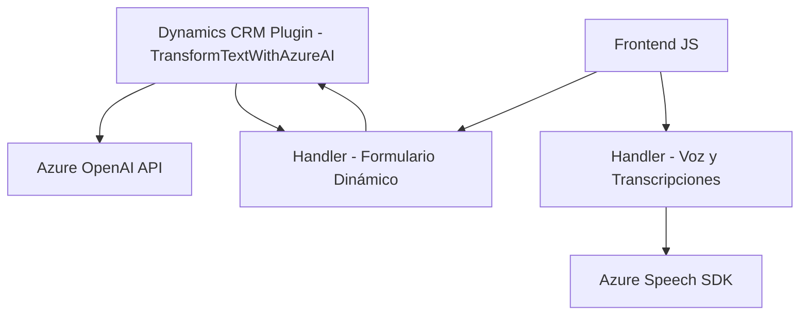

### Breve resumen técnico

- La solución parece consistir en una integración entre formularios frontend basados en Dynamics CRM y servicios inteligentes de Azure Speech SDK (texto a voz) y Azure OpenAI (transformación e interpretación avanzada).
- Combina elementos de procesamiento de datos transcritos y planificación de flujo operando sobre distintos roles de arquitectura cliente-servidor.
- Implementa plugins personalizados en Dynamics CRM que aprovechan el modelo extensible de la plataforma.

---

### Descripción de arquitectura

1. **Frontend**:
   - Realiza la captura y procesamiento de datos de formularios dinámicos.
   - Utiliza servicios externos como Azure Speech SDK para reconocimiento y síntesis de voz.
   - Aplica transformaciones contextuales sobre atributos de formularios mediante funciones organizadas modularmente.

2. **Backend**:
   - Implementa plugins personalizados para Dynamics CRM que integran con servicios de Azure OpenAI para procesamiento avanzado de datos.
   - Utiliza el **Plugin Design Pattern** de Microsoft Dynamics CRM para ejecutar lógica bajo eventos predefinidos.
   - Comunica con servicios externos vía SDK y APIs RESTful (Azure Speech y OpenAI).

3. **Patrones arquitectónicos**:
   - **Capas cliente-servidor**:
      - Frontend centrado en el procesamiento de voz y transcripción directa.
      - Backend orientado a la lógica compleja y transformación dinámicamente integrada.
   - **Modularización**: División explícita de funciones con alta cohesión y bajo acoplamiento.
   - **Facade Pattern**: Múltiples puntos de abstracción para simplificar el uso de SDKs y APIs externas.
   - **Plug-in extensible**: Incrementar o modificar funcionalidad sin afectar directamente al sistema principal.

4. **Tipo de arquitectura**:
   - **Híbrida**: Se extiende un sistema monolítico (Dynamics CRM) mediante servicios cloud externos y múltiples integraciones, lo que fomenta una pequeña estructura basada en microservicios en sus dependencias remotas.

---

### Tecnologías usadas

1. **Frontend (JS)**:
   - **Azure Speech SDK**: Para texto a voz y transcripción de voz a texto.
   - **JavaScript basado en ES6**: Modularización con funciones reutilizables orientadas al uso de SDK/API.

2. **Backend (C#)**:
   - **Dynamics CRM SDK**: Implementación personalizada mediante plugins.
   - **Azure OpenAI API**: Modelo GPT-4 para reglas avanzadas de procesamiento.
   - **RESTful API**: Comunicación con servicios externos.
   - Librerías como `Newtonsoft.Json.Linq` y `System.Net.Http` para manipulación y transporte de datos JSON.

---

### Dependencias y componentes externos

1. **Externos**:
   - **Azure Speech SDK**: Requiere clave de registro y región configurada.
   - **Azure OpenAI API**: Utiliza un endpoint específico (`https://openai-netcore.openai.azure.com/`) para transformaciones avanzadas basadas en modelos GPT.
   - **Xrm.WebApi**: Propia de Dynamics CRM para acceder a datos de entidades y realizar llamadas a APIs personalizadas.

2. **Internos**:
   - `ExecutionContext` y `formContext`: Contextos proporcionados por Dynamics CRM para interactuar con atributos de formularios.

---

### Diagrama Mermaid válido para GitHub

---

### Conclusión final

La solución interconecta un sistema monolítico base (Dynamics CRM) con servicios cloud inteligentes (Azure Speech y Azure OpenAI). Se ejecutan funciones clave tanto en el lado frontend como en el backend, extendiendo las capacidades de la experiencia del usuario y los flujos dinámicos del formulario. La arquitectura híbrida y modular fomenta reutilización y escalabilidad, aunque presenta dependencias críticas en servicios externos que deben monitorearse cuidadosamente para garantizar robustez y seguridad.