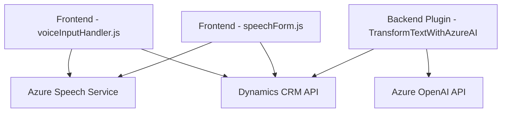

### Breve resumen técnico:
El repositorio describe un sistema compuesto por módulos y plugins que integran tecnologías cliente-servidor para interactuar con formularios de Dynamics CRM mediante capacidades de reconocimiento y síntesis de voz, apoyadas por el Azure Speech SDK. Adicionalmente, implementa un módulo para transformación de texto mediante Azure's OpenAI API, lo que denota el uso de inteligencia artificial en el sistema.

---

### Descripción de arquitectura:
La solución sigue una **arquitectura orientada a servicios (SOA)**, que incluye componentes claramente delimitados:
1. **Frontend Modular JS Code:** Scripts que actúan como módulos autónomos relacionados con lectura (voice synthesis) y entrada (speech recognition) de datos en formularios CRM. Estos módulos gestionan eventos, llaman APIs externas, y utilizan un modelo de carga dinámica de SDK.
   
2. **Backend Plugins:** Plugins en Dynamics CRM escritos en C#. Estos se comportan como microservicios que interactúan con las APIs de Dynamics y Azure OpenAI para tareas específicas, como la transformación textual inteligente.

---

### Tecnologías usadas:
1. **Frontend:**
   - **Lenguaje:** JavaScript (ES6+).
   - **Azure Speech SDK:** Para síntesis y reconocimiento de voz.
   - **Dynamics CRM Client API:** Para interactuar con objetos del CRM y asignar datos según estructura.

2. **Backend:**
   - **Lenguaje:** C#.
   - **Dynamics SDK (Microsoft.Xrm.Sdk):** Para implementar plugins en Dynamics CRM.
   - **Azure OpenAI API:** Uso de GPT-4 para transformar entradas textuales mediante HTTP client.

3. **Generales:**
   - **JSON:** Formato para intercambio de datos entre componentes.
   - **REST API (Azure/Dynamics):** Interacción con servicios externos.

---

### Dependencias o componentes externos:
1. **Azure Speech SDK URL:** `https://aka.ms/csspeech/jsbrowserpackageraw` (JavaScript Speech SDK).
2. **Dynamics APIs:** Uso de Xrm.WebApi para manipular registros Dynamics en el lado cliente y Microsoft Dynamics SDK para manipulación en el backend.
3. **Azure OpenAI API:** Inteligencia artificial para procesamiento avanzado de lenguaje natural.
4. **HTTP/Web Requests:** Para cargar dinámicamente SDKs y hacer peticiones a APIs.
5. **JSON Processors:** Dependencias como Newtonsoft.Json y System.Text.Json para manipulación avanzada de objetos JSON.

---

### Diagrama Mermaid válido para GitHub:

---

### Conclusión final:
El repositorio implementa una solución orientada a servicios (SOA) utilizando una arquitectura híbrida que combina elementos de **modularidad** en el frontend y **microservicios** en el backend. Las tecnologías empleadas están cuidadosamente diseñadas para facilitar la integración entre servicios de voz (Azure Speech SDK), inteligencia artificial (Azure OpenAI), y sistemas CRM avanzados (Dynamics). Este enfoque permite dotar al sistema de capacidades robustas de interacción natural usuario-aplicación mediante voz y texto transformado. El repositorio es adecuado para entornos donde la entrada y salida natural (voz/texto) son esenciales.