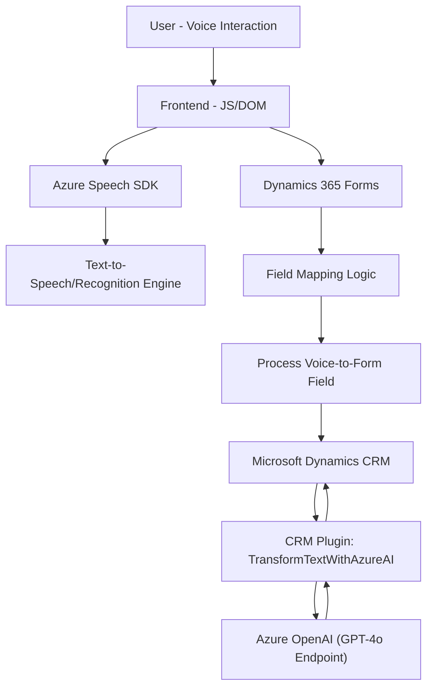

# Breve Resumen Técnico

Este repositorio integra funcionalidades relacionadas con reconocimiento de voz, síntesis de texto a voz, y procesamiento de texto natural utilizando tecnologías de Microsoft Azure. Está diseñado para ayudar en la interacción dinámica con un sistema basado en Microsoft Dynamics 365 CRM, usando comandos hablados y/o procesamiento mediante Azure OpenAI.

---

## Descripción de Arquitectura

La solución combina componentes de frontend (JavaScript) y backend (C#). Este diseño sugiere una **arquitectura de capas** que incluye:
1. **Frontend (JavaScript)** para interacción del usuario con formularios dinámicos mediante voz y texto.
2. **Backend (C#)** en forma de plugins que procesan información y conectan con servicios como Azure OpenAI y Dynamics CRM.

Integración:
- **Azure Speech SDK**: Reconocimiento y síntesis de voz en tiempo real en el cliente.
- **Azure OpenAI (GPT Model)**: Procesamiento avanzado de texto en el servidor.
- **Dynamics 365 Plugins**: Backend procesando eventos de CRM y conectándose a APIs externas.
- **External API Gateway Pattern**: Integración con servicios externos como Azure OpenAI mediante REST API.

---

## Tecnologías Usadas

1. **Frontend:**
   - **Tecnologías:** JavaScript (DOM Manipulation, ES6+).
   - **Dependencias:** Azure Speech SDK, Dynamics365 API.
   - **Patrones:** Modularidad, Separation of Concerns, Event-Driven Programming.

2. **Backend:**
   - **Tecnologías:** C# .NET.
   - **Dependencias:** Microsoft Dynamics SDK, Azure OpenAI API, NewtonSoft.Json, HTTP Client.
   - **Patrones:** Plugin-based Architecture, REST APIs, Repository of Dependencies.

---

## Diagrama Mermaid

---

## Conclusión Final

La solución implementada en este repositorio es un híbrido entre un frontend interactivo y un backend de procesamiento, diseñado para mejorar la experiencia del usuario al interactuar con formularios en una plataforma CRM. Con una arquitectura de capas que implementa patrones consistentes y extensibles, el sistema utiliza tecnologías avanzadas, como **Azure Speech SDK** para el reconocimiento y síntesis de voz, y **Azure OpenAI** para el procesamiento del lenguaje natural. Además, está fuertemente integrado con Dynamics CRM mediante plugins en C#.