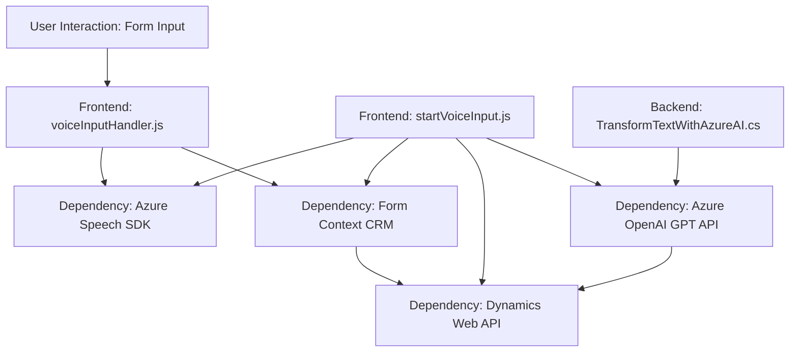

## Resumen técnico
El repositorio analiza fragmentos de código que implementan funcionalidades específicas relacionadas con el reconocimiento de voz, síntesis de voz y procesamiento de datos, integrados con servicios externos como **Azure Speech SDK** y **Azure OpenAI GPT**. Estas soluciones están orientadas a mejorar la interacción en contextos de formularios CRM.

---

### 1. Tipo de solución
La solución parece ser una combinación de **frontend y backend** diseñada para integrarse con **Microsoft Dynamics CRM**. En el frontend, los scripts implementan funcionalidades como entrada/salida de voz y procesamiento de datos dinámicos. El backend consiste en un plugin que se integra con Dynamics CRM para realizar transformaciones avanzadas de texto utilizando Azure OpenAI GPT.

---

### 2. Tecnologías, frameworks y patrones utilizados
#### **Frontend**
- **JavaScript**: Lenguaje principal para manejar DOM, APIs, y comunicación asincrónica.
- **Azure Speech SDK**: Utilizado para reconocimiento y síntesis de voz.
- **Event-driven architecture**: Uso de callbacks para manejar la carga dinámica de SDK y eventos.
- **APIs de Dynamics CRM (`formContext`)**: Permiten interactuar y manipular formularios del CRM.
  
#### **Backend (Plugin)**
- **C# y .NET SDK**: Lenguajes y frameworks base para desarrollar el plugin CRM.
- **Dynamics SDK (`Microsoft.Xrm.Sdk`)**: Para operaciones CRM.
- **Azure OpenAI GPT-4**: Usado para el procesamiento avanzado del lenguaje.
- **REST Client (`System.Net.Http`)**: Comunicación con servicios externos (Azure).

#### **Patrones de Diseño**
1. **Modularización**: División clara de funcionalidad en métodos independientes.
2. **SDK Dependency Injection**: Uso de parámetros para manejar configuraciones del SDK.
3. **Event-driven programming**: Uso de eventos/callbacks en la interacción con servicios.
4. **Plugin Architecture**: En el backend, siguiendo el paradigma oficial de extensibilidad CRM.
5. **Service Integration**: Uso de HTTP Clients para consumir APIs externas.
6. **Factory y Estrategia**: Diferenciación de la lógica procesada con transcripciones estándar vs IA.

---

### 3. Tipo de arquitectura
#### **Frontend**
El frontend utiliza una arquitectura **n capas bien modulada** basada en la separación de lógica y responsabilidades: procesamiento de datos, comunicación con APIs externas (Azure Speech SDK), y manipulación de formularios a través del `formContext`.

#### **Backend**
El backend basado en plugins sigue una **arquitectura de extensibilidad** estándar para **Microsoft Dynamics CRM**, haciendo uso de *servicios externos* como Azure OpenAI GPT. Este componente puede ser considerado parte de una **arquitectura de microservicios**, dado que su responsabilidad está altamente concentrada y se comunica de forma aislada con servicios externos.

---

### 4. Dependencias o componentes externos
1. **Azure Speech SDK**:
   - Funcionalidades: Reconocimiento y síntesis de voz.
   - Script dinámico: `https://aka.ms/csspeech/jsbrowserpackageraw`.
2. **Dynamics Web API**:
   - APIs internas para manipulación de formularios, atributos visibles y valores dinámicos.
3. **Rest API (Azure OpenAI GPT)**:
   - Para procesamiento de texto avanzado desde los plugins back-end.
4. **JSON Libraries**:
   - `System.Text.Json` y `Newtonsoft.Json` para manipulación de datos estructurados JSON.
5. **DOM Manipulation Framework**:
   - Uso del `document` y `window` para agregar elementos dinámicos como el SDK.

---

### Diagrama Mermaid

El diagrama representa la interacción entre los principales componentes, tecnologías y su flujo.

---

### Conclusión final
El repositorio implementa una solución **híbrida** que combina características de frontend y backend, integrando capacidades avanzadas como reconocimiento de voz, síntesis de texto hablado y procesamiento semántico mediante **Azure GPT-4**. La solución sigue patrones establecidos de modularización y escalabilidad al utilizar servicios externos como Azure Speech y Dynamics CRM. 

El diseño general indica un entorno CRM optimizado para facilitar interacciones más naturales y automatizadas con los usuarios, como lo son las transcripciones de voz y procesamiento dinámico de datos en formularios.