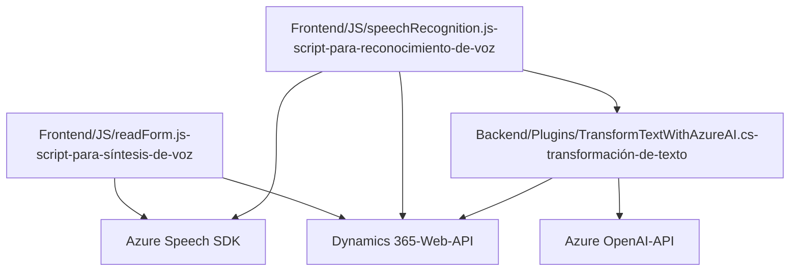

### Análisis Técnico

#### **Breve Resumen Técnico**
El repositorio describe una solución destinada a la integración de accesibilidad y procesamiento avanzado de voz y texto utilizando el **Azure Speech SDK** y el **Azure OpenAI Service**. La funcionalidad principal está orientada a mejorar la experiencia de usuario en formularios de Dynamics 365, usando reconocimiento y síntesis de voz, así como transformaciones del lenguaje mediante lógica avanzada y envoltura en plugins.

---

### **Descripción de Arquitectura**

La solución está diseñada con una arquitectura **n-capas**, cumpliendo las siguientes funciones principales:

1. **Frontend (JavaScript):**
   - Dos archivos principales (`readForm.js` y `speechRecognition.js`) se centran en la sintaxis de calidad para una interfaz web general.
   - La capa se conecta de forma directa con SDKs externos (como Azure Speech SDK) y APIs propias de Dynamics 365, enfocándose en procesamiento de voz, extracción de datos en formularios y mapeo de transcripciones a dichos formularios.  
   - Modularización alta con funciones especializadas para extracción, síntesis y asignación de datos.
   
2. **Backend (C# Plugin):**
   - Compuesto por el archivo `TransformTextWithAzureAI.cs`, que implementa un **plugin del CRM**. Este archivo define un patrón de interacción directa por eventos del sistema y transforma texto con ayuda de Azure OpenAI.
   - Utiliza integración de API externa (Azure OpenAI Service) para procesar comandos de lenguaje natural y generar respuestas estructuradas.  

#### **Tipo de solución**
La solución se categoriza como una **extensión de plugins y funcionalidad para Microsoft Dynamics CRM**. Se centra en la interconexión backend (C# SDK + Azure OpenAI) y funcionalidad de frontend (Azure Speech SDK + Dynamics Web API) para procesar voz y texto, e interactuar con formulación de usuarios.

---

### **Tecnologías Usadas**

**1. Frontend:**
   - **JavaScript:** Lenguaje de programación orientado al desarrollo de lógica del navegador.
   - **Microsoft Dynamics 365 Web API:** Consultas de datos y atributos del sistema de CRM (e.g., mapeo de campos, asignación en formularios).
   - **Azure Speech SDK:** Proporciona la funcionalidad de síntesis y reconocimiento de voz. Cargado desde la CDN: `https://aka.ms/csspeech/jsbrowserpackageraw`.

**2. Backend:**
   - **Microsoft Dynamics CRM SDK**: Framework para integrar y desarrollar extensiones para el sistema CRM.
   - **Azure OpenAI Service API:** Comunicación para procesamiento de texto según exigencias de reglas personalizadas, transformando a JSON estructurado. Aquí se realiza con `HttpClient` de C#.
   - **Newtonsoft.JSON:** Manipulación avanzada de JSON (dado que los resultados de OpenAI son en formato JSON).
   - **.NET Framework / C#:** Base para desarrollo de plugins en Dynamics CRM (probablemente bajo el entorno Visual Studio).

**3. Patrones:**
   - **Asynchronous Event Handling:** Gestionar la carga y ejecución de servicios asincrónicos por medio del uso de `async/await` en JavaScript y funciones en C#.
   - **API Integration:** Comunicación directa con servicios de terceros como Azure Speech SDK y Azure OpenAI.
   - **Modularización:** Dividir la lógica principal en funciones específicas para facilitar la lectura y reutilización.
   - **Repository Pattern:** Localización, extracción y mapeo de datos hacia atributos de formularios CRM mediante funciones de búsqueda.
   - **Plugin Design Pattern:** Organización del código para extender la funcionalidad del sistema mediante puntos de ejecución.

---

### **Diagrama Mermaid**

---

### **Conclusión Final**

El repositorio describe una solución bien estructurada que extiende las capacidades de **Microsoft Dynamics CRM** para la integración de funcionalidades avanzadas de reconocimiento de voz, síntesis de voz y procesamiento de texto en tiempo real. La arquitectura está dividida en capas claras con roles específicos, usando tecnologías modernas como el **Azure Speech SDK** y el **Azure OpenAI Service**. El diseño fomenta la modularidad y escalabilidad, haciendo que sea altamente adaptable para ampliaciones de funcionalidades en la plataforma Dynamics 365.