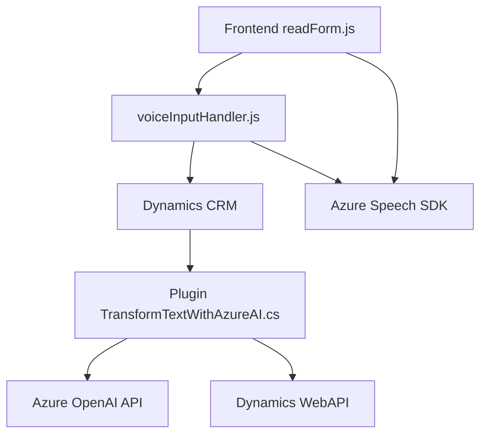

### Breve resumen técnico

Este repositorio muestra principalmente una solución basada en la integración de **Microsoft Dynamics CRM** con dos actores clave: **Azure Speech SDK** (para transcripción de voz a texto y síntesis de voz) y **Azure OpenAI API** (para lógica avanzada de transformación de texto). La arquitectura sugiere un sistema que agrega capacidades de procesamiento de voz y texto con IA orientado a la interacción con formularios.

---

### Descripción de arquitectura

La solución tiene una arquitectura de **n capas**, donde se incluye:
1. **Capa de presentación (Frontend-JS):**  
   - Archivos `readForm.js` y `voiceInputHandler.js` interactúan directamente con formularios HTML/DOM del cliente y usan la integración con Azure Speech SDK para realizar tanto transcripciones de voz como síntesis de voz.  
   - Técnica de manipulación DOM para acceder y modificar atributos del formulario.  
   - Uso dinámico de SDK de Azure con callbacks y promesas.

2. **Capa de lógica empresarial (Back-end / Plugins):**  
   - `TransformTextWithAzureAI.cs` como plugin implementa lógica avanzada para normalizar texto usando Azure OpenAI API directamente en el backend de Dynamics CRM.  
   - Expone servicios de transformación de texto, integrándose eficazmente con los eventos de Dynamics CRM mediante la interfaz `IPlugin`.  

3. **Capa de datos:**  
   Aunque no se presentan archivos específicos de bases de datos, la interacción se basa en los datos asociados en los formularios y entidades de Dynamics CRM, con soporte para campos tipo lookup y consultas específicas mediante Dynamics `WebAPI`.

La arquitectura de la solución es un **monolito extendido con integración a servicios externos como Azure Speech SDK y OpenAI API.**

---

### Tecnologías y patrones usados

#### **Tecnologías y Frameworks**
1. **Frontend JS:**  
   - JavaScript (ECMAScript 6+).  
   - Azure Speech SDK (para reconocimiento y síntesis de voz).  

2. **Backend Plugins de Dynamics CRM:**  
   - C#, .NET Framework.  
   - Microsoft Dynamics CRM SDK (extensibilidad de plugin).  
   - Azure OpenAI API para GPT.  

3. **Integraciones y comunicación:**  
   - REST API con Azure services.  
   - HTTP client para peticiones a OpenAI.  

4. **Paquetes adicionales:**  
   - `Newtonsoft.Json` para manejo de JSON en el plugin.  

#### **Patrones de diseño**
1. **Arquitectura n capas:** Separación entre las capas de presentación (Javascript), lógica empresarial (C# plugin) y datos (CRM).  
2. **Callback/Promise:** Predominio de control de flujo asíncrono en funciones del lado cliente.  
3. **Integración con SaaS:** Uso de servicios externos (Azure Speech y OpenAI) como componentes que amplían la funcionalidad.  
4. **Responsabilidad única (SRP):** Clases y funciones mantienen propósitos claros y separados.  
5. **Decoupled SDK Loader:** Carga de SDK bajo demanda dinamiza y optimiza recursos en el sistema frontend.

---

### Dependencias o componentes externos

1. **Azure Speech SDK:** Para realizar transcripciones y síntesis de voz mediante funcionalidad cloud de Microsoft Azure.  
   - URL del paquete: `https://aka.ms/csspeech/jsbrowserpackageraw`.  
   - Azure API Key y región deben configurarse en el cliente.  

2. **Azure OpenAI API:** Utilizada para transformar texto con IA basada en GPT.  
   - Las credenciales de la API se establecen directamente en el plugin `TransformTextWithAzureAI.cs`.  

3. **Xrm.WebApi:** Servicio RESTful para integrar los plugins y la lógica de negocio en entidades del Microsoft Dynamics CRM.  

4. **Newtonsoft.Json:** Paquete de terceros en .NET para manejar datos JSON extensivamente.  

---

### Diagrama Mermaid

---

### Conclusión final

La solución es una integración de **Microsoft Dynamics CRM** con múltiples servicios de Azure, principalmente **Speech SDK** (transcripción y síntesis de voz) y **OpenAI API** (procesamiento de texto con IA). Se trata de una arquitectura **n capas**, que separa responsabilidades entre presentación, negocio y datos, con una fuerte dependencia de servicios externos en la nube. Los patrones empleados optimizan la integración con SDKs dinámicos y servicios basados en SaaS. Sin embargo, sería conveniente externalizar las credenciales fuera del código directamente para mejorar la seguridad y facilitar el mantenimiento.