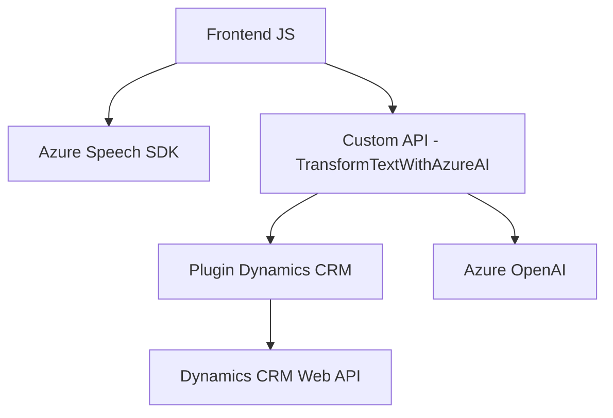

Breve resumen técnico:  
La solución consiste en una arquitectura híbrida con componente de frontend JavaScript (que integra capacidades de voz y procesamiento de formularios mediante Azure Speech SDK y APIs personalizadas), y plugins para Dynamics CRM, específicamente para transformación de texto usando Azure OpenAI. Es un sistema extensible orientado a la interacción entre voz, IA y dinámica en formularios.

---

### Descripción de arquitectura:  
La solución tiene una arquitectura n-capas, dividiendo responsabilidades entre:
1. **Frontend (Capas UI/Cliente):** Código JS basado en eventos, conectado a servicios externos (Azure Speech SDK). Hay integración modular de SDKs y APIs.
2. **Backend/Plugins para Dynamics CRM (Capas de lógica):** Interacciones con Dynamics CRM y procesamiento mediante un microservicio REST (Azure OpenAI).
3. **Servicios externos:** SDK de Azure Speech y Azure OpenAI para gestionar IA y síntesis de voz.

---

### Tecnologías usadas:  
- **Frontend:** JavaScript, Azure Speech SDK, API personalizada en Dynamics, modularidad enfocada en IA y procesamiento de voz.  
- **Backend:** .NET Framework (C#), Dynamics SDK extensiones (Organización y Plugins).
- **Servicios Externos:** Azure Cognitive Services (Speech y OpenAI), Dynamics Web API.

---

### Diagrama Mermaid:  

---

### Conclusión final:  
La solución es una arquitectura n-capas con integración modular, aprovechando capacidades de servicios externos como Azure Speech SDK y Azure OpenAI. El frontend interactúa directamente con formularios dinámicos y servicios de IA, mientras que los plugins en Dynamics funcionan como complemento especializado. Esto permite interacción avanzada, análisis de voz y procesamiento de datos estructurados mediante tecnologías modernas. Es ideal para entornos empresariales con Dynamics CRM y capacidades de IA robustas.