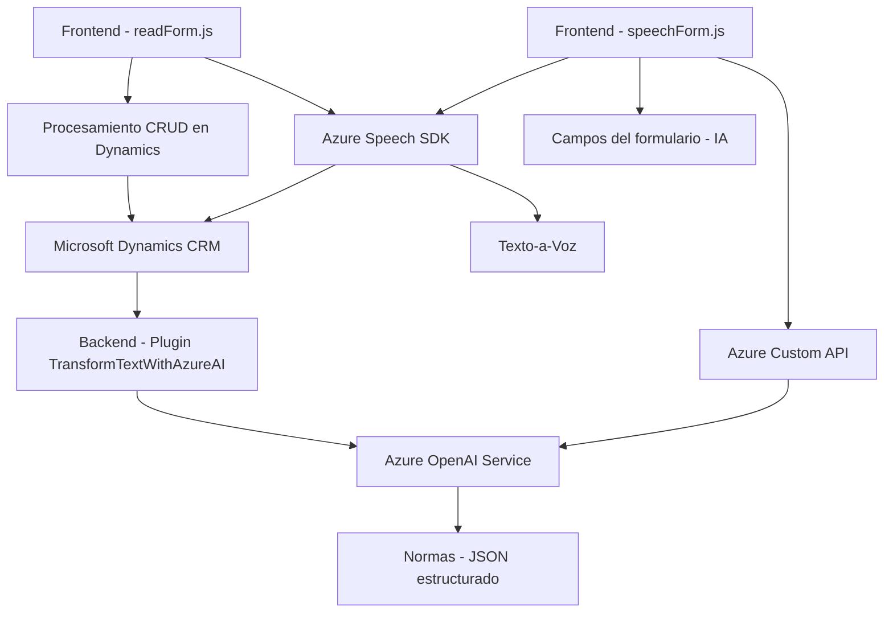

### Breve resumen técnico:
El repositorio está dividido principalmente en tres partes que interactúan entre sí:
1. Funcionalidades frontend encapsuladas en archivos de JavaScript para la interfaz de usuario del formulario y su interacción con Azure Speech SDK.
2. Plugins para Microsoft Dynamics CRM con lógica de procesamiento usando Azure OpenAI Service.
3. Uso de APIs externas relacionadas con servicios de Microsoft Azure.

El enfoque principal es la integración de reconocimiento y síntesis de voz junto con la adaptación dinámica de formularios en un entorno corporativo, apoyado por inteligencia artificial para procesar texto mediante Azure OpenAI Service.

---

### Descripción de arquitectura:
- **Tipo de solución**: La solución en su totalidad puede clasificarse como un sistema integrador. Incluye una interfaz de usuario en frontend que interactúa con una plataforma empresarial (Microsoft Dynamics CRM) y un servicio externo (Azure Speech/OpenAI). Esto hace que la solución sea un híbrido entre una aplicación de frontend y procesamiento backend basado en microservicios.
- **Arquitectura**: La solución sigue un enfoque **n-capas**, donde la interfaz de usuario y los plugins desarrollados para Dynamics CRM están separados por capas de servicios externos (Azure Speech SDK, Azure OpenAI API). Esto facilita la modularidad y escalabilidad, permitiendo que cada componente mantenga su independencia funcional.

---

### Tecnologías usadas:
1. **Frontend**:
   - JavaScript
   - Azure Speech SDK
   - DOM APIs de navegador
   - Context API para formularios de Dynamics (uso de `executionContext`)
2. **Backend/Plugins**:
   - Microsoft Dynamics CRM SDK (`IPlugin`, `IOrganizationService`)
   - Azure OpenAI Service
   - .NET Framework (probable uso de C#)
   - Newtonsoft.Json y System.Text.Json para la serialización de datos
   - System.Net.Http para realizar solicitudes HTTP
3. **Patrones de diseño**:
   - Modularidad: Uso de funciones independientes en los archivos frontend.
   - Delegación: Callback (en frontend) y servicios externos (en backend).
   - Uso de servicios: Comunicación basada en APIs estándares y SDKs de Azure.
   - Patrón de extensibilidad (Dynamics CRM + Plugin).
   - Patrón cliente-servidor.

---

### Dependencias y componentes externos:
1. **Externos**:
   - **Azure Speech SDK** para síntesis de voz y reconocimiento de lenguaje.
   - **Azure OpenAI Service** para procesamiento avanzado de texto mediante técnicas de Inteligencia Artificial.
   - URLs predefinidos para la carga dinámica de librerías y APIs.
2. **Internos**:
   - Dynamics CRM context (`executionContext`) para manejar datos en formularios.
   - Plugins en .NET para lógica empresarial dentro de Dynamics CRM.

---

### Diagrama Mermaid válido para GitHub:

---

### Conclusión final:
El repositorio muestra una solución basada en la interacción entre el frontend (JavaScript) y el backend (Plugins para Dynamics CRM) con integraciones de servicios externos de Microsoft Azure. La arquitectura es modular, usando un enfoque de n-capas para separar responsabilidades y permitir una fácil extensibilidad. La implementación enfatiza el uso de SDKs y APIs estándar de Azure, lo que lo convierte en un sistema altamente adaptable y escalable para escenarios empresariales relacionados con formularios dinámicos y uso de inteligencia artificial.