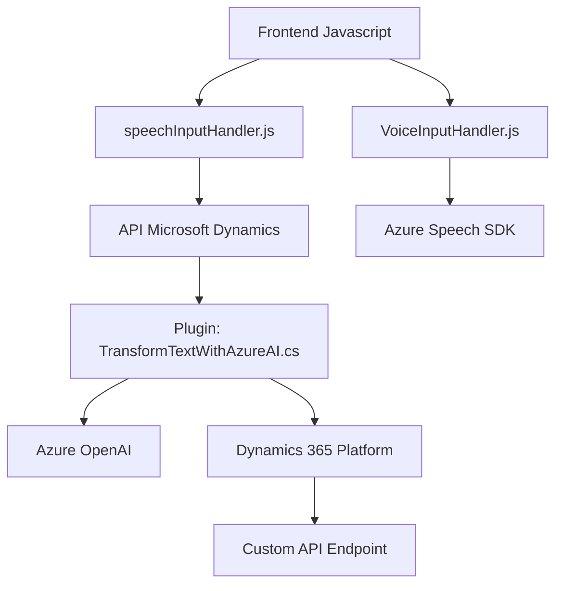

### Breve Resumen Técnico

El repositorio incluye archivos que integran tecnologías de reconocimiento de voz y síntesis de voz (Azure Speech SDK), procesamiento avanzado de texto con inteligencia artificial (Azure OpenAI), y su conexión con Microsoft Dynamics CRM. Los propósitos principales incluyen:
- Sintonización y captura de voz para actualizar formularios de Dynamics 365 en frontend (`VoiceInputHandler.js` y `speechInputHandler.js`).
- Procesamiento de texto mediante un plugin de Dynamics 365 para transformación y enriquecimiento de datos con Azure OpenAI (`TransformTextWithAzureAI.cs`).

Este sistema refleja una arquitectura híbrida orientada a la interacción entre un frontend, servicios externos de Azure, y un backend conectado al sistema CRM.

---

### Descripción de Arquitectura

1. **Tipo de Solución**: 
   - **Híbrida**: Configuración frontend (JS), backend (Dynamics Plugin con C#), y servicios externos (Azure Speech SDK y OpenAI).

2. **Arquitectura**:
   - **Frontend**:
     - Arquitectura en capas, con funciones de presentación, integración con API externas (Azure), y lógica de negocio asociada a formularios.
   - **Plugin en Dynamics 365**:
     - Componentes distribuidos sobre una arquitectura monolítica conectada a servicios externos mediante API.
   - **Integración con Azure Speech y OpenAI**:
     - Usa patrones como `Facade` para simplificar la interacción con SDK y APIs externas.

3. **Patrones Implementados**:
   - **Carga Dinámica**: SDK de Azure Speech se carga en tiempo de ejecución según necesidad (`ensureSpeechSDKLoaded`).
   - **Enriquecimiento de Datos**: Azure OpenAI transforma el texto desde Dynamics CRM para generar datos accionables.
   - **Integración de Servicios Externos**: Requisito explícito, con lógica optimizada para conectarse a Azure Speech y OpenAI mediante API.

---

### Tecnologías Usadas

1. **Frontend**:
   - **HTML y JavaScript**: Actualización dinámica de formularios en Dynamics CRM.
   - **Azure Speech SDK**: Sintetización de voz a texto/fusión con contextos visibles.
2. **Backend/Plugin**:
   - **C# .NET Framework**: Plugin diseñado para Dynamics CRM.
   - **Azure OpenAI**: Procesamiento de texto basado en IA.
   - **Microsoft Dynamics SDK (`Microsoft.XRM.Sdk`)**: Interacción directa con datos y entidades en el CRM.
3. **Servicios Externos**:
   - **Azure Speech**: Reconocimiento y síntesis de voz.
   - **Azure OpenAI**: Transformación avanzada de texto mediante el modelo GPT.

---

### Diagrama Mermaid

---

### Conclusión Final

El repositorio está diseñado para una solución completa que habilita procesamiento de datos en Dynamics 365 mediante servicios externos de Azure. Usa reconocimiento de voz, síntesis de voz, y procesamiento de datos con inteligencia artificial para enriquecer los datos del sistema CRM. Aunque está basado en una arquitectura monolítica para el plugin (C#), utiliza integración con Azure SDKs y APIs que responden a una necesidad de modularidad y extensibilidad.

Este tipo de software sería ideal en aplicaciones de CRM dinámico como Dynamics 365, donde la interacción inteligente con datos es crucial para mejorar la experiencia del usuario y automatizar procesos empresariales.